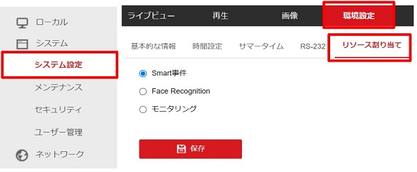
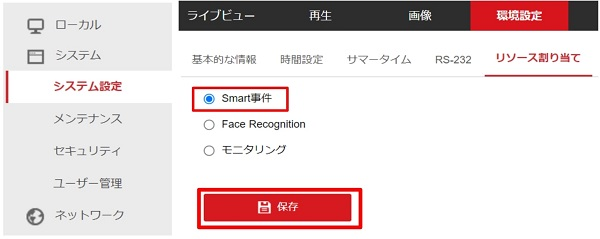
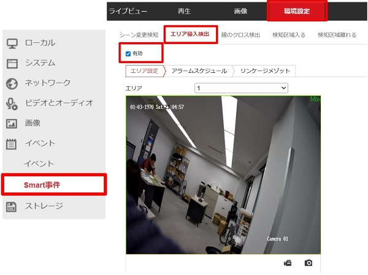
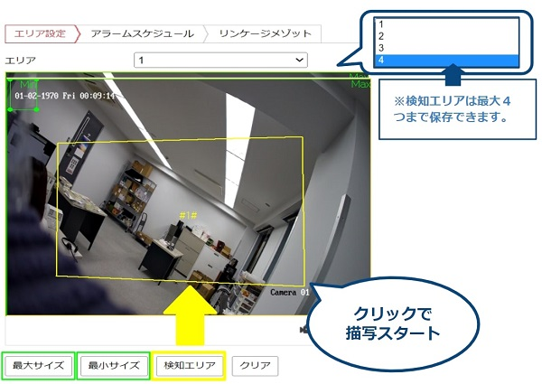
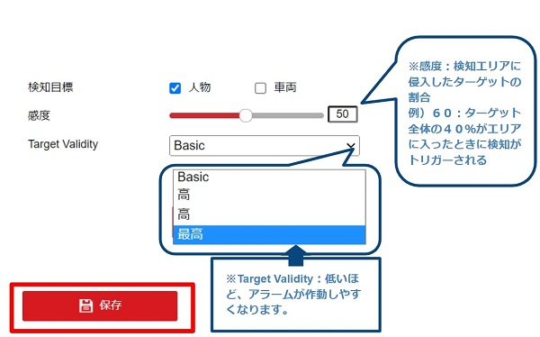
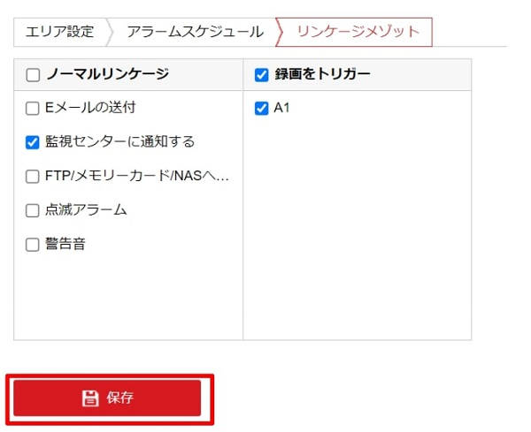
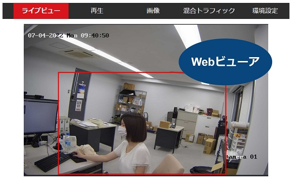
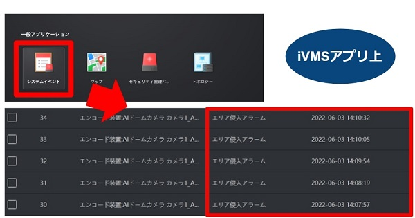
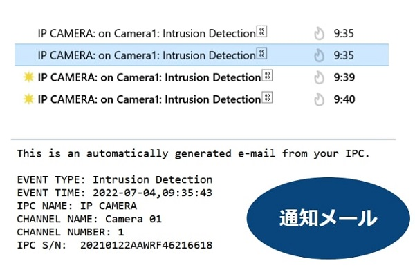

# エリア検出アラーム

[[toc]]

## エリア検出アラームとは
あらかじめ指定したエリア(領域)に侵入した人や物を検知することができる機能です。
AIカメラでは、カメラから直接光や警告音を出し、ターゲットに対し警告を出すことができます。

## 設定手順

### 1. リソースを割り当てる
1. Webビューアにログインし、環境設定＞システム＞リソース割り当てと移動します。

2. 「Smart事件」を選択し、「保存」をクリックして実行します。

3. 自動的に再起動されますので、再起動後再度ログインを行います。

### 2. エリア設定を行う
1. イベント＞Smart事件に移動し、「有効」をチェックします。

2. 「検知エリア」を選択し、画面上にエリアを描写します。
    ライブ画面上でクリックして指定したいエリアの4頂点を指定し、右クリックで描画を完了します。
    ドロップダウンリストで最大4つまでエリアを保存することができます。「クリア」を押すとすべての領域がリセットされます。
    
3. 「最大・最小」サイズで検知対象のサイズを設定します。
    最大以上、最小以下のターゲットは検知対象外となります。
4. 検知目標、感度、Target Validityをそれぞれ設定します。
- **検知目標**：検知対象として人物または車両、もしくは両方を選択することができます。
- **感度**：検知エリアに侵入したターゲットの割合です。
    例）６０：ターゲット全体の４０％がエリアに入ったときに検知が作動する
- **Target Validity**：低いほど、アラームが作動しやすくなります。
 
 5. 「保存」をクリックし、設定を確定します。

### 3. スケジュール・検知時の動作を決める
1. エリア侵入検知を作動するスケジュールを設定します。バーをクリックすると、時間を指定できます。

2. エリア侵入を検知した際に作動するリンク動作を設定します。

※**「点滅アラーム」と「警告音」は別途基本設定を行う必要があります。**
[設定方法はこちらから](./camera-linkage-methods.html)

### 4. 検知結果の表示
-  Webビューア上(リンケージメソッドで監視センターへの通知をONにした場合)
    ライブビューでリアルタイムで監視ができます。
    ターゲットがエリアに侵入すると枠が赤く表示されます。
    

-  iVMSアプリ上(リンケージメソッドで監視センターへの通知をONにした場合)
   iVMSアプリを開き、一般アプリケーション＞システムイベントよりリアルタイムの検出結果が見られます。
   キャプチャした画像はダウンロードおよびメール送信が可能です。
   

-  通知メール(リンケージメソッドでメール送信を選択した場合)
    エリア検知した旨のメールが届きます。メールには検知した日時やカメラ情報が書かれています。
    

アイゼックの主要カメラ一覧はこちら▼
- AIカメラ：[「ILC-4M79製品ページ」](https://isecj.jp/camera/ilc-4m79)
- WiFiカメラ：[「DLC-176-wifi製品ページ」](https://isecj.jp/camera/dlc-176-wifi)
- IPカメラ（集音マイクつき）：[「TLC-161製品ページ(近日公開)」]()
- アナログカメラ：[「IDC-127 withmic 製品ページ(近日公開)」]()