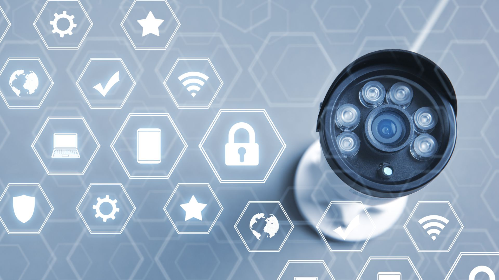
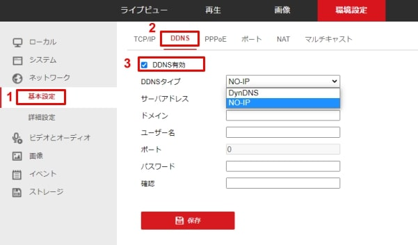

# DDNS設定について

[[toc]]

## 初めに
本カメラはDDNS設定サービスとしてNO-IPとDynDNSのどちらかのサービスを利用頂けます。
DynDNSは完全有料のサービスとなりますが
NO-IPは１ヵ月に１回アクティベーション化をする必要があるものの、無料でサービスが利用頂けます。
※NO-IPでも有料プランであればアクティベーション化が不要です。

## 手順：
本ページではNO-IPでのDDNS設定方法を紹介します。
DDNSサービスとは何かについてはこちらの記事参照下さい。
[ダイナミックDNS（DDNS）とは？DDNSを使った遠隔監視方法をご紹介](https://isecj.jp/blog/tech-ddns/)

### 1．NO-IPでアカウントを作成する
手順は下記記を参考にして作成下さい。
[no-ipの無料アカウント登録手順](https://onl.tw/aaKtKcf)

### 2. カメラ側の設定を行う
１）カメラの環境設定画面にログインし「基本設定」⇒DDNSを選択、DDNS有効にチェックを入れます。

２）下記の通り入力します。
DDNSタイプ　　⇒　NO-IP
サーバアドレス　⇒　dynupdate.no-ip.com
ドメイン　　　　⇒　NO-IPで設定したドメイン名
ユーザー名　　　⇒　NO-IPでアカウント作成したメールアドレス
パスワード　　　  ⇒　NO-IPでアカウント作成した際に設定したパスワード
確認　　　　　　  ⇒　パスワード再入力

入力したら最後に保存を押します。

以上で完了です。

**アイゼックの主要カメラ一覧はこちら▼**
- [【AI機能で高精度なモーション検知, 夜間でもカラー映像】「AIカメラ製品ページ」](https://isecj.jp/camera/ilc-4m79)
- [【WiFi接続で省配線接続, レコーダーいらずの監視システム】「wifiカメラ製品ページ」](https://isecj.jp/camera/dlc-176-wifi)
- [【マイク付きで音声もクリアに録音】「IPカメラ（集音マイクつき）製品ページ(近日公開)」]()
- [【高性能かつ低価格, 夜間でもカラー映像】「アナログカメラ 製品ページ(近日公開)」]()