# 顔キャプチャ
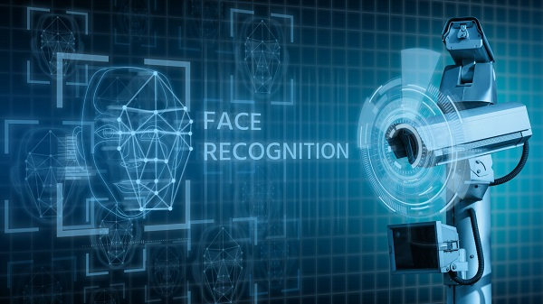
[[toc]]

## 顔キャプチャとは
あらかじめ指定したエリアに表示された顔をキャプチャする機能です。キャプチャした画像は検索・ダウンロードすることができます。

## 顔キャプチャの設定手順

### 1. リソースを割り当てる
1. Webビューアにログインし、環境設定＞システム＞リソース割り当てと移動します。
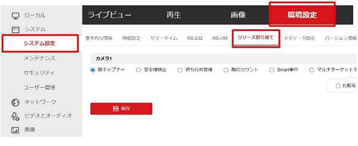
2. 「顔キャプチャ」を選択し、「保存」をクリックして実行します。
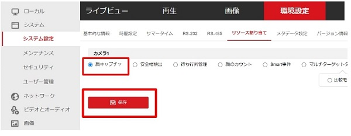
3. 自動的に再起動されますので、再起動後再度ログインを行います。
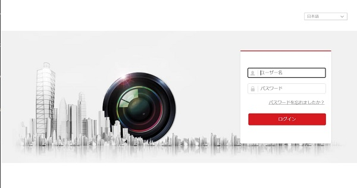

### 2. オーバーレイとキャプチャを設定する
以下の設定をご参考に、テストを行ってください。
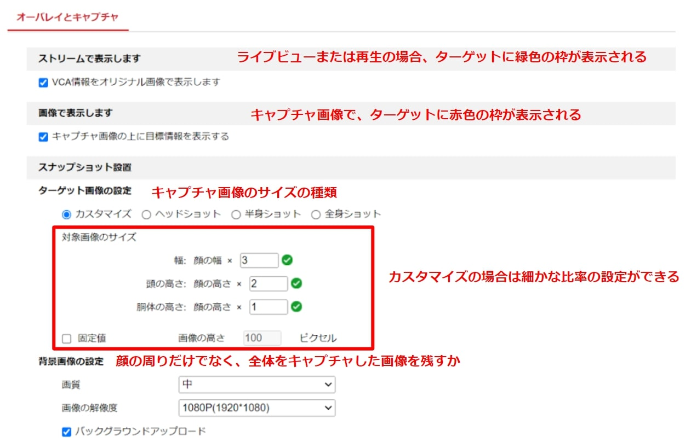
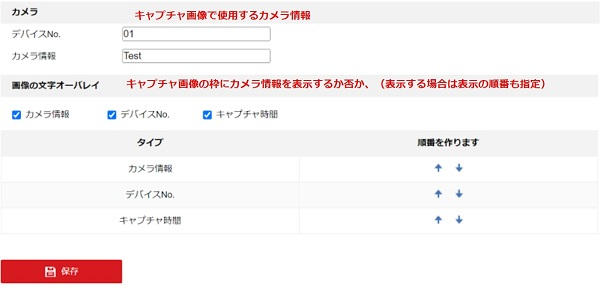
それぞれの項目の働きは以下の通りです。

- **ストリームで表示**：ライブビューまたは再生の場合、ターゲットに緑色の枠が表示される
- **画像で表示**：キャプチャ画像で、ターゲットに赤色の枠が表示される
- **ターゲット画像の設定**：キャプチャ画像のサイズの種類
                    カスタマイズの場合は細かな比率の設定ができる
- **背景画像の設定**：顔の周りだけでなく、全体をキャプチャした画像を残すか
- **カメラ**：キャプチャ画像で使用するカメラ情報
- **文字のオーバーレイ**：キャプチャ画像の枠にカメラ情報を表示するか否か、（表示する場合は表示の順番も指定）

### 3. シールド領域を設定する
1. 六角形のアイコンをクリックして、画面にシールド領域（検知対象外の領域）を描写します。
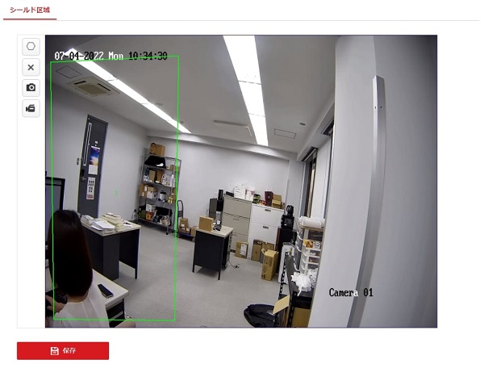
2. 【保存】をクリックし、設定を保存します。 ×をクリックすると、領域がクリアされます。

### 4. 基本ルールを設定する

1. 最小最大瞳孔間距離を設定します。数値を記入するか、画面上に直接範囲を書くことができます。
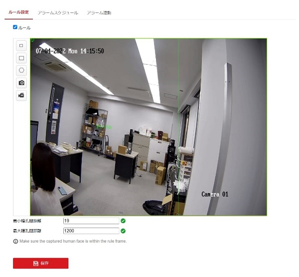
2. 顔キャプチャを作動するスケジュールを設定します。バーをクリックすると、時間を指定できます。

3. 顔キャプチャした際に作動させるリンク動作を設定します。
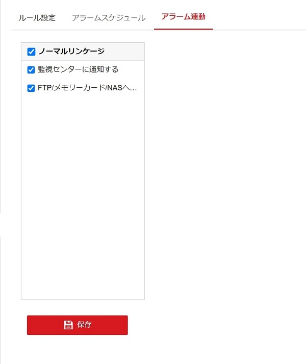

### 5. 高度なルールを設定する（任意）
基本的には初期値のままで問題なくキャプチャできますが、必要に応じて細かなパラメーターの設定をすることができます。
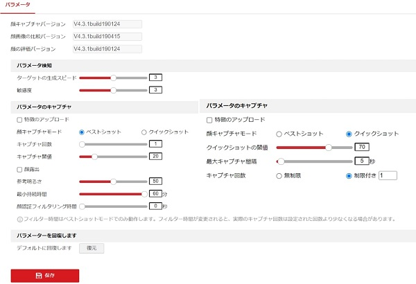

**パラメーター検知**
- ターゲットの生成スピード：ターゲットを識別する速度です。値が高いほど、ターゲットを高速に認識します。デフォルトの「3」を推奨します。
- 敏感度(Sensitivity)：ターゲットを識別する感度を指定します。値が高いほど顔を認識しやすくなりますが、誤認識の可能性が高くなります。デフォルトの「3」を推奨します。

**パラメーターのキャプチャ**
　　　　　
- **キャプチャ回数**：設定したエリアに滞在している間に顔がキャプチャされる回数を指します。
- キャプチャ閾値：値が高いほど、キャプチャおよびアラームを実行するために、高画質基準を満たす必要があります。（ベストショット）
- **クイックショットしきい値**：クイックショットのトリガーとなる顔の画質を表します。
- **顔の露出**：顔がシーンに現れた際にデバイスが自動的に露出レベルを調整します。
- **参考明るさ**：実際のシーンに写っている顔が、設定した基準輝度より明るい場合は、露光レベルを下げ、基準よりも暗い場合は、露光レベルを上げます。
- **最小継続時間**：顔が消えてから露出を維持する時間です。
- **顔認証フィルタリング時間**：カメラが顔を検出してからキャプチャアクションを行うまでの時間間隔を意味します。検出された 顔が設定されたフィルタリング時間未満しかシーンに存在しない場合、キャプチャは実行されません。

注意：顔のフィルタリング時間は、実際のキャプチャ時間が上記の設定値より短くなる可能性が高くなる場合があります。
デフォルトに回復します[ 復元］をクリックすると、詳細設定のすべての設定が工場出荷時の状態に復元されます。

### 6. キャプチャ画像を確認・ダウンロードする

-  Webビューア【画像タブ】
   1.  [画像]に移動します。
   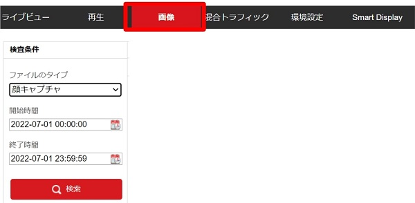
   2.  検査条件にて、ファイルのタイプ[顔キャプチャ]を選択、期間を指定して[検索]をクリックします。 一致した結果の一覧が画面に表示されます。
   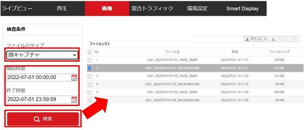
   3.  リストからダウンロードしたいファイルを選択、[ダウンロード]をクリックすると、パソコンに画像が保存されます。

-  Webビューア上【スマートディスプレイ】(リンケージメソッドで監視センターへの通知をONにした場合)
   1. Smart Displayに移動します。
   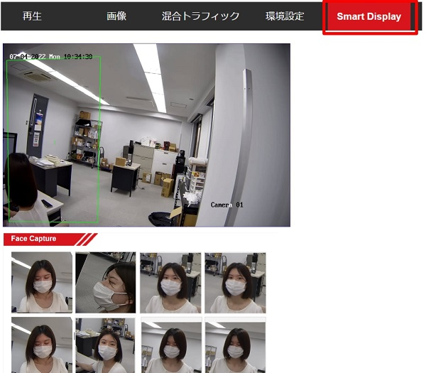
   2. 「Face Capture」でリアルタイムにキャプチャされた画像を確認できます。
   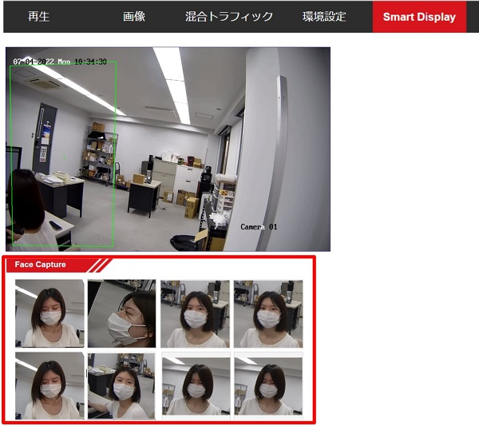
   3. 画像をクリックすると、時間やカメラ情報などの詳細情報が見られます。
   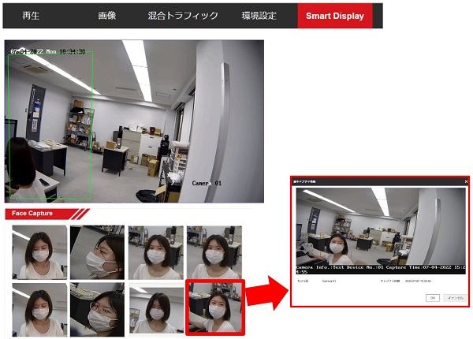

**アイゼックの主要カメラ一覧はこちら▼**
- [【AI機能で高精度なモーション検知, 夜間でもカラー映像】「AIカメラ製品ページ」](https://isecj.jp/camera/ilc-4m79)
- [【WiFi接続で省配線接続, レコーダーいらずの監視システム】「wifiカメラ製品ページ」](https://isecj.jp/camera/dlc-176-wifi)
- [【マイク付きで音声もクリアに録音】「IPカメラ（集音マイクつき）製品ページ(近日公開)」]()
- [【高性能かつ低価格, 夜間でもカラー映像】「アナログカメラ 製品ページ(近日公開)」]()
