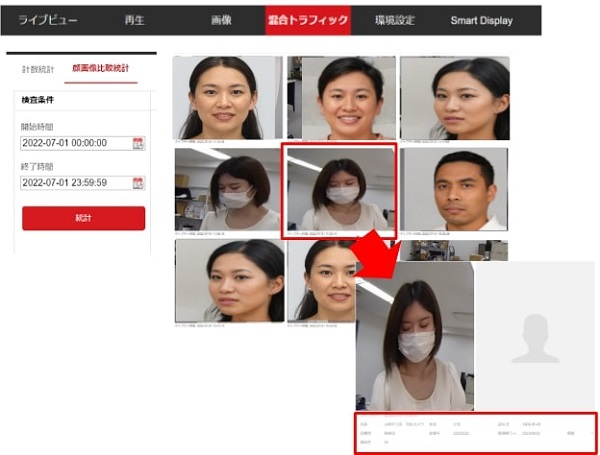
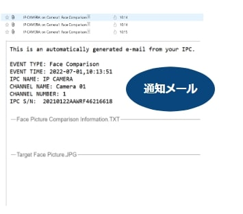

# 顔比較

[[toc]]

## 顔比較とは
あらかじめ保存した顔情報とキャプチャーされた顔を比較する機能です。

## 設定手順

### 1. リソースを割り当てる
1. Webビューアにログインし、環境設定＞システム＞リソース割り当てと移動します。

2. 「顔キャプチャ」を選択し、「保存」をクリックして実行します。

3. 自動的に再起動されますので、再起動後再度ログインを行います。

### 2. 顔ライブラリを設定する
1. 環境設定＞顔画像ライブラリに移動します。
2. 「＋」をクリックして、顔ライブラリのフォルダを新規作成します。

3. 作成したライブラリを選択し、「追加」を押して、顔比較に使いたいターゲットの顔写真をインポートします。

### 3. 顔比較を設定する
1. 環境設定＞顔比較とモデリングに移動します。
2. 「顔画像の比較」「顔画像の有効化」をそれぞれチェックします。

3. その他のルールを設定します。それぞれの設定項目の働きは以下の通りです。
- 顔画像ライブラリ＞対象の顔ライブラリを選ぶ
- 顔情報アップロード設定＞顔情報のアップロードの条件を設定
- リンク比較アラーム設定＞アラーム出力の条件を設定
- 比較モード＞顔比較を行う条件を設定
    ベスト比較とクイック比較の違い：
    **ベスト比較**：ターゲット顔がエリアから離れた際、ベストスコアの顔画像と
    関連するアラーム情報をアップロードする。
    **クイック比較**：キャプチャーしきい値を超えたときに、ターゲットの顔を
キャプチャして比較する。

- アラームスケジュール＞顔比較を行うスケジュール
- リンケージメソッド＞顔比較が検知された時の連動タスク

4. 「保存」をクリックして設定を確定します。

### 4. 顔比較結果の確認・ダウンロード
1. [混合トラフィック]に移動します。

2. [顔画像比較統計]のタブを選択、検査条件にて、期間を設定して[統計]をクリックします。
3.  一致した結果の一覧が画面に表示されます。

4. 一覧から任意の画像をクリックすると、詳細情報が見られます。

### 5. 顔比較結果の表示
-  Webビューア上(リンケージメソッドで監視センターへの通知をONにした場合)
 Smart Displayでリアルタイム監視ができます。顔比較結果はリアルタイムで表示されます。

   

-  iVMSアプリ上(リンケージメソッドで監視センターへの通知をONにした場合)
iVMSアプリを開き、一般アプリケーション＞システムイベントよりリアルタイムの検出結果が見られます。
   キャプチャした画像はダウンロードおよびメール送信が可能です。

   

-  通知メール(リンケージメソッドでメール送信を選択した場合)
    顔比較結果の通知メールが届きます。メールには検知した日時やカメラ情報のほか、キャプチャした顔画像が添付されています。
    

**アイゼックの主要カメラ一覧はこちら▼**
- [【AI機能で高精度なモーション検知, 夜間でもカラー映像】「AIカメラ製品ページ」](https://isecj.jp/camera/ilc-4m79)
- [【WiFi接続で省配線接続, レコーダーいらずの監視システム】「wifiカメラ製品ページ」](https://isecj.jp/camera/dlc-176-wifi)
- [【マイク付きで音声もクリアに録音】「IPカメラ（集音マイクつき）製品ページ(近日公開)」]()
- [【高性能かつ低価格, 夜間でもカラー映像】「アナログカメラ 製品ページ(近日公開)」]()