# Ipv6接続の手順

近年Ipv6のネット回線が増えてきました。
従来防犯カメラを遠隔で監視する為にはIpv4回線でポート開放を行うのが一般的でしたが、Ipv6回線ではポート開放ができ無いため、インターネット回線を他社に変更した際に防犯カメラの遠隔監視が出来なくなってしまった等のトラブルが発生する事がよくあります。

Ipv6対応の防犯カメラであれば、Ipv6回線でも遠隔監視が可能です。
本記事ではipv6対応の監視カメラを用いて手順を紹介します。

[[toc]]

## 接続手順

１）IPカメラの設定画面にログインし、上部メニューより「環境設定」⇒左メニューの「ネットワーク」⇒「基本設定をクリックし」ネットワーク情報からIpv6アドレスを確認します。
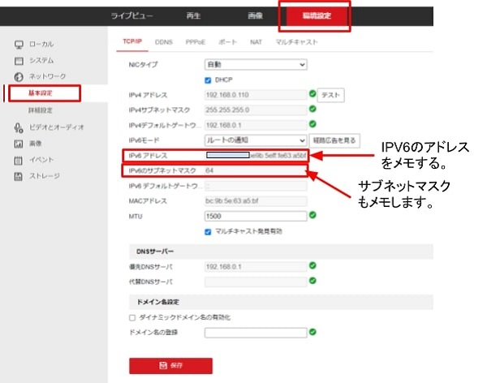

２）IPカメラ設置場所のルーターの設定を行います。
ルーターのIpv6用パケットフィルターに対して、１）でメモしたIpv6アドレスが通過できるように設定します。
＊本例はAterm WX6000HPを使って設定、ルーターによって設定画面に違いがあるのでルータ取扱説明書をご確認下さい。
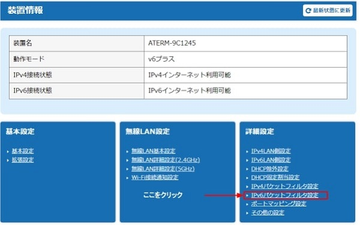
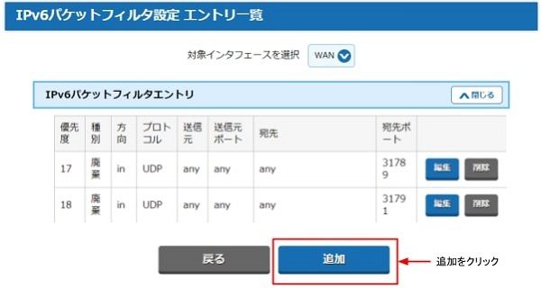

2-2)　下記のようにIpカメラのIpv6アドレスが通過するようにフィルタを設定します。

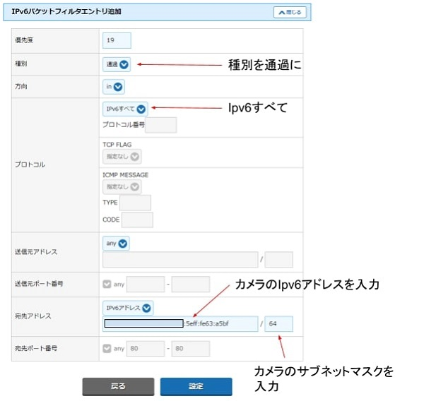
以上で完了です。

あとはカメラのIpv6アドレスを入力すれば遠隔から映像を閲覧できます。
ブラウザで閲覧する場合、ブラウザのアドレスバーにカメラのipv6アドレスを「」で囲んで入力します。

例
240b:10:c220:5700:2ea5:xxxx:xxxx:xxxxの場合
[240b:10:c220:5700:2ea5:xxxx:xxxx:xxxx]
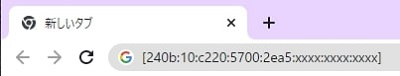

## アプリケーションでの閲覧方法(PCアプリの場合）
①アプリケーションivms-4200を立ち上げ、メインメニューからデバイスマネージャーを選択します。
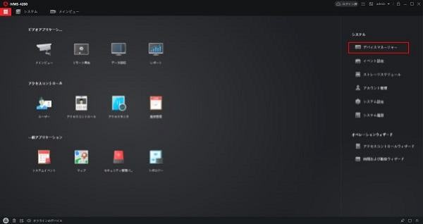

②左メニューよりデバイスマネージャー⇒①デバイスを選択肢、②追加をクリックします。

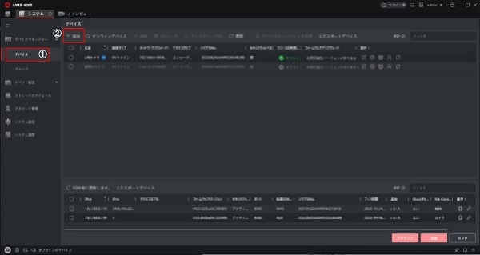

③ポップアップが表示されるので
名前：任意の名前を記入
- アドレス：カメラのipv6のアドレス
- ポート：カメラポート（標準は8000)を入力
- ユーザー名：カメラＩＤ(標準はadmin)を入力
- パスワード：カメラパスワードを入力
各項目を記入したら追加して接続を押します。
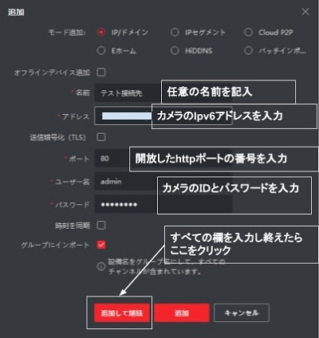

④デバイスの欄にカメラが追加され、リソースの利用状況がオンラインになっていたら設定成功です。
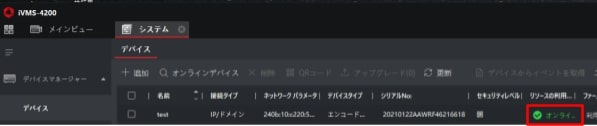

⑤メインメニューに戻りメインビューを選択します。
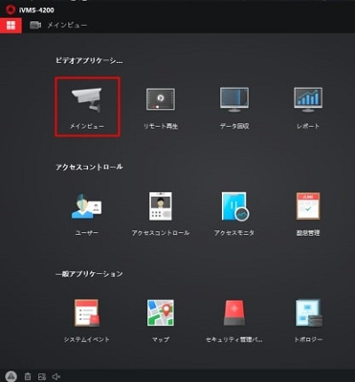

⑥左側にカメラ名が表示されているので右画面にドラック＆ドロップする映像を閲覧できます。
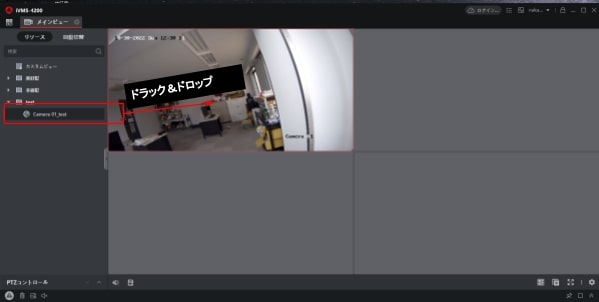

## アプリケーションでの閲覧方法(スマートフォンアプリの場合）
①スマートフォンアプリhik-conectをインストールします。

②PCアプリivms-4200にてQRを選択します。
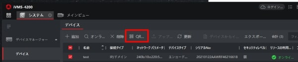

③QRコードが表示されるのでそのQRコードをHik-connectアプリで「デバイスの追加」もしくは「QRコードのスキャン」を選択しQRコードをスキャンします。
以上で、カメラとの接続は完了です。

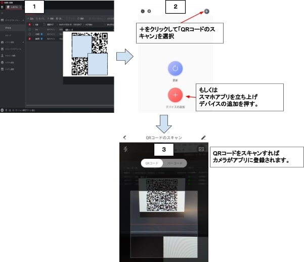