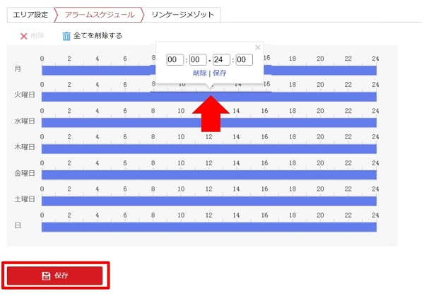

# ラインクロス検知

[[toc]]

## ラインクロス検知とは
あらかじめ指定したラインを通過した人や物を検知することができる機能です。
AIカメラでは、カメラから直接光や警告音を出し、ターゲットに対し警告を出すことができます。

## 設定手順

### 1. リソースを割り当てる
1. Webビューアにログインし、環境設定＞システム＞リソース割り当てと移動します。

2. 「Smart事件」を選択し、「保存」をクリックして実行します。

3. 自動的に再起動されますので、再起動後再度ログインを行います。

### 2. エリア設定を行う

1. 環境設定＞イベント＞Smart事件に移動し、「線のクロス検出」タブを選択、「有効」をチェックします。

2. 「検知エリア」を選択し、画面上に検知ラインを描写します。

    ライブ画面上に表示される線をドラッグして、好きな場所に配置することができます。線をクリックすると、両端に2つの赤い〇が表示され、それぞれの〇をドラッグして線の形と長さを定義することができます。
    ドロップダウンリストで最大4つまで検知ラインを保存することができます。「クリア」を押すとすべての領域がリセットされます。
3. 「最大・最小」サイズで検知対象のサイズを設定します。
    最大以上、最小以下のターゲットは検知対象外となります。
4. 検知目標、方向、感度、Target Validityをそれぞれ設定します。

- **検知目標**：検知対象として人物または車両、もしくは両方を選択することができます。
- **方向**：検知ラインを通過する方向を設定します。一方または両方の方向を選択することができます。
- **感度**：検知エリアに侵入したターゲットの割合です。
    例）６０：ターゲット全体の４０％がエリアに入ったときに検知が作動する
- **Target Validity**：低いほど、アラームが作動しやすくなります。
5. 「保存」をクリックし、設定を確定します。

### 3. スケジュール・検知時の動作を決める
1. ラインクロス検知を作動するスケジュールを設定します。バーをクリックすると、時間を指定できます。

2. ラインの通過を検知した際に作動するリンク動作を設定します。

※**「点滅アラーム」と「警告音」は別途基本設定を行う必要があります。**
[設定方法はこちらから](./camera-linkage-methods.html)

### 4. 検知結果の表示
-  Webビューア上(リンケージメソッドで監視センターへの通知をONにした場合)

    ライブビューでリアルタイムで監視ができます。
    ターゲットがラインを通過するとラインが赤く表示されます。

-  iVMSアプリ上(リンケージメソッドで監視センターへの通知をONにした場合)

   iVMSアプリを開き、一般アプリケーション＞システムイベントよりリアルタイムの検出結果が見られます。
   キャプチャした画像はダウンロードおよびメール送信が可能です。

-  通知メール(リンケージメソッドでメール送信を選択した場合)

    エリア検知した旨のメールが届きます。メールには検知した日時やカメラ情報が書かれています。

**アイゼックの主要カメラ一覧はこちら▼**
- [【AI機能で高精度なモーション検知, 夜間でもカラー映像】「AIカメラ製品ページ」](https://isecj.jp/camera/ilc-4m79)
- [【WiFi接続で省配線接続, レコーダーいらずの監視システム】「wifiカメラ製品ページ」](https://isecj.jp/camera/dlc-176-wifi)
- [【マイク付きで音声もクリアに録音】「IPカメラ（集音マイクつき）製品ページ(近日公開)」]()
- [【高性能かつ低価格, 夜間でもカラー映像】「アナログカメラ 製品ページ(近日公開)」]()