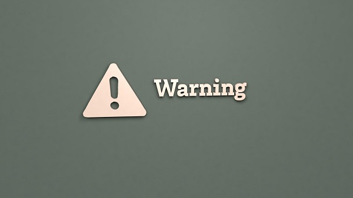
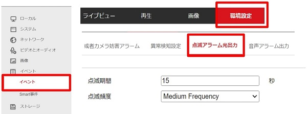
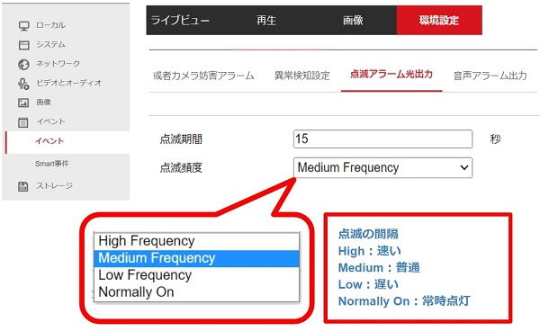
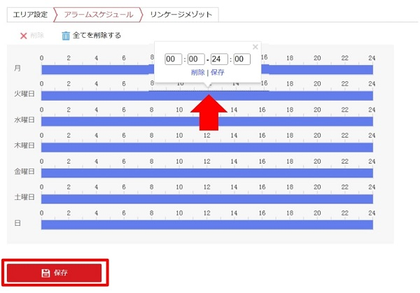
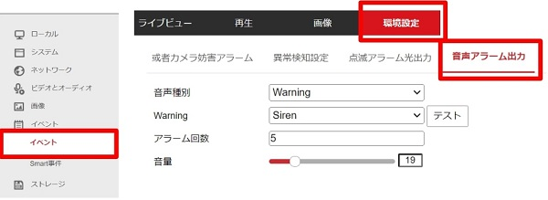
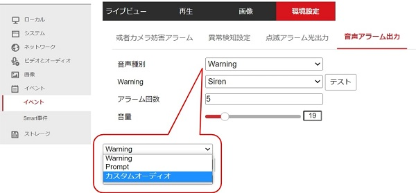
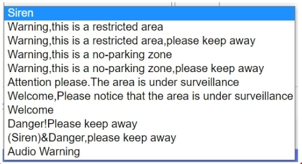
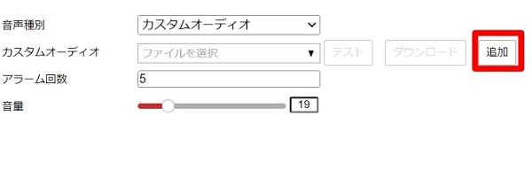
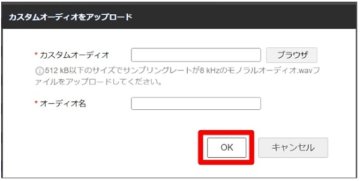

# リンケージメソッド（音声・点滅）の基本設定

[[toc]]

##  はじめに～AIカメラにさらに便利な機能が搭載～
今までは、カメラ本体ではなく、外部のスピーカーや、レコーダーから音声・光の警告を行う必要がありました。しかし、本AIカメラには、カメラ本体に点滅・スピーカーの機能が搭載されたため、別途機器を取り付けることなく、カメラのみで警告できます。

### 点滅アラーム出力の設定
- **機能：カメラで直接光を点滅、警告を出すことができる**
1. 環境設定＞イベント＞点滅アラーム出力と移動します。

2. 点滅期間（長さ）、点滅頻度（間隔）を設定します。
- 点滅の間隔
    - High：速い
    - Medium：普通
    - Low：遅い
    - Normally On：常時点灯

3. アラームスケジュールを設定し「保存」で設定を確定します。
※青色のバーをクリックすると、時間を指定できます。

    

### 音声アラーム出力の設定
- **機能：カメラから直接音声を出力、警告を知らせることができる**
1. 環境設定＞イベント＞音声アラーム出力と移動します。

2. 音声種別、アラーム回数、音量をそれぞれ設定し、「テスト」で一度確かめます。
音声種別：「Warning」「Prompt」「カスタムオーディオ」から選択します。

    
- **Warning**：Warningを選択した場合は、下記のように、音声データ(英語)を選択することができます。
                
- **カスタムオーディオ**：カスタムオーディオを選択した場合：コンピュータから音声データをアップロードします。
①「追加」をクリックします。
 
②「ブラウザ」をクリックしてファイルを選択し、「オーディオ名」で名前をつけ、「OK」で確定します。
 
 以上でアップロードは完了です。

3. アラームスケジュールを設定し、「保存」で設定を保存します。
※青色のバーをクリックすると、時間を指定できます。

   

以上で基本設定は完了です。
これらの機能をエリア検知やライン検知などと組み合わせることで、効果的な防犯、警備対策を行うことができます。
## リンケージメソッドが使える機能はこちら
- [ラインクロス検知](./camera-line-crossing.html)
- [エリア検出アラーム](./camera-area-detection.html)

**アイゼックの主要カメラ一覧はこちら▼**
- [【AI機能で高精度なモーション検知, 夜間でもカラー映像】「AIカメラ製品ページ」](https://isecj.jp/camera/ilc-4m79)
- [【WiFi接続で省配線接続, レコーダーいらずの監視システム】「wifiカメラ製品ページ」](https://isecj.jp/camera/dlc-176-wifi)
- [【マイク付きで音声もクリアに録音】「IPカメラ（集音マイクつき）製品ページ(近日公開)」]()
- [【高性能かつ低価格, 夜間でもカラー映像】「アナログカメラ 製品ページ(近日公開)」]()