# マルチターゲット検出
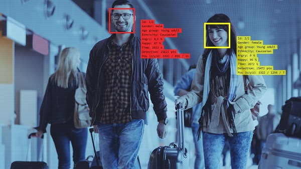
[[toc]]

## マルチターゲット検出とは
ターゲットの属性・見た目など複数の情報を取得することができる機能です。

## 設定手順

### 1. リソースを割り当てる
1. Webビューアにログインし、環境設定＞システム＞リソース割り当てと移動します。
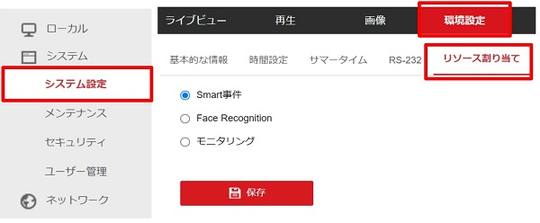
2. 「Smart事件」を選択し、「保存」をクリックして実行します。
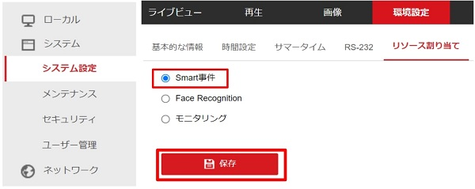
3. 自動的に再起動されますので、再起動後再度ログインを行います。

### 2. オーバーレイとキャプチャを設定する
以下の設定をご参考に、テストを行ってください。
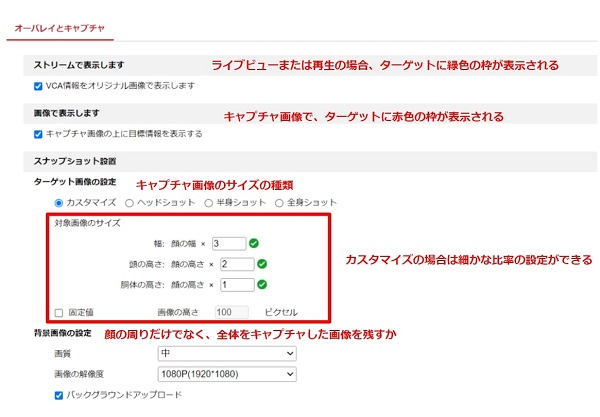
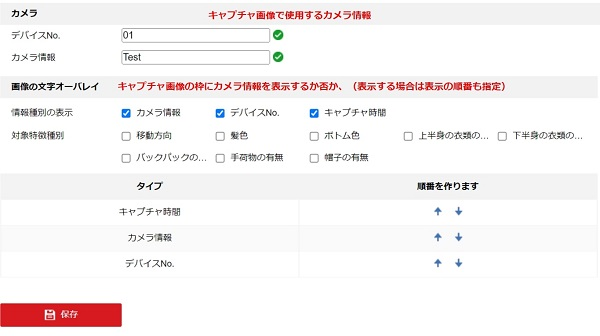

それぞれの項目の働きは以下の通りです。
- ストリームで表示：ライブビューまたは再生の場合、ターゲットに緑色の枠が表示される
- 画像で表示：キャプチャ画像で、ターゲットに赤色の枠が表示される
- ターゲット画像の設定：キャプチャ画像のサイズの種類※カスタマイズの場合は細かな比率の設定ができる
- 背景画像の設定：顔の周りだけでなく、全体をキャプチャした画像を残すか
- カメラ：キャプチャ画像で使用するカメラ情報
- 文字のオーバーレイ：キャプチャ画像の枠にカメラ情報を表示するか否か、（表示する場合は表示の順番も指定）
### 3. シールド領域を設定する
1. 六角形のアイコンをクリックして、画面にシールド領域（検知対象外の領域）を描写します。
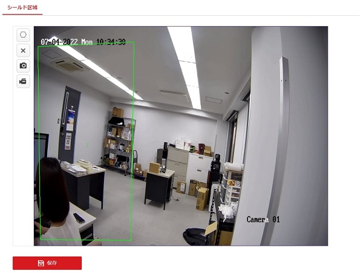
2. 【保存】をクリックし、設定を保存します。 ×をクリックすると、領域がクリアされます。
### 4. 基本ルールを設定する
1. 最小最大瞳孔間距離を設定します。数値を記入するか、画面上に直接範囲を書くことができます。
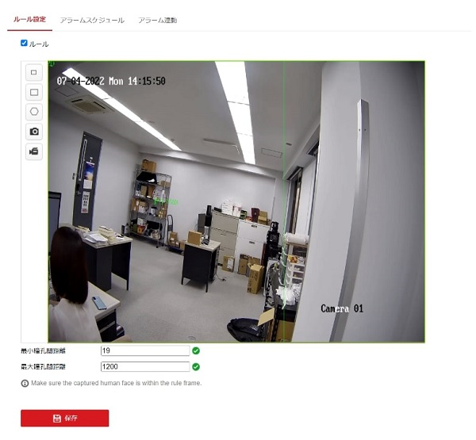
2. 顔キャプチャを作動するスケジュールを設定します。バーをクリックすると、時間を指定できます。
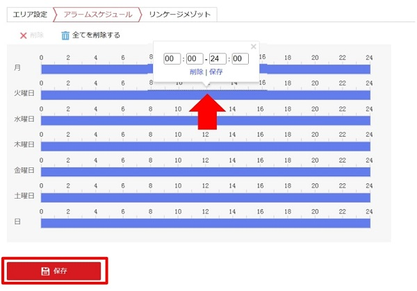
3. 顔キャプチャした際に作動させるリンク動作を設定します。
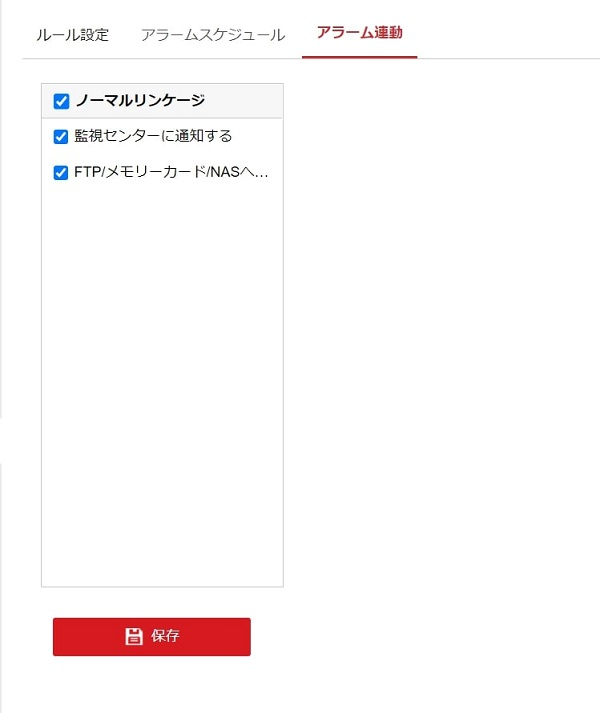

### 5. 検出結果を表示する（Webビューア）
1. Smart Displayに移動します。
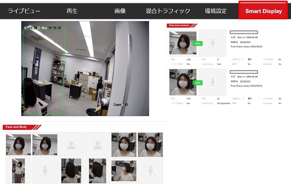
2. 「Real-time Analyze」でそれぞれターゲットの細かな属性を確認できます。
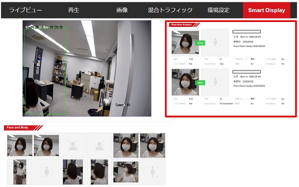
3. 「Face and Body」内の画像をクリックすると、より細かな情報が見られます。
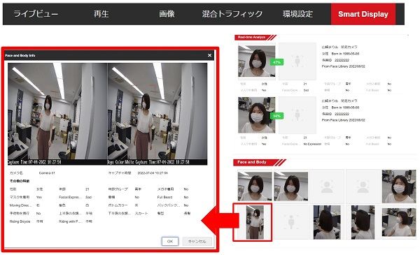

**アイゼックの主要カメラ一覧はこちら▼**
- [【AI機能で高精度なモーション検知, 夜間でもカラー映像】「AIカメラ製品ページ」](https://isecj.jp/camera/ilc-4m79)
- [【WiFi接続で省配線接続, レコーダーいらずの監視システム】「wifiカメラ製品ページ」](https://isecj.jp/camera/dlc-176-wifi)
- [【マイク付きで音声もクリアに録音】「IPカメラ（集音マイクつき）製品ページ(近日公開)」]()
- [【高性能かつ低価格, 夜間でもカラー映像】「アナログカメラ 製品ページ(近日公開)」]()