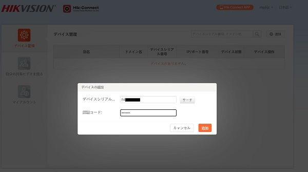

# P2P接続でのカメラ映像閲覧方法

アイゼックのカメラ映像はPC・スマホのアプリと連携することで、PCやスマホで遠隔から監視を行うことができます。
今回はそんな遠隔監視アプリとカメラの接続方法について紹介します。

[[toc]]

## STEP 1 Hik-Connectの接続を有効化する

1. カメラにアクセスし、プラットフォームアクセスの「有効」にチェックが入っているか確認をします。

2. SDAPツールを開き、接続したいカメラにチェックを入れ、ネットワークパラメータの「Enable Hik Connect 」にチェックを入れます。

3.  この先のカメラ接続で使う認証コードを設定します。（後ほど使いますのでメモをしておくことをお勧めいたします）

管理者パスワードを入力し、Modifyをクリックして設定を保存します。

## STEP 2 カメラのシリアルナンバーを確認

1. SDAPツールを開き、Exportをクリックします。

2. ファイル名と保存先を指定して、Confirmをクリックします。

3. 保存したエクセルファイルを開きます。

4. カメラのシリアルナンバーを確認します。下９桁がシリアルナンバーです。 メモ等に覚え書きをしておくことをお勧めします。

## STEP3 PCアプリへの接続

1. PCアプリを開きます。（https://www.hik-connect.com/）
 ▼ログインまたは登録を行います。
 

デバイスの追加を行なっていきます。

2. Addをクリックします。

3. 先ほど確認したシリアル番号を記入します。

4. 認証コードを記入します。

デバイスがPCアプリに追加されました。

## STEP4 携帯用アプリへの接続
携帯用アプリにも接続していきます。
1. 右上の「Hik-Connect APP」をクリックします。

2. 表示されたQRコードをスマホ等で読み取ります。（カメラアプリでQRコードを読むことができます。）

3. 携帯アプリをダウンロードします。（本画像はandroidとなっています。iPhoneで読み取った場合はApple Storeのページに移動します。）

4. 国・地域の設定を行い、Hik-Connectのアカウントでログインします。

5. 先ほどPCアプリで接続したカメラが携帯でも表示されています。

6. デバイス名をクリックし、SDAPツールで設定した認証コードを記入します。

7. 接続が完了し、携帯から映像が確認できるようになりました。

