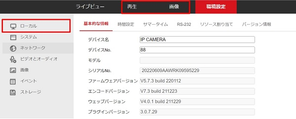

# プラグインのダウンロード

[[toc]]

## はじめに

初期の状態では、タブやナビゲーションバーに表示される機能項目が制限されています。　各機能を滞りなく設定できるよう、プラグインのダウンロードをお勧めしています。

## プラグインを実行する

1. Webビューアにログインします。

2. 上部のタブから「プラグインのダウンロード」をクリックします。

3. ダウンロードされたexeファイルをクリックし、実行を選択します。

4. 自動的に再起動が行われますので、再起動後ログインをします。

5. 以上でプラグインの実行は完了です。

**アイゼックの主要カメラ一覧はこちら▼**
- [【AI機能で高精度なモーション検知, 夜間でもカラー映像】「AIカメラ製品ページ」](https://isecj.jp/camera/ilc-4m79)
- [【WiFi接続で省配線接続, レコーダーいらずの監視システム】「wifiカメラ製品ページ」](https://isecj.jp/camera/dlc-176-wifi)
- [【マイク付きで音声もクリアに録音】「IPカメラ（集音マイクつき）製品ページ(近日公開)」]()
- [【高性能かつ低価格, 夜間でもカラー映像】「アナログカメラ 製品ページ(近日公開)」]()