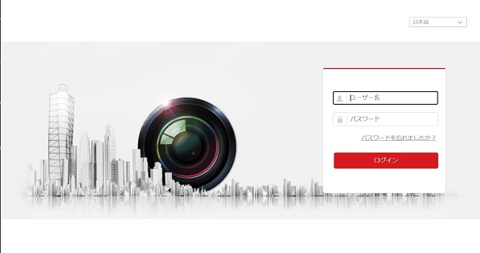

# 行列管理

[[toc]]

## 行列管理とは
列に並んでいる人の数と各人の待ち時間を表示する機能です。

## 設定手順

### 1. リソースを割り当てる
1. Webビューアにログインし、環境設定＞システム＞リソース割り当てと移動します。

2. 「行列管理」を選択し、「保存」をクリックして実行します。

3. 自動的に再起動されますので、再起動後再度ログインを行います。

### 2. エリアを指定し、ルールを設定
1. 環境設定＞行列管理に移動します。
2. 「範囲内人物行列形成」「待機時間検知」「リアルタイムデータアップロード」をそれぞれ有効化します。

3. 範囲の追加をクリックし、画面上に検知エリアを描写します。
    ライブ画面上でクリックして指定したいエリアの4頂点を指定し、右クリックで描画を完了します。
    
4. 行列と待機時間のルールを設定します。
- 範囲内行列形成設定：エリア内の行列を認識するための条件を設定します。
- アラームしきい値「０」：０人より多い（１人以上）並んだ時に行列と認識するという意味
- 待機時間検知設定：待機時間を検知するための条件を設定します。
- アラームしきい値「５」：５秒以上人が待機すると待機時間としてカウントするという意味
  
5. 「保存」をクリックし、設定を確定します。

### 3. スケジュール・検知時の動作を決める
1. 行列管理を有効にするスケジュールを設定します。バーをクリックすると、時間を指定できます。

2. 行列・待ち時間を検知した際に作動させるリンク動作を設定します。

### 4. 検知結果の表示
-  Webビューア上(リンケージメソッドで監視センターへの通知をONにした場合)
    ライブビューでリアルタイムで監視ができます。
    並んでいる人の人数や待ち時間の表示ができます。
 

-  iVMSアプリ上(リンケージメソッドで監視センターへの通知をONにした場合)
   iVMSアプリを開き、一般アプリケーション＞システムイベントよりリアルタイムの検出結果が見られます。
   キャプチャした画像はダウンロードおよびメール送信が可能です。
 

-  通知メール(リンケージメソッドでメール送信を選択した場合)
    エリア検知した旨のメールが届きます。メールには検知した日時やカメラ情報の他、カウントした人数、ライブ映像のキャプチャ画像が確認できます。
 

**アイゼックの主要カメラ一覧はこちら▼**
- [【AI機能で高精度なモーション検知, 夜間でもカラー映像】「AIカメラ製品ページ」](https://isecj.jp/camera/ilc-4m79)
- [【WiFi接続で省配線接続, レコーダーいらずの監視システム】「wifiカメラ製品ページ」](https://isecj.jp/camera/dlc-176-wifi)
- [【マイク付きで音声もクリアに録音】「IPカメラ（集音マイクつき）製品ページ(近日公開)」]()
- [【高性能かつ低価格, 夜間でもカラー映像】「アナログカメラ 製品ページ(近日公開)」]()