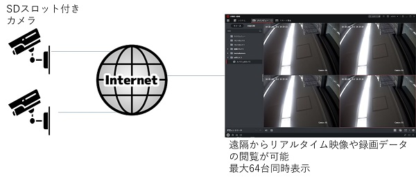
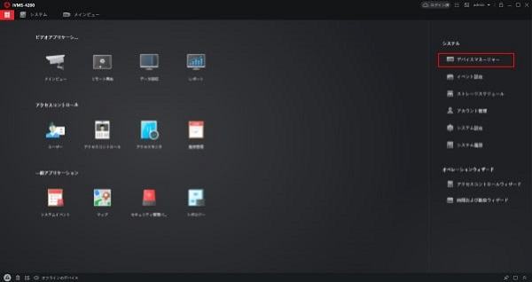
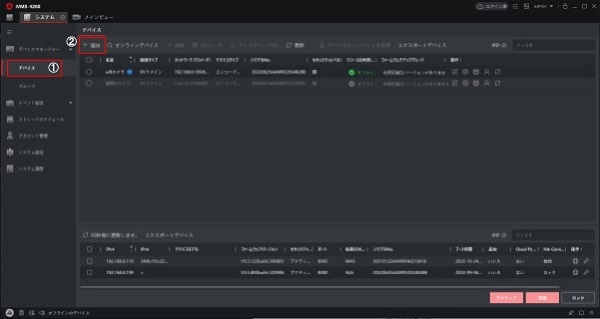
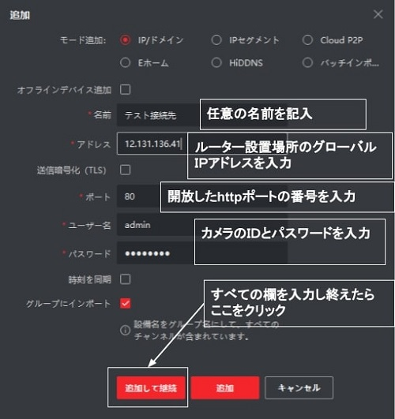
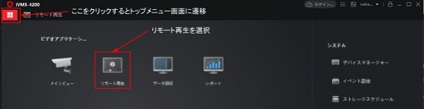
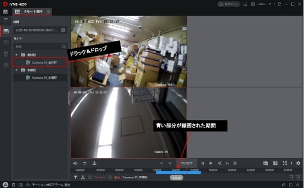

# SDカメラの映像を遠隔で管理、録画映像を閲覧する方法

DLC-176-wifi、TDC-126-wifi、ILC-4M79、IDC-4M138、IDC-127withmicの初期からSDスロットの付いているカメラは、インターネット経由で遠隔監視やSDスロット内の録画データ閲覧、バックアップの取得が可能です。今回は遠隔監視の手順について紹介します。

[[toc]]

### １）カメラを遠隔接続する為、ルーター設定を行う。
本稿ではIpv4回線でポート開放を行い接続する方法を解説します。
　　
       Ipv6で接続する場合、ルータのフィルタリング設定を実施します。
[詳細はこちら：ipv6でカメラを遠隔接続する方法](./camera-ipv6-setup.html)　

[p2pで接続する場合はこちら](./camera-p2p-connect.html)　

### ２）IPカメラのポート開放を行う
IPカメラが設置されている場所にあるルーターで
httpポート（標準80)
rtspポート（標準554)
を開放します。

更にルーター設置場所のグローバルIPアドレスをメモしておきます。
（設置場所の回線のアドレスは定期的に変わるので①固定IPオプションに加入するか、②DDNSサービスに加入する必要があります）

Ipv6かp2pで接続する際はサービスへの加入は不要です。

### ３）iVMS-4200のインストール

遠隔監視場所のPCにソフトウェアiVMS-4200をインストールし、ソフトを立ち上げデバイスマネージャーをクリックします。
※MacPCをご利用のお客様はUIが若干異なります。

### ４）デバイスを追加

左メニューよりデバイスマネージャー⇒①デバイスを選択肢、②追加をクリックします。

ポップアップが表示されるので
名前：任意の名前を記入
- アドレス：2）にて調べたルータ設置場所のグローバルＩＰアドレスを入力
- ポート：2)にて開放したhttpポート（標準は80)を入力
- ユーザー名：カメラＩＤ(標準はadmin)を入力
- パスワード：カメラパスワードを入力
各項目を記入したら追加して接続を押します。

### ５）映像を閲覧する

上部メニューでトップメニュー画面に戻り、リモート再生を選択します。

左側にカメラ名が表示されているので右画面にドラック＆ドロップすると、SD録画した映像を閲覧できます。

