# Wifiカメラのセットアップ手順

今回はWifiカメラの接続方法についてご紹介いたします。一度接続が完了したら、次回以降同じwifi環境下であればパソコンやスマホから簡単に映像を監視、そしてカメラの設定を行うことができます

用意するもの：有線LANケーブル（初回のみ必要）
- 電源ケーブル（付属）
- カメラ（付属）
- パソコン
- ルーター本体
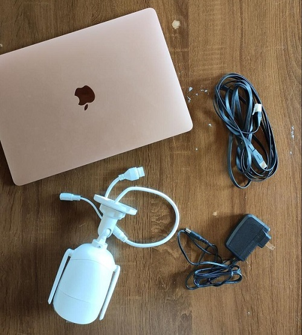
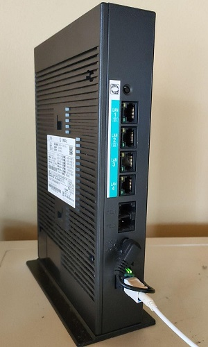

## 手順

### Step1 カメラ側：電源とWifiを繋げる

1. 電源コードをさして、カメラと繋げます
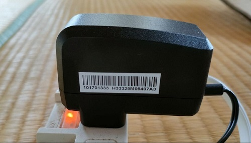
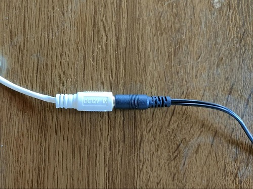
2. ルーターとカメラをLANケーブルで繋ぎます。（初回のみこの作業が必要となります）
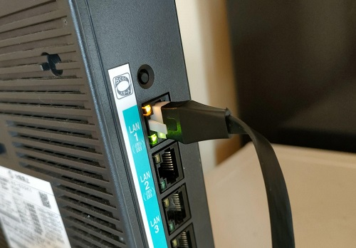
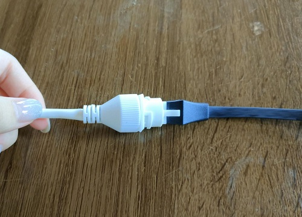

### Step2 パソコン側：SDAPツールをダウンロードする

1. 以下のURLからアプリをダウンロードします。
- [Windowsの方](https://www.hikvision.com/jp/support/tools/hitools/clea8b3e4ea7da90a9/)
- [Macの方](https://www.hikvision.com/jp/support/tools/hitools/cl3620e9fb51dfac31/)
2. ダウンロードが完了したら、アプリを開きます。（Macの方：アプリが開けない際は[こちら](https://support.apple.com/ja-jp/guide/mac-help/mh40616/mac)のサイトを参考にしてください。）
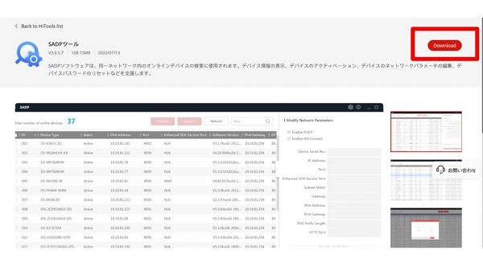
3. IPアドレスを確認する
一覧に、先ほど接続したカメラの情報が出てくるので、IPv4 Adressを確認します。本例：「192.168.1.71」
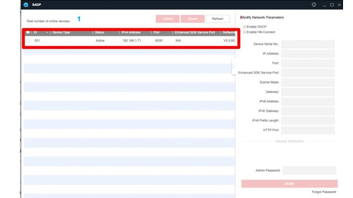

### Step3 ：パソコン側：Webブラウザーにログインする
1. 先ほど確認したIPアドレスを検索窓に打ち込み、検索します。
▼すると、以下の画面に移動します。
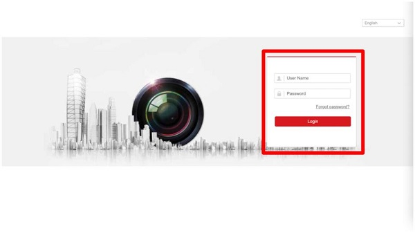

2. UserName：「admin」
   PassWord：（本体に付属している簡易マニュアルで確認ください。不明な場合は弊社にお問い合わせください。）
   をいれ、ログインします。
  

### Step4 ：パソコン側：WIfiを有効にする
1. 「Configuration(設定)」→「Network(ネットワーク)」→「Advanced Settings(詳細設定)」に移動します。
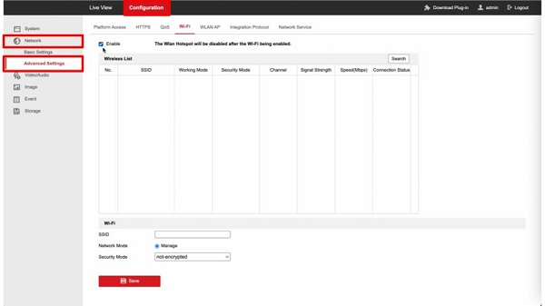
    WIfiメニューを選択、「Enable（有効）」をチェックし「Save（保存）」で設定を保存します。
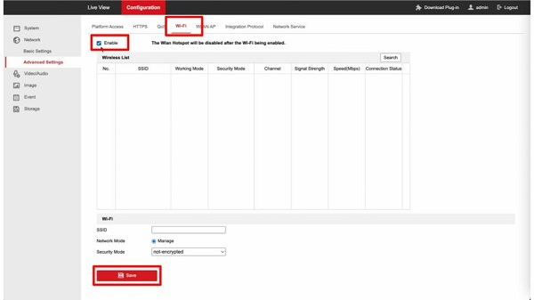

2. 「Search（検索）」をクリックすると、接続可能なWifiの一覧が表示されます。
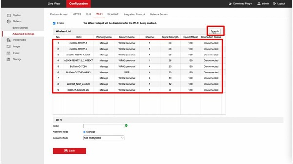
    カメラを接続したWifiを選択し、Key1にWifiのパスワードを入れて、「Save」で設定を保存します。
    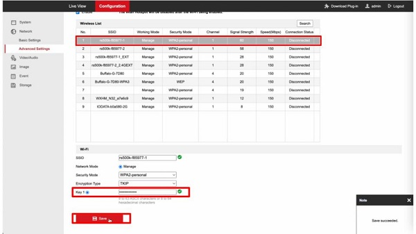

3. もう一度「Search（検索）」をクリックし、先ほど選択したWifiが接続されている事を確認します。
 接続されている場合、「Connected(接続ずみ)」と表示されます。
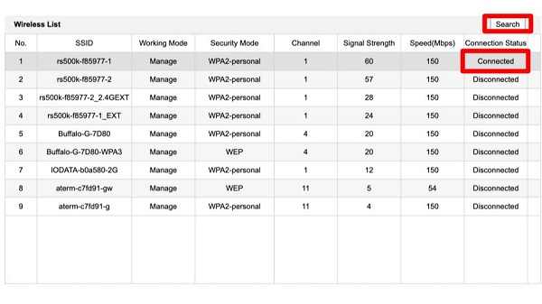
   以上でWIfiカメラの接続は完了です。

**アイゼックの主要カメラ一覧はこちら▼**
- [【AI機能で高精度なモーション検知, 夜間でもカラー映像】「AIカメラ製品ページ」](https://isecj.jp/camera/ilc-4m79)
- [【WiFi接続で省配線接続, レコーダーいらずの監視システム】「wifiカメラ製品ページ」](https://isecj.jp/camera/dlc-176-wifi)
- [【マイク付きで音声もクリアに録音】「IPカメラ（集音マイクつき）製品ページ(近日公開)」]()
- [【高性能かつ低価格, 夜間でもカラー映像】「アナログカメラ 製品ページ(近日公開)」]()