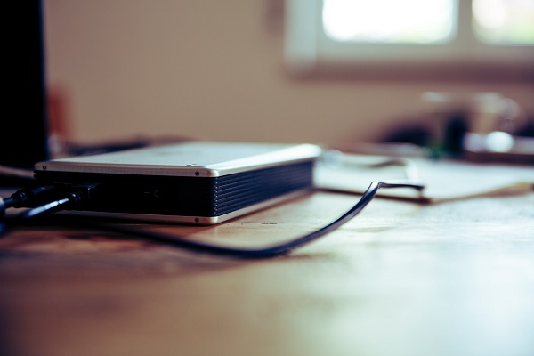

# 録画バックアップの種類と特徴

## はじめに

アイゼックのレコーダーはバックアップ方法が３種類あります。ローカル上、ネットワーク上など必要に合わせて最適なバックアップ方法を選択していきましょう。

[[toc]]

## バックアップの種類

バックアップ方法は、
- USBをでのバックアップ
- 外付けHDDでのバックアップ
- UMSクライアントでのバックアップ
の３つです。

## それぞれの特徴

- USBでのバックアップ：レコーダー本体に取り付けて、録画映像をUSBにバックアップすることができます。USBを用いる場合は[「FAT３２」にフォーマットされているものを使用する](./backup03-usb.html)必要があります。一度にバックアップ可能な録画データは１時間です。

- 外付けHDDでのバックアップ：レコーダー本体に取り付けることで、HDDに録画映像をバックアップすることができます。外付けHDDを用いる場合は [「FAT３２」にフォーマットする](./backup02-hdd.html)必要があります。一度にバックアップ可能な録画データは24時間です。

- UMSクライアントでのバックアップ：専用ソフトUMSクライアントを使用してネットワーク経由でPCにバックアップすることができます。1度に24時間分のデータをバックアップする事が可能です。

## バックアップ方法

バックアップの方法は以下の記事を参考にしてください。

- [外付けHDDのフォーマット](./backup02-hdd.html)
- [USBのフォーマット](./backup03-usb.html)
- [USBメモリ・外付けHDDでのバックアップ](./backup04-hdd-usb.html)
- [UMSクライアントでのバックアップ](./backup05-ums.html)

**アイゼック最新のレコーダーはこちら▼**
- [【16ch同時再生, 4K対応機種】ANEモデル 製品ページ](https://isecj.jp/recorder/recorder-ane)

**レコーダーの導入事例を確認する▼**
- [多機能なデジタルレコーダーを使った導入事例](https://isecj.jp/case/security-enhancement)
- [マルチクライアントソフトの導入事例](https://isecj.jp/case/netcafe-camera)
- [レコーダー・センサー・警報機を連携した独自システムの構築事例](https://isecj.jp/case/system-design)