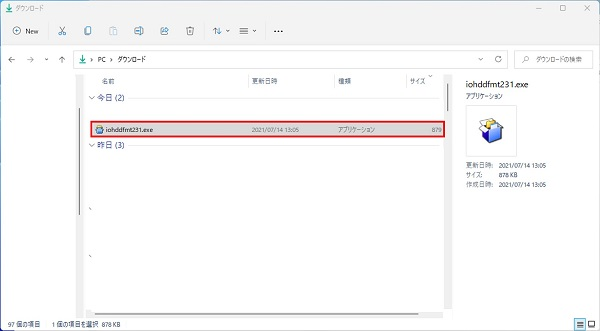
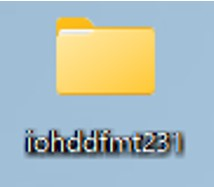
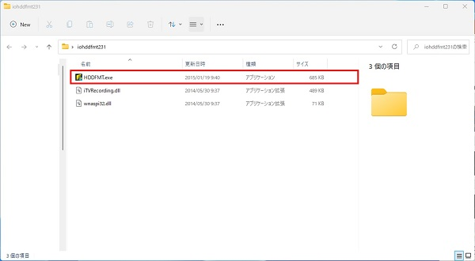
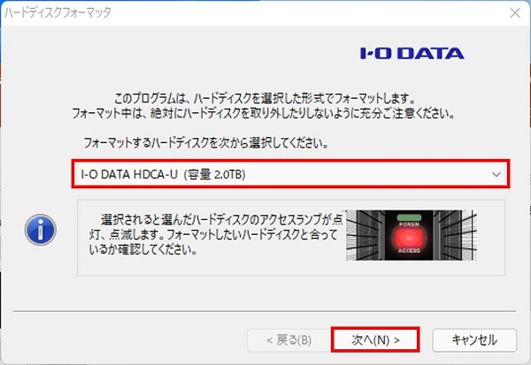
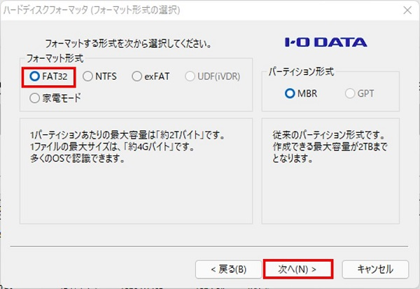
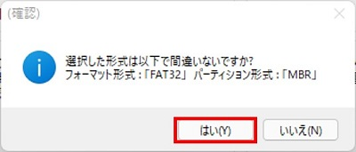
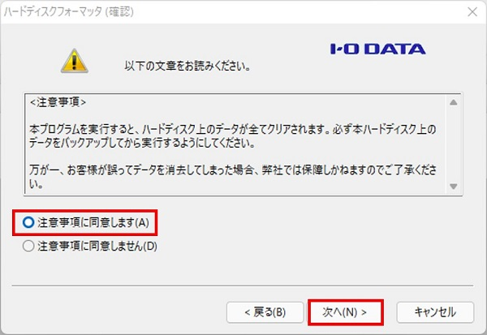
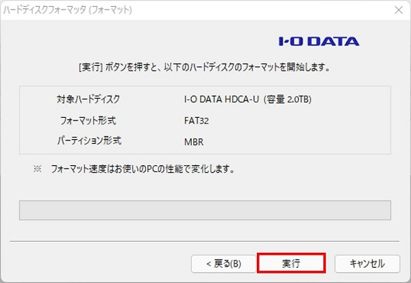

# 外付けHDDのフォーマット

[[toc]]

## はじめに

レコーダーはFAT32でフォーマットされたUSBメモリまたは外付けHDDに対応しています。

市販されているUSBメモリの多くはFAT32でフォーマットされているため、そのままレコーダーに繋いで使用できますが、HDDはフォーマットが必要です。

以下の手順に従ってHDDをフォーマットしてください。

## フォーマット手順

外付けHDDをPCに繋ぎます。

Windowsの標準機能ではFAT32にフォーマットできないので[I-O DATA ハードディスクフォーマッタ](https://www.iodata.jp/lib/product/i/2107.htm)を使用します。

下記リンクからソフトをダウンロードします。

[ダウンロード](https://www.iodata.jp/lib/product/i/2107.htm)

ダウンロードフォルダを開き、ダウンロードしたEXEファイルを実行します。

EXEファイルを実行するとデスクトップ画面にファイルが作成されます。

そのファイルの中のHDDFMT.exeを実行します。

フォーマットするHDDを選択し、次へをクリックします。

FAT32を選択し、次へをクリックします。

はいをクリックします。

注意事項に同意し、次へをクリックします。

実行をクリックします。

フォーマット完了後、完了をクリックします。

これでHDDのフォーマットは完了です。

**アイゼック最新のレコーダーはこちら▼**
- [【16ch同時再生, 4K対応機種】ANEモデル 製品ページ](https://isecj.jp/recorder/recorder-ane)

**レコーダーの導入事例を確認する▼**
- [多機能なデジタルレコーダーを使った導入事例](https://isecj.jp/case/security-enhancement)
- [マルチクライアントソフトの導入事例](https://isecj.jp/case/netcafe-camera)
- [レコーダー・センサー・警報機を連携した独自システムの構築事例](https://isecj.jp/case/system-design)