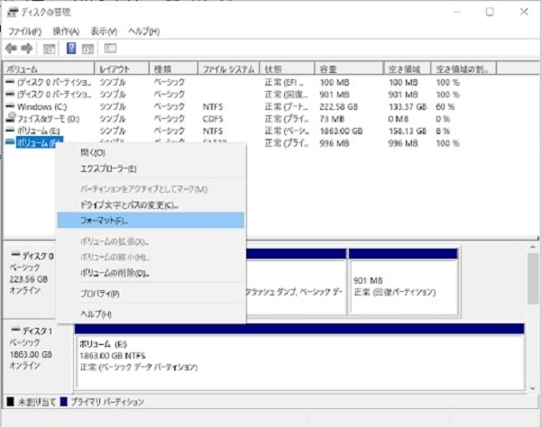
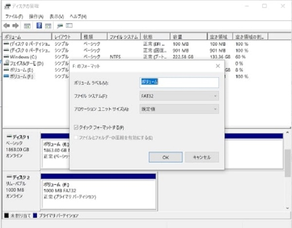
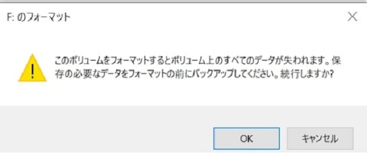

# USBのフォーマット方法
USBがうまく読み込めないときはフォーマットをする必要があります。
そこで今回はwindowsPCでのＵＳＢのフォーマット方法を解説します。

注意！
32ギガ以上のＵＳＢはフォーマットできません。
フォーマットするとデータが初期化されるため、必要なデータはあらかじめバックアップをしてください。

## 使うもの
- windows PC
- USB

## フォーマット手順
1. Ｗindows ＰＣにＵＳＢメモリを接続します

2. Windowsの検索窓に「ディスクの管理」と検索、出てきたコントロールパネルを開きます。

3. 該当のUSBファイルを右クリックし、「フォーマット（F）」を選択します。

4. ファイルシステムを「FAT３２」に設定し、OKをクリックします。

5. 注意書きがされるのでここで「OK」をクリックします。（バックアップしたいデータがある方はOKを押す前にバックアップを！）

以上でUSBのフォーマットは完了です。指定のUSBのファイルシステムが「FAT32」になっているか確かめましょう。

**アイゼック最新のレコーダーはこちら▼**
- [【16ch同時再生, 4K対応機種】ANEモデル 製品ページ](https://isecj.jp/recorder/recorder-ane)

**レコーダーの導入事例を確認する▼**
- [多機能なデジタルレコーダーを使った導入事例](https://isecj.jp/case/security-enhancement)
- [マルチクライアントソフトの導入事例](https://isecj.jp/case/netcafe-camera)
- [レコーダー・センサー・警報機を連携した独自システムの構築事例](https://isecj.jp/case/system-design)
