# USBメモリ・外付けHDDでのバックアップ

[[toc]]

## はじめに

録画した映像はレコーダーのUSBポートにUSBメモリや外付けHDDを繋げることでバックアップできます。

外付けHDDで保存する場合は外付けHDDをFAT32でフォーマットする必要があります。

フォーマット方法は[こちらの記事](./backup02-hdd.html)を参考にしてください。

## 静止画・動画のバックアップ

USBメモリまたは外付けHDDをフロントパネルまたはバックパネルのUSBポートに接続します。

検索画面を開きます。

- マウスの場合：右クリックして検索を開きます。
- リモコンの場合：SEARCHボタンを押します。

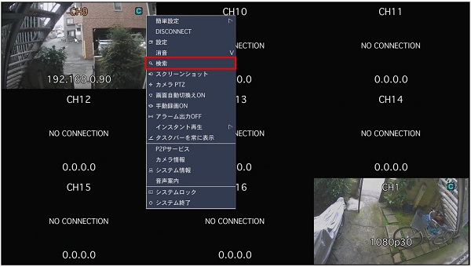

タイムライン検索を選択し、次へをクリックします。

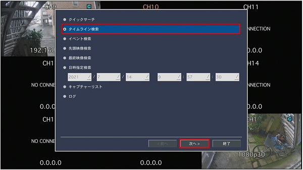

日付を選択し、次へをクリックします。

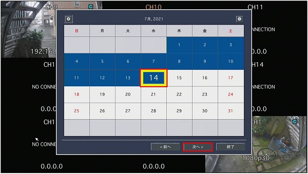

赤いシークバーを移動させ、時間帯を選択します。

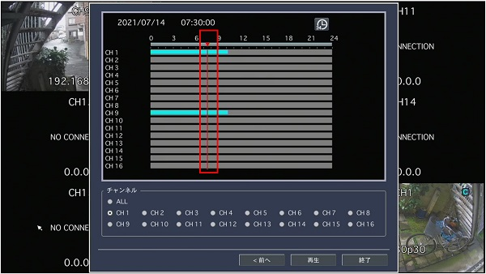

時間帯を細かく指定する場合は右上の時計アイコンをクリックします。

時計アイコンをクリックするとシークバーを15秒単位で移動できます。

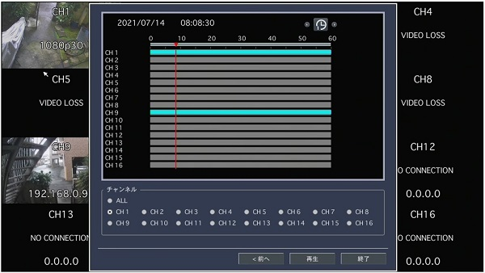

シークバーの移動が完了したら再生するチャンネルを選択し、再生をクリックします。

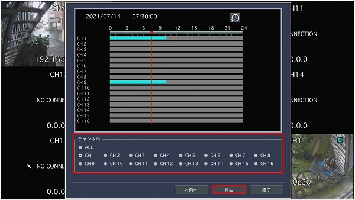

バックアップボタンを押します。

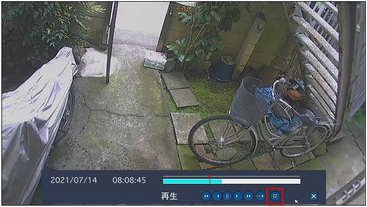

保存する形式を選択し、次へをクリックします。

画像を保存する場合は静止画、動画を保存する場合はAVIを選択してください。

- 静止画：BMPファイルを保存します。
- NSF：専用の動画再生ソフトとH.264形式の動画ファイルを保存します。
- AVI：AVI形式の動画ファイルを保存します。
- EXE：EXE形式で動画を保存します。

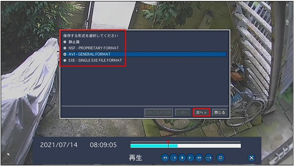

USBメモリーを選択し、次へをクリックします。

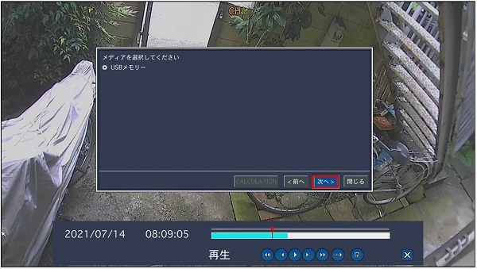

開始時刻と長さを指定し、開始をクリックします。

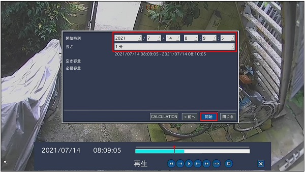

書き出しが完了したら閉じるをクリックします。これでバックアップは完了です。

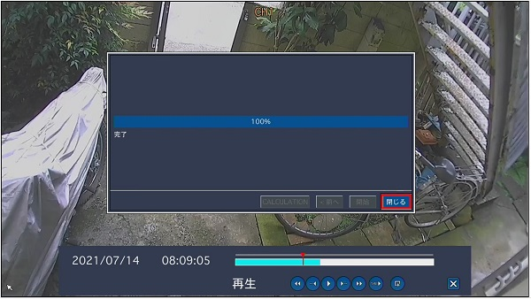

## 1時間を超える動画のバックアップ

1時間以上の動画をバックアップする場合はNSF形式でバックアップしてください。

**※大容量バックアップ中は検索や再生の操作は行えません。**

NSF形式を選択して、次へをクリックします。

外付けHDD（大容量バックアップ）を選択して、次へをクリックします。

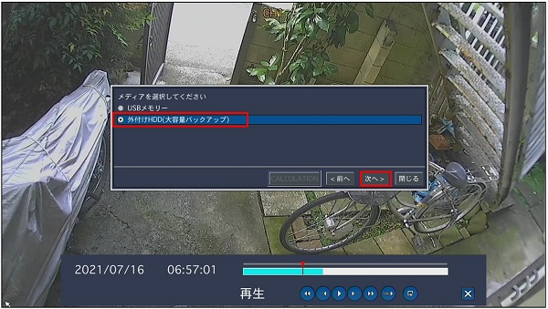

開始時刻と長さ（1～24時間）を選択して、次へをクリックします。

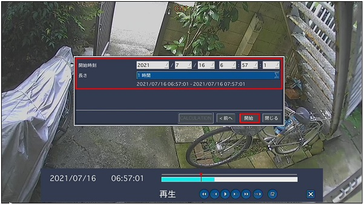

バックアップが開始されます。バックアップの進捗状況を確認する場合は右下のアイコンをクリックします。

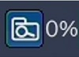

進捗状況が表示されます。画面を閉じる場合はOKをクリックしてください。

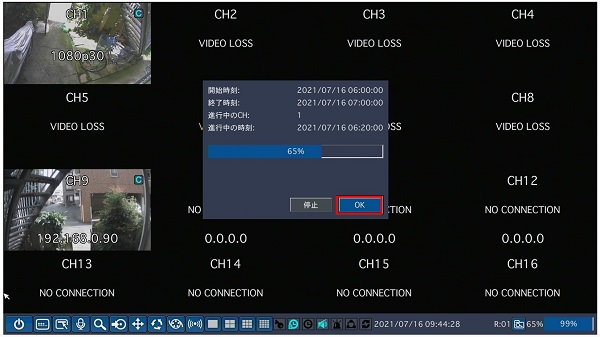

## バックアップした静止画・動画の見方

バックアップした静止画・動画はPCで確認できます。

バックアップに使用したUSBメモリや外付けHDDには日付ごとにフォルダが作成されています。

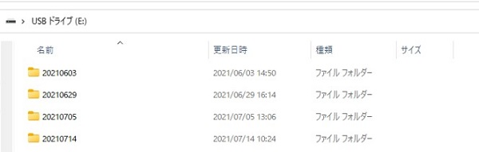

日付フォルダに静止画・動画が格納されています。

BMPファイルは静止画です。

時分秒で表記されたフォルダには動画（AVIファイルが格納されています。）

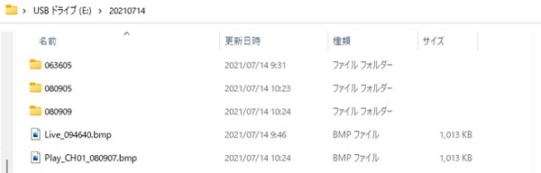

## 大容量バックアップファイルの見方

大容量バックアップファイルを作成した場合、USBメモリや外付けHDDにDvrPlayerとHYBRIDというフォルダが作成されます。

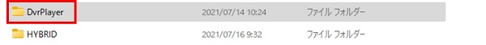

DvrPlayerフォルダには再生ソフトHDPlayer.exeが格納されています。

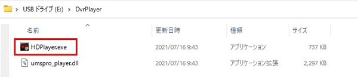

映像を見る場合はHDPlayer.exeを起動して、右下のフォルダアイコンをクリックします。

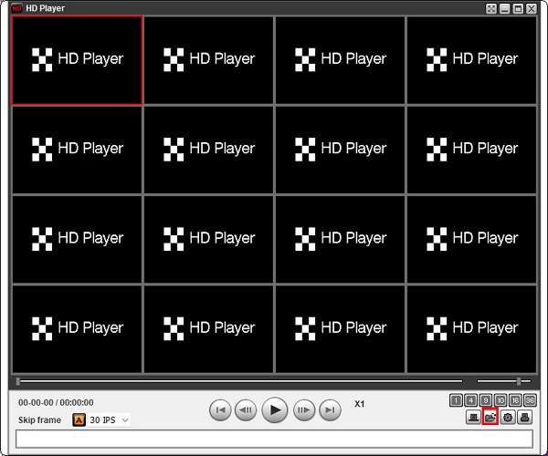

HYBRIDフォルダ＞日付フォルダ＞時分フォルダを選択して、OKをクリックします。

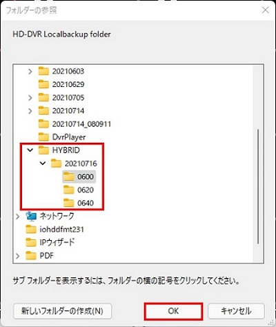

映像が再生されます。

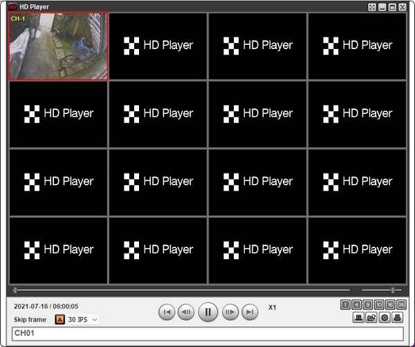

**アイゼック最新のレコーダーはこちら▼**
- [【16ch同時再生, 4K対応機種】ANEモデル 製品ページ](https://isecj.jp/recorder/recorder-ane)

**レコーダーの導入事例を確認する▼**
- [多機能なデジタルレコーダーを使った導入事例](https://isecj.jp/case/security-enhancement)
- [マルチクライアントソフトの導入事例](https://isecj.jp/case/netcafe-camera)
- [レコーダー・センサー・警報機を連携した独自システムの構築事例](https://isecj.jp/case/system-design)
