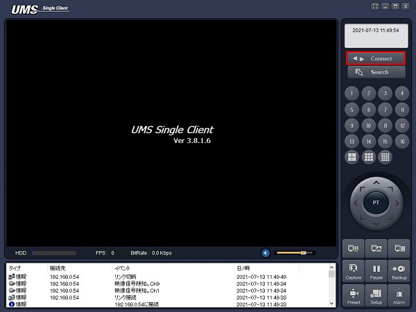
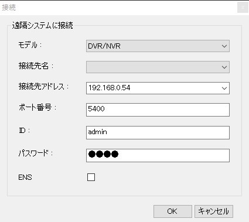
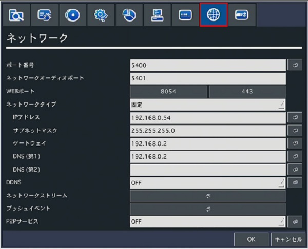
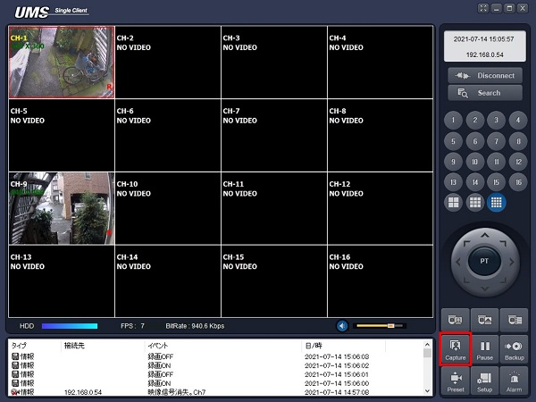
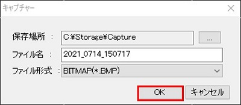
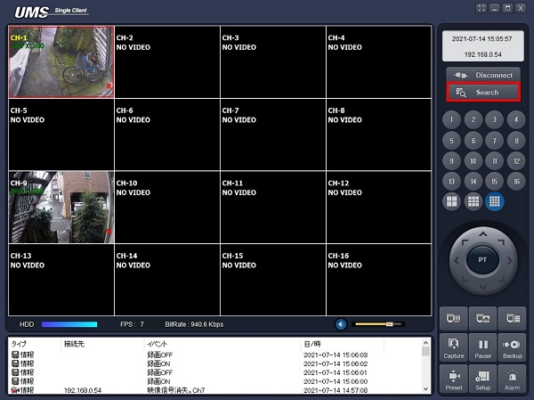
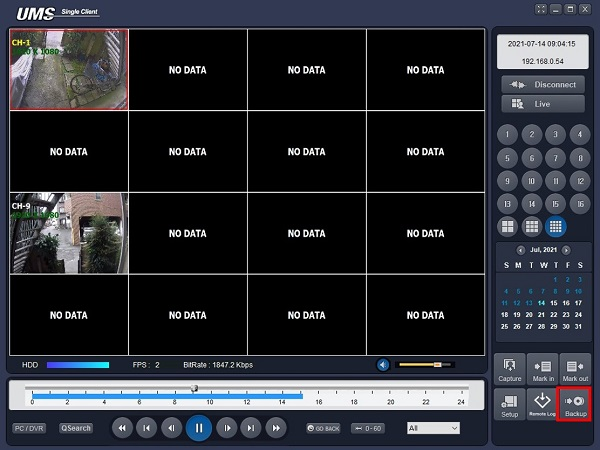
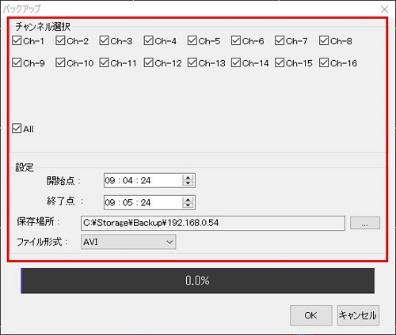
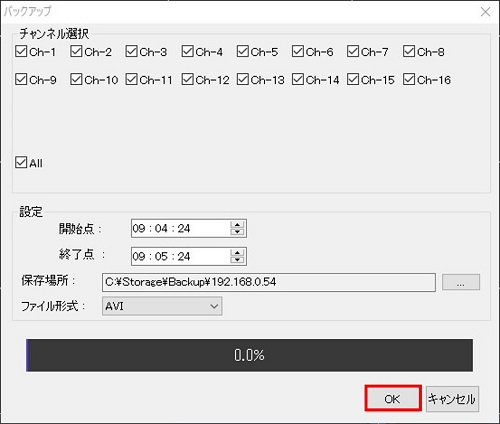

# UMSクライアントでのバックアップ

[[toc]]

## レコーダーをUMSクライアントに接続する

録画の確認にはUMSクライアントが必要です。

UMSクライアントを立ち上げ、Connectをクリックします。

接続設定を入力し、OKをクリックします。

- モデル：DVR/NVRを選択します。
- 接続先名：使用しません。
- 接続先アドレス：レコーダーのIPアドレスを入力します。
- ポート番号：レコーダーのポート番号を入力します。
- ID：レコーダーのIDを入力します。初期値は「admin」です。
- パスワード：レコーダーに設定したパスワードを入力します。

レコーダーのIPアドレスとポート番号を知りたい場合は設定＞ネットワークから確認できます。

レコーダーとの接続が完了したら一覧画面が表示されます。

## スクリーンショットを保存する

### UMSのスクリーンショット機能を使う

スクリーンショットを保存する場合はCaptureボタンをクリックします。

保存ダイアログが表示されるので各種設定を入力し、OKをクリックします。

- 保存場所：ファイルを保存する場所を決めます。
- ファイル名：ファイル名を決めます。
- ファイル形式：BMPまたはJPGを選択します。

これでスクリーンショットが保存されます。

## 動画を保存する

Searchボタンをクリックし、Search画面に移ります。

Backupボタンをクリックします。

各種設定を入力します。

- チャンネル選択：保存するチャンネルにチェックを入れます。
- 開始点：録画の開始時刻です。
- 終了点：録画の終了時刻です。
- 保存場所：ファイルを保存する場所を決めます。
- ファイル形式：AVIを選択します。

設定の入力が完了したらOKをクリックします。

これで動画の保存は完了です。

**アイゼック最新のレコーダーはこちら▼**
- [【16ch同時再生, 4K対応機種】ANEモデル 製品ページ](https://isecj.jp/recorder/recorder-ane)

**レコーダーの導入事例を確認する▼**
- [多機能なデジタルレコーダーを使った導入事例](https://isecj.jp/case/security-enhancement)
- [マルチクライアントソフトの導入事例](https://isecj.jp/case/netcafe-camera)
- [レコーダー・センサー・警報機を連携した独自システムの構築事例](https://isecj.jp/case/system-design)