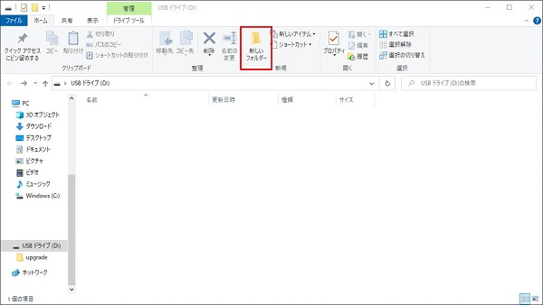
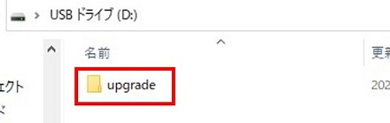
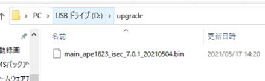
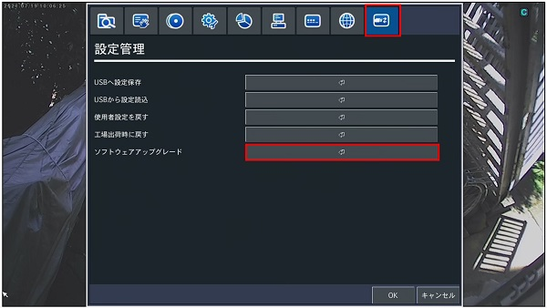
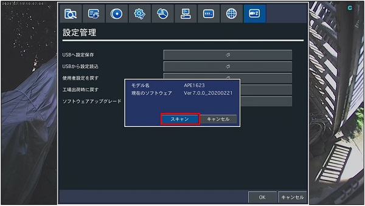
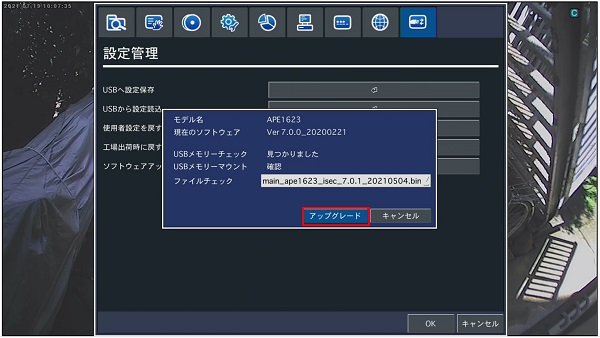
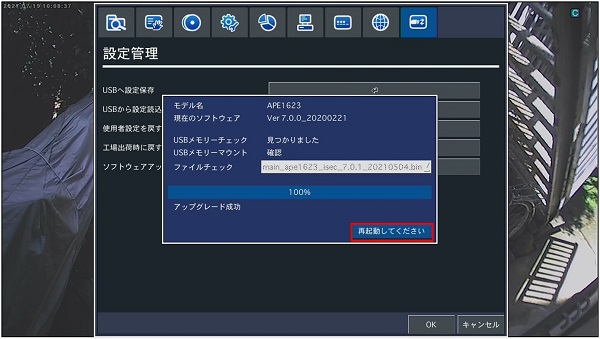
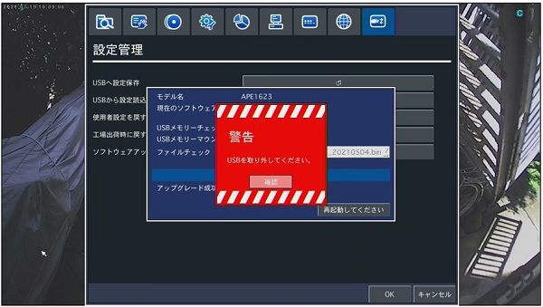

# ファームウェアアップデート手順

[[toc]]

## PCでの操作

PCにUSBメモリを接続します。

USBメモリの直下に新規フォルダを作成します。

新規フォルダの名前を「upgrade」に変更します。

「upgrade」にファームウェアを入れます。

USBメモリをPCから外します。

## レコーダーでの操作

USBメモリをレコーダーに接続します。

設定＞設定管理から「ソフトウェアアップデート」をクリックします。

「スキャン」をクリックします。

「アップグレード」をクリックします。

USBメモリを外した状態で「再起動してください」をクリックします。

レコーダーが再起動し、アップデートが完了します。

※USBメモリをつけたまま、「再起動してください」をクリックした場合、警告メッセージが表示されます。

**アイゼック最新のレコーダーはこちら▼**
- [【16ch同時再生, 4K対応機種】ANEモデル 製品ページ](https://isecj.jp/recorder/recorder-ane)

**レコーダーの導入事例を確認する▼**
- [多機能なデジタルレコーダーを使った導入事例](https://isecj.jp/case/security-enhancement)
- [マルチクライアントソフトの導入事例](https://isecj.jp/case/netcafe-camera)
- [レコーダー・センサー・警報機を連携した独自システムの構築事例](https://isecj.jp/case/system-design)