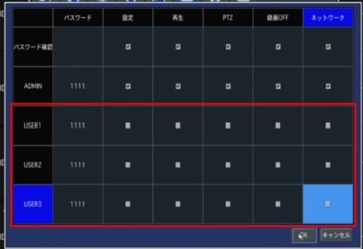

# パスワード変更手順

[[toc]]

レコーダーのパスワードを変更する場合は以下の手順に従ってください。

## レコーダーでの操作

①画面上で右クリックをするとメニューが出てくるので設定を選択（下図赤枠）

②IDとパスワードの画面がでるので入力します。

③設定画面がでてくるので上段メニューからセキュリティを選びます。（赤枠部）

④使用者権限をクリックします。

⑤赤枠で囲んだチェックを全て外します。チェックを外したらOKを押します。
（これでadmin以外のIDでは接続ができなくなります。）

⑥使用者パスワードを選択

⑦使用者パスワードを変更します。**（設定したパスワードは絶対忘れないで下さい）**

## PCでの操作

⑧UMSクライアントの設定
Setupをクリックします。

⑨「接続先」を選択します。

⑩右枠内に登録されているものを選択し、変更を押します。

⑪パスワードの欄に変更後のパスワードを入力します。

**アイゼック最新のレコーダーはこちら▼**
- [【16ch同時再生, 4K対応機種】ANEモデル 製品ページ](https://isecj.jp/recorder/recorder-ane)

**レコーダーの導入事例を確認する▼**
- [多機能なデジタルレコーダーを使った導入事例](https://isecj.jp/case/security-enhancement)
- [マルチクライアントソフトの導入事例](https://isecj.jp/case/netcafe-camera)
- [レコーダー・センサー・警報機を連携した独自システムの構築事例](https://isecj.jp/case/system-design)
