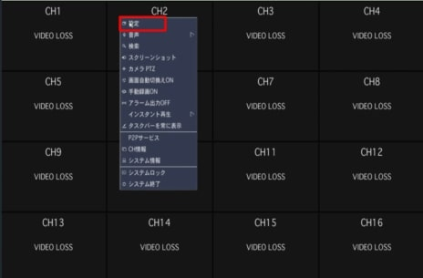
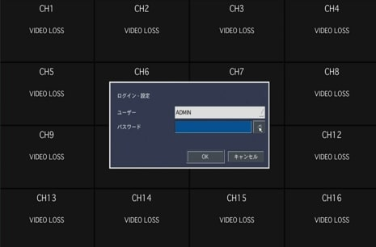
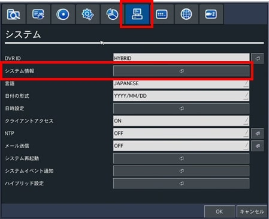
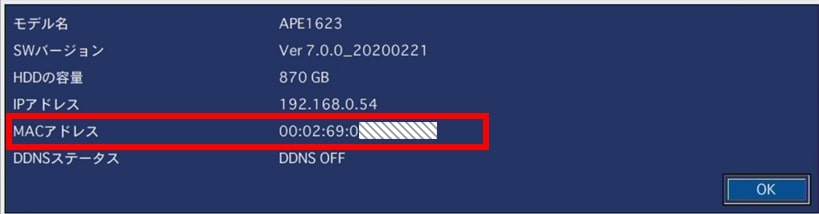

# レコーダーのシリアル番号の確認

[[toc]]

## レコーダーのシリアル番号の確認

①画面上で右クリックをするとメニューが出てくるので設定を選択（下図赤枠）

②IDとパスワードの画面がでるので入力します。

③設定画面がでてくるので上段メニューからシステムを選び、システム情報を選びます。

④ポップアップが表示されるのでMACアドレスをアイゼックへご連絡下さい。
また変更したいアドレス名（〇〇.bestddns.com)も一緒にご連絡お願いします。

⑤15分程度でアドレス名変更を行います。
変更完了したらアイゼックより連絡しますので、連絡がきたらレコーダーを再起動してください。

以上で完了です。

**アイゼック最新のレコーダーはこちら▼**
- [【16ch同時再生, 4K対応機種】ANEモデル 製品ページ](https://isecj.jp/recorder/recorder-ane)

**レコーダーの導入事例を確認する▼**
- [多機能なデジタルレコーダーを使った導入事例](https://isecj.jp/case/security-enhancement)
- [マルチクライアントソフトの導入事例](https://isecj.jp/case/netcafe-camera)
- [レコーダー・センサー・警報機を連携した独自システムの構築事例](https://isecj.jp/case/system-design)

