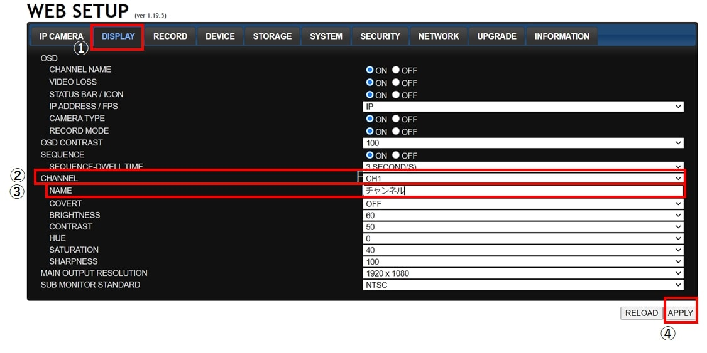

# チャンネル番号を日本語表記にしたい

[[toc]]

レコーダーの各チャンネル番号(通常左上に表示されるch1,ch2…)は任意の名前に変更する事ができます。
 レコーダー本体で変更する場合はローマ字表記で。
LANケーブルを介してPC経由で変更する場合、日本語で表記で表示名を変更ができます。
本記事ではPC経由でチャンネル番号を変更する手順をご紹介致します。

本記事ではレコーダーとPCを直接接続した場合の手順をご紹介します。
レコーダーがローカルネットに接続されていて、更にローカルネット内にUMSclientをインストールしたPCがある場合は手順の６）からで大丈夫です。

## PCでの操作

１）PCの左下のwindowsマークをおして、出てきたメニューから設定を選択します。

２）設定メニューの中からネットワークとインターネットを選択します。

３）左側のメニューから①イーサネットを選択します。次に右側の②ネットワークを選択します。

４）表示された画面の中間あたりにIP設定という項目があるので「編集ボタン」を押してIPアドレスを設定します。

５）編集画面が開いたら下記資料参考にIPアドレスやゲートウェイを設定します。

以上でPC側の設定は完了です。

**レコーダーの導入事例を確認する▼**

- [多機能なデジタルレコーダーを使った導入事例](https://isecj.jp/case/security-enhancement)
- [マルチクライアントソフトの導入事例](https://isecj.jp/case/netcafe-camera)
- [レコーダー・センサー・警報機を連携した独自システムの構築事例](https://isecj.jp/case/system-design)

## レコーダーでの操作

６）UMSclientを立ち上げ、レコーダーに接続します。
①Connectを選択し、立ち上がったポップアップの②に囲んだ箇所にレコーダーのIPアドレス、ポート番号、ID、パスワードを入力します。③入力が完了したらOKを押します。

７）レコーダーと接続したら画面上で右クリックを押して出てきたポップアップから「遠隔設定」を選択します。

８）ブラウザが立ち上がりIDとパスワード入力画面が表示されるのでIDとパスワードを入力します。

9)レコーダーの設定画面が表示されるので上段メニューから①「DISPLAY」を選択し表示された下段メニューの②で変更したいチャンネルを選択します。次に③のNAMEに任意の名前を入れます。最後に④のAPPLYを押します
（本例ではCH１の名前をチャンネルに変更しています）

10)上に下記のようなポップアップが表示されるのでOKを押します。

11)ブラウザ上に下記のタイムバーが表示されます。タイムバーの色が全て変わったら画面が自動的に遷移します。これでチャンネル名の変更が完了です。選択したチャンネルの名前が変わります。

**アイゼック最新のレコーダーはこちら▼**
- [【16ch同時再生, 4K対応機種】ANEモデル 製品ページ](https://isecj.jp/recorder/recorder-ane)

**レコーダーの導入事例を確認する▼**
- [多機能なデジタルレコーダーを使った導入事例](https://isecj.jp/case/security-enhancement)
- [マルチクライアントソフトの導入事例](https://isecj.jp/case/netcafe-camera)
- [レコーダー・センサー・警報機を連携した独自システムの構築事例](https://isecj.jp/case/system-design)

