# WindowsPCをNTPサーバーにする方法

[[toc]]

## PC側での操作

①Windowsマークを押して「Windows システムツール」⇒「ファイル名を指定して実行」を選択

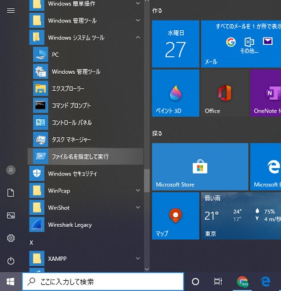

②「ファイル名を指定して実行」を選択し「regedit」と入力、「OK」をクリック

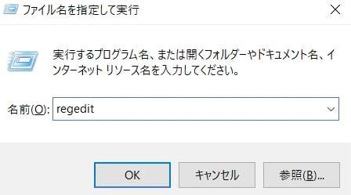

③HKEY_LOCAL_MACHINE\SYSTEM\CurrentControlSet\Services\W32Time\TimeProviders\NtpServerを選択し、
[Enabled]の項目を１へ変更し"OK"をクリック

（変更前）

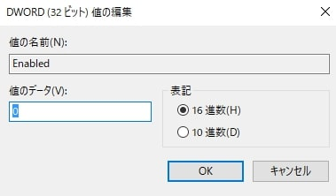

（変更後）

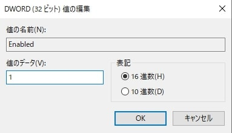

④[HKEY_LOCAL_MACHINE\SYSTEM\CurrentControlSet\Services\W32Time\Config] の [AnnounceFlags] を開き "5"へ変更しOKをクリック

変更前

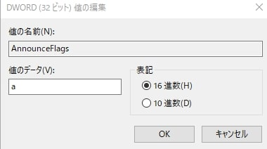

変更後

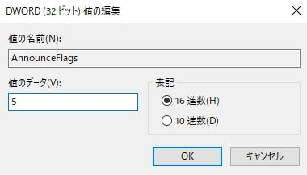

⑤regeditを閉じる。

⑥windowsの検索窓にcmdと入力

⑦検索結果にコマンドプロンプトが出てくるのでマウスで選択した状態で Ctrl + Shift + Enter で開くと管理者権限で実行できる。

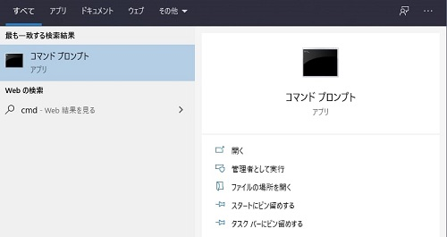

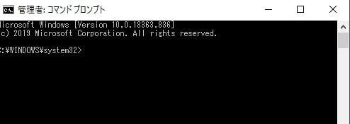

⑧net stop w32time と入力しEnter
NTPサーバが起動していない場合は以下のような表示がでる。

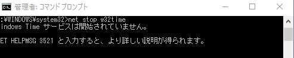

⑨net start w32time と入力しEnter
NTP サーバが起動する

以上でPCをNTPサーバーとして利用する準備が完了。

## レコーダーでの操作

 当社で実証した際のシステム図は下記の通り

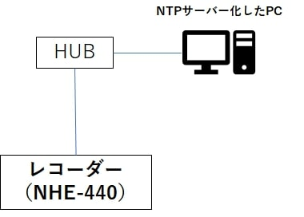

１）ネットワークの設定
①レコーダーのsetupボタンを押して設定画面を開き、ネットワークの項目を選択します。

②ネットワークの中のポート番号、IPアドレス、サブネットマスク、ゲートウェイを設定します。

設定するサブネットマスク、ゲートウェイはNTPサーバーとして利用するWindowsPCが繋がっているローカルネットワークの設定とあわせる必要があります。またIPアドレスについてもローカルネットワーク内で被らないように設定します。（設置場所の環境により設定は異なりますので、設置場所のネットワーク管理者の方に確認下さい）

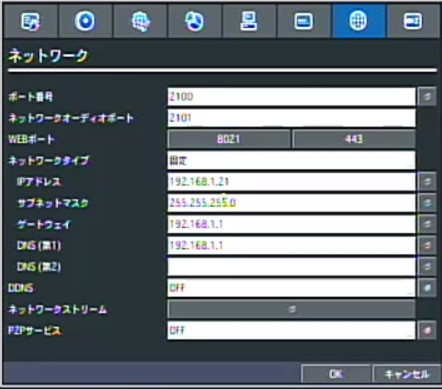

ポート番号、IPアドレス、サブネットマスク、ゲートウェイを設定完了したらOKを押して設定を保存します。

２）NTPの設定
①セットアップ画面のシステムの項を選択します。
②システムの画面からNTPを選択し、OFFをON変更し決定ボタンをおします。

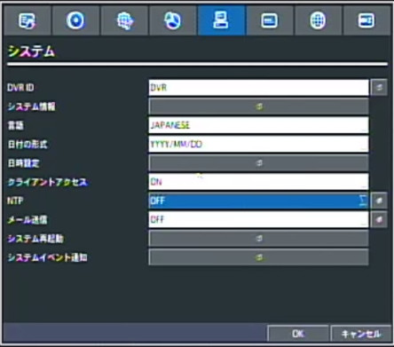

③ポップアップが出てくるのでNTPサーバーの欄にNTPサーバーとして利用するWindowsPCのIPアドレスを入力します

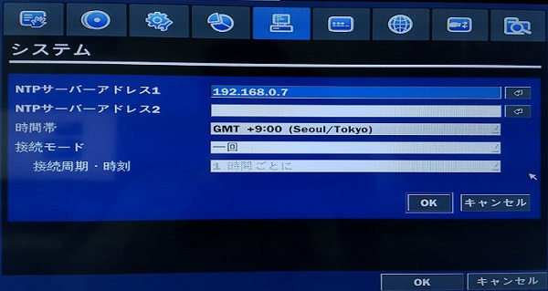

接続モードを一回に設定し、設定が完了したら設定画面を閉じて設定を保存するを選択します。設定を保存するとそのタイミングでNTPサーバーに通信を行います。

④次にsearchボタンを押してログを選択します。

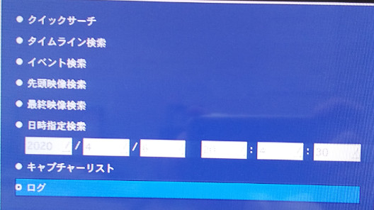

⑤ログの中にNTP:System time matches NTP server time又はUpdate SuccessとあればPCのNTPサーバーと接続ができております。

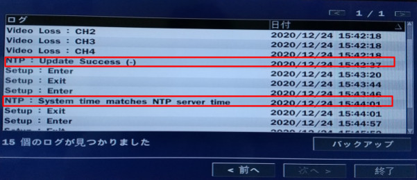

⑥NTPサーバーとの更新周期を任意の設定（1日1回など）にします。
以上で設定完了です。

**アイゼック最新のレコーダーはこちら▼**
- [【16ch同時再生, 4K対応機種】ANEモデル 製品ページ](https://isecj.jp/recorder/recorder-ane)

**レコーダーの導入事例を確認する▼**
- [多機能なデジタルレコーダーを使った導入事例](https://isecj.jp/case/security-enhancement)
- [マルチクライアントソフトの導入事例](https://isecj.jp/case/netcafe-camera)
- [レコーダー・センサー・警報機を連携した独自システムの構築事例](https://isecj.jp/case/system-design)

