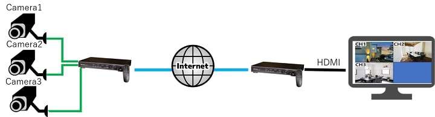
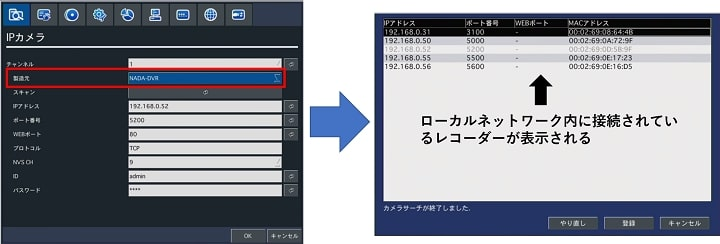
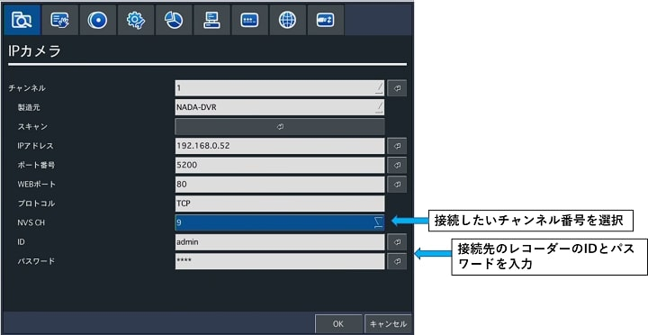
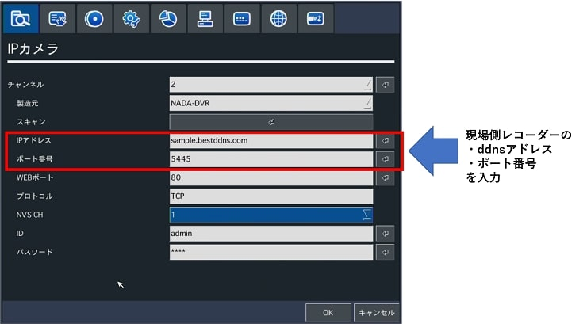

# モニターで見る【レコーダー同士のIP接続】

[[toc]]

## はじめに

レコーダーとレコーダーもネットワーク接続が可能です。

下記図のようにレコーダーに繋がっているカメラの映像をネットワーク経由で伝送し遠隔地のレコーダーで映像を受信し録画とHDMI出力からモニタへ表示する事ができます。

この機能を使用する事で遠隔地でPCではなくモニタに監視場所の映像を表示させた場合など活用きます。

## ローカルネットワーク内での接続

1. レコーダーの設定画面⇒「IPカメラ」の製造元でNADA-DVRを選択します。
2. スキャンを押すと、ローカルネットワーク内に繋がっているレコーダーが表示されるので接続したいレコーダーを選択します。
   

3. レコーダーの設定画面⇒「IPカメラ」のNVSで接続したいチャンネル番号を選択します。図のように9を選択すると現場側に設置しているレコーダーのch9に入力されているカメラの映像を受信する事ができます。
4. 最後に接続先のレコーダーのIDとパスワードを入力して完了です。

## グローバルネットワーク経由での接続

1. まず現場側のレコーダーのネットワークの設定、ルーターのポート開放、DDNS設定が必用です。詳しくはこちらもご参考下さい。[こちら](https://isecj.jp/manual/recorder/faq05-remote-viewer.html)
2. レコーダーの設定画面⇒「IPカメラ」の製造元でNADA-DVRを選択します。
3. IPアドレスの欄に現場側レコーダーのDDNSアドレスを、ポート番号の欄にポート番号を入力します。
   

4. レコーダーの設定画面⇒「IPカメラ」のNVSで接続したいチャンネル番号を選択します。図のように9を選択すると現場側に設置しているレコーダーのch9に入力されているカメラの映像を受信する事ができます。
5. 最後に接続先のレコーダーのIDとパスワードを入力して完了です。

**アイゼック最新のレコーダーはこちら▼**
- [【16ch同時再生, 4K対応機種】ANEモデル 製品ページ](https://isecj.jp/recorder/recorder-ane)

**レコーダーの導入事例を確認する▼**
- [多機能なデジタルレコーダーを使った導入事例](https://isecj.jp/case/security-enhancement)
- [マルチクライアントソフトの導入事例](https://isecj.jp/case/netcafe-camera)
- [レコーダー・センサー・警報機を連携した独自システムの構築事例](https://isecj.jp/case/system-design)