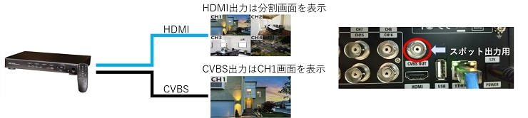
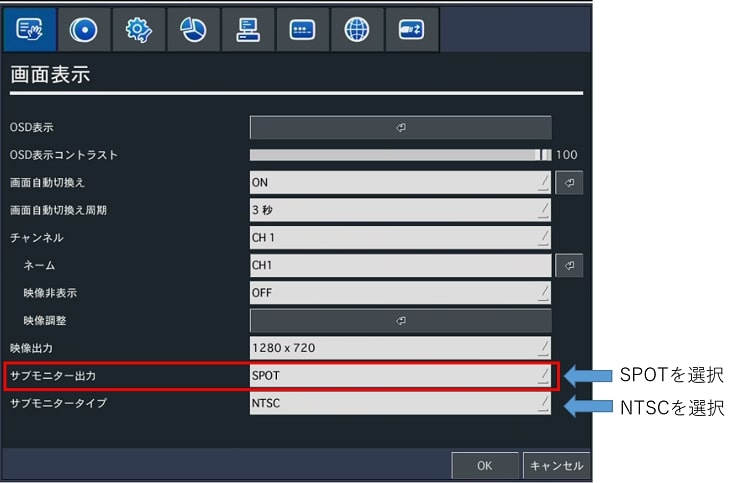
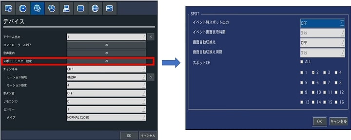

# スポット表示機能

[[toc]]

## スポット出力とは

レコーダーにはスポット表示機能という機能があり、HDMI出力から出すメイン映像以外にCVBS出力から特定のチャンネルの映像のみを表示させる事ができます。この機能を使えば、メインのモニタにはカメラの分割映像を表示しておき、サブモニタに特定のチャンネルの映像を表示させる事が可能です。

スポット出力はモーション検知が働いた際に、該当するチャンネルの映像を表示させたり、各チャンネルの映像を数秒ごとに切替表示する事が可能です。

（＊注１分割表示は出来ません）

（＊注２スポット出力可能な映像はアナログカメラの映像のみでIPカメラの映像はスポット出力出来ません）

## スポット出力の設定方法

1. スポット出力を表示させる為にはまずレコーダーの設定画面⇒「画面表示」のサブモニター出力でSPOTを選択します。（モニタ設定もNTSCが選択されている事を確認下さい）

1. 設定画面⇒「デバイス」からスポットモニター設定を選択します。ポップアップが表示されるので、用途に合わせて設定します。
- イベント時スポット出力⇒ONにするとモーション検知やセンサ入力設定をしたチャンネルで実際に検知や入力があった際に、そのチャンネルの映像をスポット出力します。
- イベント画面表示時間⇒イベント（モーション検知やセンサ入力）があってからスポット出力を表示する時間が設定できます。
- 画面自動切換え⇒ONにすると一定の周期でスポット出力される映像を切り替えます。スポット出力される映像はスポットCHの項目で選択します。
- 画面自動切換え周期⇒映像を切り替える時間を設定できます。
- スポットＣＨ　スポット出力で表示したいチャンネルを選択します。複数チャンネル選択した場合、画面自動切換えをＯＮにすると一定周期で映像が切り替わります。（画面自動切換えをOFFのまま複数選択した場合若いチャンネルの映像が表示され、分割表示はされません。）

以上で設定完了です。背面のCVBS出力をモニタに接続すると設定したチャンネルの映像が表示されます。

スポット出力はレコーダーで録画再生などを行っても影響を受けずリアルタイムの映像出力を表示します。

**アイゼック最新のレコーダーはこちら▼**
- [【16ch同時再生, 4K対応機種】ANEモデル 製品ページ](https://isecj.jp/recorder/recorder-ane)

**レコーダーの導入事例を確認する▼**
- [多機能なデジタルレコーダーを使った導入事例](https://isecj.jp/case/security-enhancement)
- [マルチクライアントソフトの導入事例](https://isecj.jp/case/netcafe-camera)
- [レコーダー・センサー・警報機を連携した独自システムの構築事例](https://isecj.jp/case/system-design)