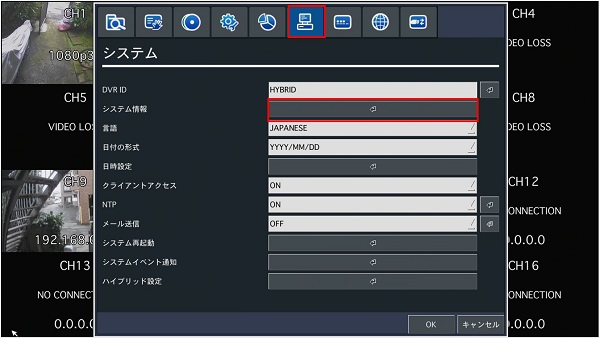

# DDNSサービスの設定

[[toc]]

## はじめに

アイゼックではレコーダーご購入のお客様向けに無料のダイナミックDNS（DDNS）サービスを提供しています。

DDNSを導入することで固定グローバルIPアドレスなしでもレコーダーの映像をインターネット上から確認可能になります。

DDNSを使用するには以下の手順が必要です。

1. アイゼックにDDNS登録申請をする。
2. レコーダーのIPアドレスを固定する。
3. DDNSに使用するポートを指定する。
4. ルーターのポートを開放する。
5. レコーダーをDDNSに接続する。


## アイゼックにDDNS登録申請する

設定＞システムからシステム情報をクリックします。



システム情報のモデル名とMACアドレスをメモします。


[問い合わせフォーム](https://isecj.jp/contact/?subject=DDNS%E7%99%BB%E9%8C%B2%E4%BE%9D%E9%A0%BC)からDDNSサーバー登録依頼をします。

以下の文章をコピーし、モデル名とMACアドレスを記入して送信ボタンを押してください。

```
以下の機種のDDNS登録をお願いします。

モデル名：〇〇
MACアドレス： xx:xx:xx:xx:xx:xx
```

メッセージ送信から数営業日以内に接続先のDDNSアドレスをメールにてお伝えします。

接続先のDDNSアドレスはパスワード台帳等に保存してください。

## レコーダーのIPアドレスを固定する

設定＞ネットワークからIPアドレスを固定します。


レコーダーに割り当てるIPアドレス等はネットワーク管理者と相談して決定してください。

- ネットワークタイプ：固定
- IPアドレス：レコーダーのIPアドレスを指定します。
- サブネットマスク：255:255:255:0を入力します。
- ゲートウェイ：ゲートウェイのIPアドレスを入力します。
- DNS（第1）：DNS（第1）のIPアドレスを入力します。
- DNS（第2）：DNS（第2）のIPアドレスを入力します。


## DDNSに使用するポートを指定する

設定＞ネットワークからWEBポートを指定します。

WEBポートの左側または右側をクリックしてください。

- WEBポート（左）：DDNSに接続するHTTPポートを指定します。
- WEBポート（右）：DDNSに接続するHTTPSポートを指定します。


テンキーが表示されます。ポート番号の入力が完了したら右下の矢印ボタンを押してください。


## ルーターのポートを開放する

ルーターの設定画面を開き、ポート開放（ポートフォワーディング）します。

以下のポートを開放してください。

- ポート番号
- WEBポート（左側、右側）


ポート開放の方法は各種メーカーのHPを参照してください。

- [バッファロー](https://www.buffalo.jp/support/faq/detail/15022.html)
- [NEC](https://www.aterm.jp/support/qa/qa/00020.html)
- [TP-LINK](https://www.tp-link.com/jp/support/faq/2799/)
- [ASUS](https://www.asus.com/jp/support/FAQ/114093/)
- [エレコム](http://qa.elecom.co.jp/faq_detail.html?id=7097)
- [IODATA](https://www.iodata.jp/lib/manual/wn-ac1600dgr/ouyou/port.htm)
- [ヤマハ](https://network.yamaha.com/setting/router_firewall/ts_router/server_release)
- [CISCO](https://community.cisco.com/t5/cisco-start-%E3%83%89%E3%82%AD%E3%83%A5%E3%83%A1%E3%83%B3%E3%83%88/c841m-%E3%83%9D%E3%83%BC%E3%83%88%E3%83%95%E3%82%A9%E3%83%AF%E3%83%BC%E3%83%87%E3%82%A3%E3%83%B3%E3%82%B0-%E3%83%9D%E3%83%BC%E3%83%88%E8%BB%A2%E9%80%81-%E3%83%9D%E3%83%BC%E3%83%88%E9%96%8B%E6%94%BE-%E3%81%AE%E8%A8%AD%E5%AE%9A%E6%96%B9%E6%B3%95/ta-p/3158437)

## レコーダーのDDNSを設定する（ANEモデル以降）

設定画面が下記の画像と異なる場合は本記事末尾に記載のAPEモデルまでの設定手順を参照してください。

設定＞ネットワークからDDNSをオンにします。


矢印ボタンをクリックします。


ソフトウェアキーボードボタンをクリックします。


ホスト名を入力し、ENTERをクリックします。


確認をクリックします。


これでDDNSの設定は完了です。


## 動作確認

動作確認のためUMSクライアントを立ち上げます。

Connectをクリックします。


各種項目を入力し、OKをクリックします。

- モデル：DVR/NVR
- 接続先名：右下のSetupボタンから接続先を登録した場合、表示されます。
- 接続先アドレス：〇〇.bestddns.comを入力します。
- ポート番号：設定＞ネットワークのポート番号と同じ数字を入力します。
- ID：「admin」を入力します。
- パスワード：パスワードを入力します。


レコーダーの映像が表示されます。


もし接続できない場合は以下の事項を確認してください。

1. 接続先アドレスを打ち間違えていないか確認する。
2. レコーダーの設定＞ネットワークのポート番号がポート開放されているかルーターを確認する。
3. レコーダーの設定＞ネットワークのWEBポート番号がポート開放されているかルーターを確認する。
4. パスワードを誤入力していないか確認する。

## レコーダーのDDNSを設定する（APEモデルまで）

旧レコーダーを使用の方は以下の手順に従ってDDNSの設定をしてください。

設定＞ネットワークからDDNSのサーバーを選択します。


サーバー選択後、矢印ボタンをクリックします。


bestddnsを選択し、OKをクリックします。


これでDDNSの設定は完了です。

[遠隔監視の基本設定【パソコン・スマホ】に戻る](./faq05-remote-viewer.html#ddnsの設定)

**アイゼック最新のレコーダーはこちら▼**
- [【16ch同時再生, 4K対応機種】ANEモデル 製品ページ](https://isecj.jp/recorder/recorder-ane)

**レコーダーの導入事例を確認する▼**
- [多機能なデジタルレコーダーを使った導入事例](https://isecj.jp/case/security-enhancement)
- [マルチクライアントソフトの導入事例](https://isecj.jp/case/netcafe-camera)
- [レコーダー・センサー・警報機を連携した独自システムの構築事例](https://isecj.jp/case/system-design)