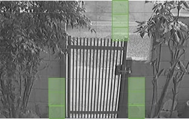

# 【APEモデル】スマホへのプッシュ通知機能（iPhone, Android）

目次
[[toc]]

**この機能はAPEモデルのみ使用できます。**

**ANEモデル以降は非対応です。**

## iPhoneへのプッシュ通知

プッシュ通知でモーション検知した際に通知が行くように設定の手順

１：メニューの「デバイス」を選択しモーション検知するチャンネルを選択し、モーション領域を設定します。

2:メニュー→「ネットワーク」→「プッシュイベント」をクリックして出てきた
ポップアップに
1. 電話識別番号を入力（電話識別番号は下図　アイフォン画面図を参照）
1. プッシュサービスをONに
1. モーション検知をON
1. モーション検知を検知したら通知がくるチャンネルを選択

（アイフォン画面図）

３：レコーダー側にアイフォンのcodeが電話識別番号に入力され、プッシュサービスもONになっていると「Notice Registration success..,」と表記がでます。
これで設定完了です。

注意
ネットワーク設定の設定情報がレコーダーとアイフォンであっていないと下記の表示が出ますのでＩＰアドレス、ポート番号などご確認ください。

## Androidへのプッシュ通知

[[toc]]

１）スマートフォンでiUMSを開きます。
リアルタイム／録画映像をクリックし遷移した画面でPUSHを押します。

２）下記のようなポップアップが表示されるので、表示された数字をレコーダーへ入力します。入力場所は３）を参照ください。

３）レコーダー設定メニューより「ネットワーク」⇒PUSH EVENTをクリックします。

するとポップアップが表示されるので赤枠で示した箇所に２）で表示された数字を入力します。

４）数字を入力したら次にプッシュサービスを「ON」にします。
そしてイベント種類を選択します。
- センサー入力⇒レコーダーに繋がっているセンサに入力があったらスマホへ通知します。
- モーション検知⇒選択したチャンネルでモーション検知が働いたらスマホへ通知します。
- 火災警報検知⇒特定の海外の警報音しか対応していない為不使用の項目です。

本例ではモーション検知を選択します。

モーション検知のチェックボックスにチェックを入れたあと矢印ボタンを押します。

チャンネル選択のポップアップが表示されるのでモーション検知を設定するチャンネルを選択します。（本例ではCH1）

５）モーション領域を設定します。
モーション領域を設定したいカメラ＊が接続されているチャンネルを選択し（本例ではCH1）モーション領域を検出枠に設定し青枠部分をクリックしモーション領域を設定します。
（＊IPカメラではモーション検知は使用できません）

5-1)モーション領域の設定
映像画面に格子状の線が引かれブロックに分割された画面が表示されます。任意のブロックを選択すると右図のようにブロックが薄い緑色にかわり検出枠として設定されます。
設定された検出枠の映像に変化（人が通るなど）があると検知します。

6)録画モードを設定
設定メニューの「録画」から録画モードにモーション録画を選択します。
次に青枠部分を押します。

青枠部分を押すと「モーションのみ」か「常時＋モーション」のどちらかを選択できます。
「モーションのみ」を選択するとモーション検知時のみしか録画をしません。
モーション検知以外の時も録画をしたい場合は「常時＋モーション」を選択ください。
また「常時＋モーション」を選択した際、初期設定では常時録画は低画質でフレームレートも低い設定となっていますので、画質やフレームレートの調整も忘れないよう実施ください。

以上で設定は完了です。

CH1でモーション検知が働くとスマートフォンへ音声と通知が届きます。

**アイゼック最新のレコーダーはこちら▼**
- [【16ch同時再生, 4K対応機種】ANEモデル 製品ページ](https://isecj.jp/recorder/recorder-ane)

**レコーダーの導入事例を確認する▼**
- [多機能なデジタルレコーダーを使った導入事例](https://isecj.jp/case/security-enhancement)
- [マルチクライアントソフトの導入事例](https://isecj.jp/case/netcafe-camera)
- [レコーダー・センサー・警報機を連携した独自システムの構築事例](https://isecj.jp/case/system-design)
