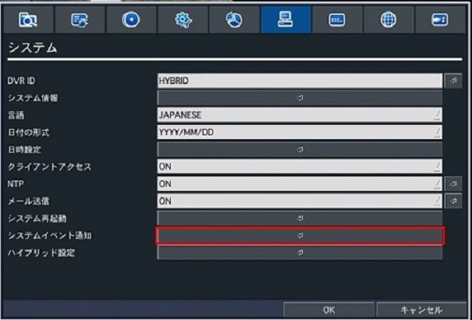
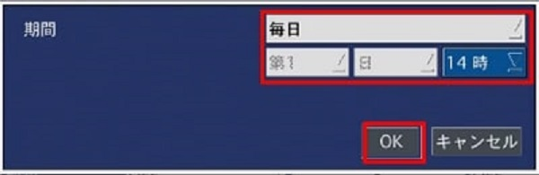
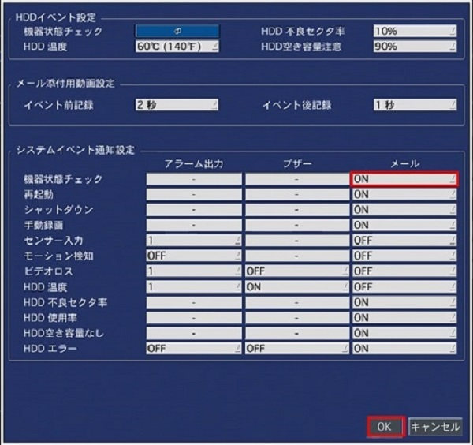
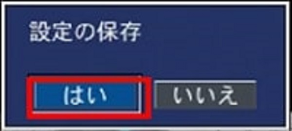
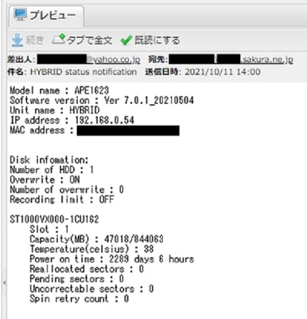

# メール送信機能

[[toc]]

## レコーダーメール送信機能について

レコーダーのメール送信機能でメールを送る方法をご紹介します。

設定＞システム＞メール送信をONに設定して矢印ボタンをクリックします。

### プロバイダやレンタルサーバーのメールを使用する場合

プロバイダやレンタルサーバー業者が提供しているメールを使用する場合は各社のメール設定ページ（送信部分のみ）をご確認ください。

#### プロバイダのメール設定ページ

[OCN](https://support.ntt.com/ocn/support/pid2990021006)
[BIGLOBE](https://support.biglobe.ne.jp/settei/mailer/overssl.html)
[So-net](https://support.so-net.ne.jp/supportsitedetailpage?id=000011999)

#### レンタルサーバーのメール設定ページ

[さくらインターネット](https://help.sakura.ad.jp/206206021/)
[カゴヤジャパン](https://support.kagoya.jp/kir/manual/mail_ssl/)
[WebARENA](https://help.arena.ne.jp/hc/ja/articles/360025520593-%E9%9B%BB%E5%AD%90%E3%83%A1%E3%83%BC%E3%83%AB-%E8%A8%AD%E5%AE%9A-%E4%BD%BF%E7%94%A8%E6%96%B9%E6%B3%95)

さくらインターネットのメールサービスを使用する場合の設定方法を説明します。

- メールサーバー名：****.sakura.ne.jp(初期ドメイン)を入力します。
- メールポート：587を入力します。
- セキュリティー設定：TLSを選択します。
- ID：送信元のメールアドレス（ example@****.sakura.ne.jp等 ）
- パスワード：送信元のメールアドレスのパスワードを入力
- メールアドレス：送信先のメールアドレスを入力
- 送信元メールアドレス：送信元のメールアドレスを入力

メールテストを押してメールが送信されるかご確認下さい。

メールを受信出来たら設定完了です。OKをクリックし、ウィンドウを閉じます。

### Yahooメールを使用する場合

Yahooメールを使用する場合はヤフーメールの設定ページからYahoo！JAPAN公式サービス以外からのアクセスを有効化する必要があります。

[Yahoo!JAPAN](https://www.yahoo.co.jp/)のメールメニュー右上の「設定・利用規約」を押して出てきたメニュー一覧から「メールの設定」を選択

Yahoo！JAPAN公式サービス以外からのアクセスも有効にするを選択

IMAP：任意
POP：任意
SMTP：有効にする
選択して保存を押します。

レコーダーの設定画面に戻ります。
メール設定画面が表示されたらサーバータイプにYAHOOを選択します。

- メールサーバー名：smtp.mail.yahoo.**com**からsmtp.mail.yahoo.**co.jp**に変更する。
- メールポート：465を入力します。
- セキュリティー設定：SSLを選択します。
- ID：Yahooのメールアドレスを入力
- パスワード：Yahooのパスワードを入力
- メールアドレス：送信先のメールアドレスを入力
- 送信元メールアドレス：Yahooのメールアドレスを入力

メールテストを押してメールが送信されるかご確認下さい。

メールを受信出来たら設定完了です。OKをクリックし、ウィンドウを閉じます。

[モーション・センサー検知をメール送信するに戻る](./recorder-system-event.html)

[レコーダーの状態を日次でメール送信するに戻る](./recorder-mail-notification.html)

**アイゼック最新のレコーダーはこちら▼**
- [【16ch同時再生, 4K対応機種】ANEモデル 製品ページ](https://isecj.jp/recorder/recorder-ane)

**レコーダーの導入事例を確認する▼**
- [多機能なデジタルレコーダーを使った導入事例](https://isecj.jp/case/security-enhancement)
- [マルチクライアントソフトの導入事例](https://isecj.jp/case/netcafe-camera)
- [レコーダー・センサー・警報機を連携した独自システムの構築事例](https://isecj.jp/case/system-design)

<!-- ## レコーダーの状態を毎日メール送信する方法

システムイベント通知をクリックします。

機器状態チェックをクリックします。

通知間隔を設定し、OKをクリックします。

システムイベント通知設定の機器状態チェックのメール通知をONにして、OKをクリックします。
※レコーダーの再起動やHDDエラー等も通知したい場合はこれらの項目もONにしてください。

OKをクリックします。

はいをクリックします。

これでレコーダーの設定は完了です。
指定した時間にメールが届いているか確認してください。

 -->

<!-- ## モーション検知したらメール送信する方法

1. 設定＞デバイスからモーション検知を行うチャンネルを選択します。

2. モーション領域を選択します。

全領域は画面全体をモーション検知します。

検出枠は画面の一部をモーション検知箇所に設定できます。検出枠を設定した場合は矢印ボタンを押して、検出枠を設定します。

3. 検出したい領域をマウスで左クリックします。

4. 検出領域は緑の線がオーバーレイされます。枠の設定が完了したらマウスを右クリックして設定画面に戻ります。

5. 録画タブを選択し、モーション領域を設定したチャンネルを選択します。

6. 録画モードをモーション録画に変更し、矢印ボタンを押します。

7. モーション録画の設定をし、OKをクリックします。

常時＋モーションを選択すればモーション検知時以外も録画可能です。

画質やFPSもモーション時と変わらない設定にできます。

8. システムタブを選択し、メール送信がONになっていることを確認します。

確認後、システムイベント通知をクリックします。

9. モーション検知のメール設定を設定します。

テキストを選択した場合、モーション検知が発生するとテキストメールが送信されます。

動画を選択した場合、モーション検知が発生すると動画ファイル付きメールが送信されます。

設定後、OKをクリックし、前の画面に戻ります。

10. OKをクリックします。

11. 設定の保存画面が表示されるので「はい」をクリックします。

これでレコーダーの設定は完了です。

12. 設定完了後はモーション検知を有効にした撮影場所に立ち寄るなどしてモーション検知後にメールが届くか確認してください。 -->
