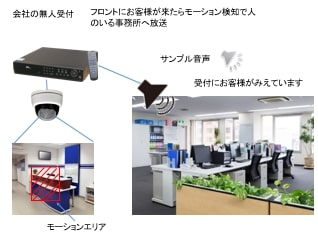
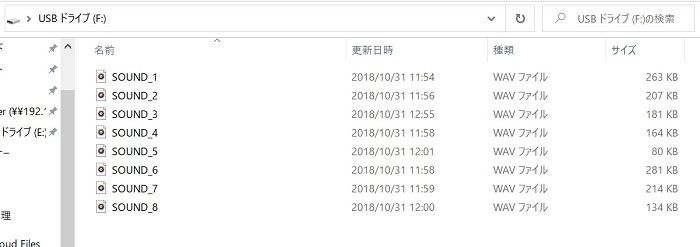
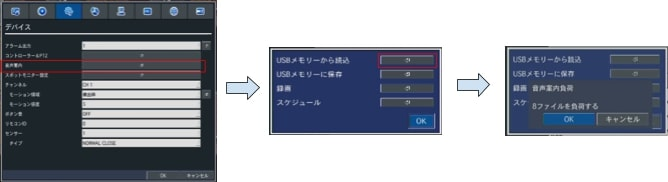
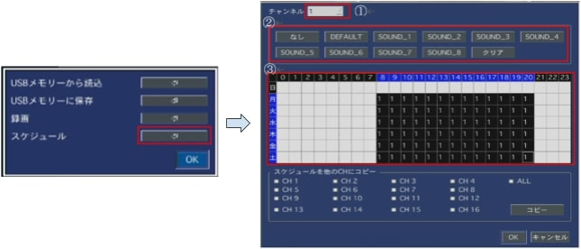
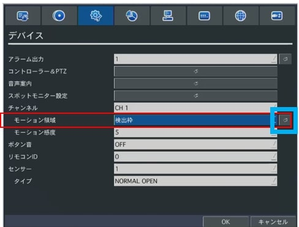
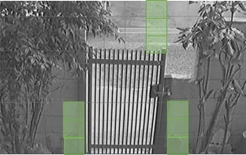
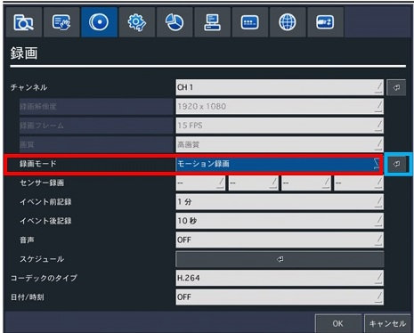
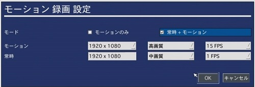
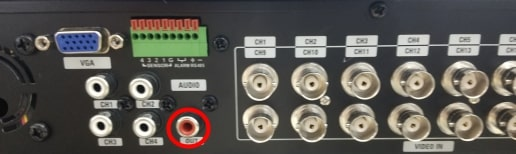
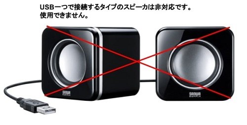

# 音声発報機能

[[toc]]

## はじめに

APEモデルから上位モデルにしか搭載していなかった音声案内機能をご利用頂けるようになりました。

この機能はモーション検知機能と併用して使用します。
モーション設定範囲の映像に動きがあった際にAudio出力から音声を出力します。

活用事例として無人の受付にモーションエリアを設定し、そのエリア内に人が来たらモーション検知が働き事務書へスピーカで通知するといった環境を構築する事ができます。

## PCでの作業

### 1）音声ファイルの作成

レコーダーに自身で製作した音声ファイルを８つまで登録できます。
音声ファイル作成時の注意点として
　・音声ファイルの形式はWAV形式とする事
　・音声ファイルのファイル名はSOUND_1,SOUND_2～SOUND_8といった名称にする事
上記を守って音声ファイルを製作ください。

音声ファイルは下記HPなどで製作する事が可能です。

[参考リンク](https://note.cman.jp/other/voice/)

### 2）作成した音声ファイルをUSBに入れる

作成した音声ファイルはUSBの直下に保存してください。
（フォルダの中に入れると認識しません）
＊USBメモリーのフォーマットがFAT32であるかご確認ください。FAT32以外はレコーダーで認識できません。

## レコーダーでの作業

### 3）レコーダーへ音声ファイルの読み込み

音声ファイルの入ったUSBをレコーダーに挿したあと、レコーダーの設定画面メニューより「デバイス」を選択しその中の「音声案内」の項目をクリックします。
ポップアップが表示されるのでUSBメモリーから読込をクリックします。
USBメモリーから音声ファイルをよみとりファイルを負荷するとポップアップがでますのでOKを押します。
＊音声ファイルのファイル名や形式が違っており読み込みが出来ない場合は「no file」というポップアップが出ます。

### 4）スケジュールの登録

次に音声案内を押して出たポップアップからスケジュールを選択します。
スケジュール表が表示されるので
①チャンネルを選択
②使用する音声ファイルを選択します。
（DEFAULTはレコーダーに初期から入っている英語音声です。
③週間スケジュールに音声案内機能を有効にする時間を設定します。
本例では月曜～土曜の8:00～20時までSOUND_1の音声を出力する設定としています。

### 5）モーション領域を設定します。
モーション領域を設定したいカメラ＊が接続されているチャンネルを選択し（本例ではCH1）モーション領域を検出枠に設定し青枠部分をクリックしモーション領域を設定します。
（＊IPカメラではモーション検知は使用できません）

#### 5-1)モーション領域の設定
映像画面に格子状の線が引かれブロックに分割された画面が表示されます。任意のブロックを選択すると右図のようにブロックが薄い緑色にかわり検出枠として設定されます。
設定された検出枠の映像に変化（人が通るなど）があると検知します。

### 6)録画モードを設定
設定メニューの「録画」から録画モードにモーション録画を選択します。
次に青枠部分を押します。

青枠部分を押すと「モーションのみ」か「常時＋モーション」のどちらかを選択できます。
「モーションのみ」を選択するとモーション検知時のみしか録画をしません。
モーション検知以外の時も録画をしたい場合は「常時＋モーション」を選択ください。
また「常時＋モーション」を選択した際、初期設定では常時録画は低画質でフレームレートも低い設定となっていますので、画質やフレームレートの調整も忘れないよう実施ください。

### 7）ハードウェアの設定
レコーダー側の設定は６）までで完了です。
あとはレコーダーにスピーカを接続すれば完了です。
スピーカへの音声入力はレコーダー背面のAUDIO OUTの端子をRCA端子で接続頂く形となります。

ＰＣ用でよくあるUSB端子で電源と音声を同梱して送るタイプのスピーカには対応しておりませんのでご注意ください。

**アイゼック最新のレコーダーはこちら▼**
- [【16ch同時再生, 4K対応機種】ANEモデル 製品ページ](https://isecj.jp/recorder/recorder-ane)

**レコーダーの導入事例を確認する▼**
- [多機能なデジタルレコーダーを使った導入事例](https://isecj.jp/case/security-enhancement)
- [マルチクライアントソフトの導入事例](https://isecj.jp/case/netcafe-camera)
- [レコーダー・センサー・警報機を連携した独自システムの構築事例](https://isecj.jp/case/system-design)

