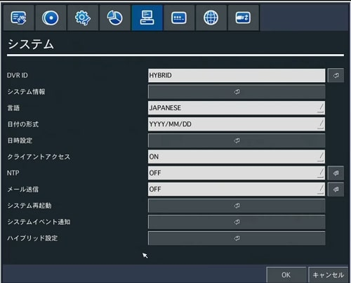
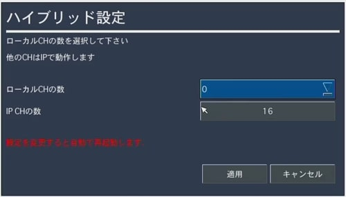
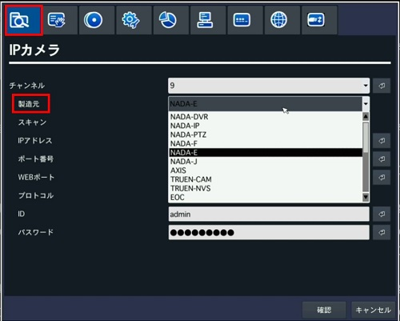
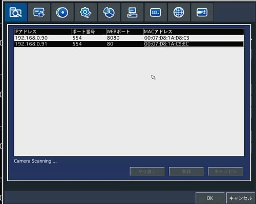
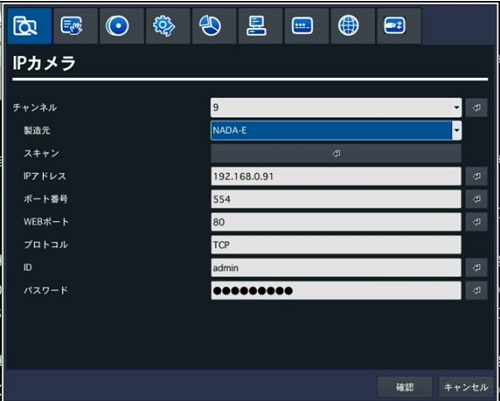

# IPカメラ接続手順

[[toc]]

## 動画解説版

<iframe width="560" height="315" src="https://www.youtube.com/embed/5K6JlQWjaHg" title="YouTube video player" frameborder="0" allow="accelerometer; autoplay; clipboard-write; encrypted-media; gyroscope; picture-in-picture" allowfullscreen></iframe>

## テキスト解説版

①設定画面のメニューより「システム」を選択しハイブリッド設定を選択します。

②ポップアップが表示されるのでIPカメラ用につかうチャンネル数を設定します。
（本例では１６ｃｈ全てＩＰカメラ用にしました。）
適用を押すと再起動しますので再起動を待ちます。

③設定メニューに「IPカメラ」という項目が追加されますのでメニュー内の「製造元」でNADA-Eを選択します。

④スキャンを押すとローカルネットワークに繋がっているIPカメラが表示されます。

⑤IPカメラを選択するとパスワード以外の項目が自動的に記入されるのでパスワードを入力します。
（初期パスワード：admin1357)

以上で設定完了です。

**アイゼック最新のレコーダーはこちら▼**
- [【16ch同時再生, 4K対応機種】ANEモデル 製品ページ](https://isecj.jp/recorder/recorder-ane)

**レコーダーの導入事例を確認する▼**
- [多機能なデジタルレコーダーを使った導入事例](https://isecj.jp/case/security-enhancement)
- [マルチクライアントソフトの導入事例](https://isecj.jp/case/netcafe-camera)
- [レコーダー・センサー・警報機を連携した独自システムの構築事例](https://isecj.jp/case/system-design)

