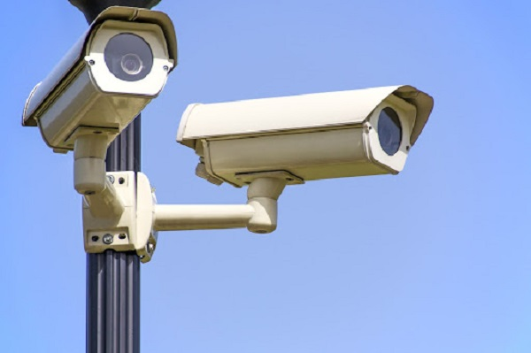

# 録画方法の種類と特徴

アイゼックのレコーダーでは録画方式が４種類あり、必用に応じて録画方式の変更が可能です。

（出荷時の初期設定では通常録画が選択されております。）

[[toc]]

## 録画方法の種類

- 通常録画
- 動作検知（モーション）録画
- センサー感知録画
- 予約（スケジュール）録画

の４つです。

## それぞれの特徴

- 通常録画：常時映像を録画します。
- センサー感知録画：レコーダーに外部センサー接点を取り込ませた状態で外部センサーが働いた時のみ録画を行う方式です。センサー検知があった時のみ録画する為、通常録画に比べて長い期間の録画をHDDに残しておくことができます。
- 動作検知（モーション）録画：カメラ映像の中で範囲設定し、その中で動きがあった時のみ録画を行う方式です。動作検知があった時のみ録画する為、通常録画に比べて長い期間の録画をHDDに残しておくことができます。
- 予約（スケジュール）録画：レコーダーで録画を行う曜日と時間を設定し、その期間だけ録画を行う方式です。人がいない夜間帯だけ監視カメラ映像を録画したいなどの用途に活用できます。設定したスケジュール期間のみ録画を行う為、通常録画に比べて長い期間の録画をHDDに残しておくことができます。

＜各録画方法の特徴まとめ＞

|    |  通常録画 | センサー録画 | モーション録画  |  スケジュール録画  |
| ---- | ---- | ---- | ---- | ---- |
|  録画のタイミング |  常時  |  センサー検知時のみ  |  モーション検知時のみ  | 設定された日時の間のみ  |
| HDDへの録画時間  |  普通  |  通常録画より多い  |  通常録画より多い  |  通常録画より多い  |
| 使用シーン・補足情報  |  初期設定時の録画方法  |    |    |  人がいない夜間帯だけ検視カメラ映像を撮影など  |

## 録画方法
録画の方法は以下の記事を参考にしてください。

- [センサー録画](./record02-sensor.html)
- [モーション録画](./record03-motion.html)
- [スケジュール録画](./record04-schedule.html)
- [手動録画](./record05-manual.html)

## 録画方法選択の便利な機能
- モーションやセンサーの検知時に音声案内を流したい
 [音声発報機能](./function05-sound.html)
- モーションやセンサーの検知時に録画の様子やログをメール送信してほしい
→[メール送信機能（モーション・センサー）](./recorder-system-event.html)
- モーションやセンサーの検知時にスマホへ通知をしてほしい
→[スマホへのプッシュ通知](./function02-ios.html)
- 特定の録画方法がいつ録画されたか（ログ）を知りたい
→[ログの確認機能](./recorder-event-log.html)

**アイゼック最新のレコーダーはこちら▼**
- [【16ch同時再生, 4K対応機種】ANEモデル 製品ページ](https://isecj.jp/recorder/recorder-ane)

**レコーダーの導入事例を確認する▼**
- [多機能なデジタルレコーダーを使った導入事例](https://isecj.jp/case/security-enhancement)
- [マルチクライアントソフトの導入事例](https://isecj.jp/case/netcafe-camera)
- [レコーダー・センサー・警報機を連携した独自システムの構築事例](https://isecj.jp/case/system-design)