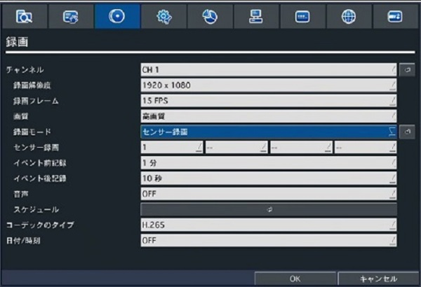
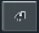
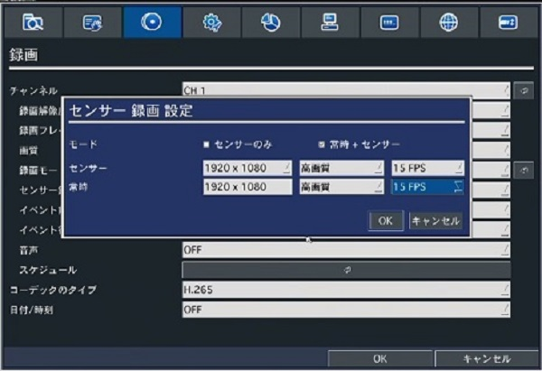
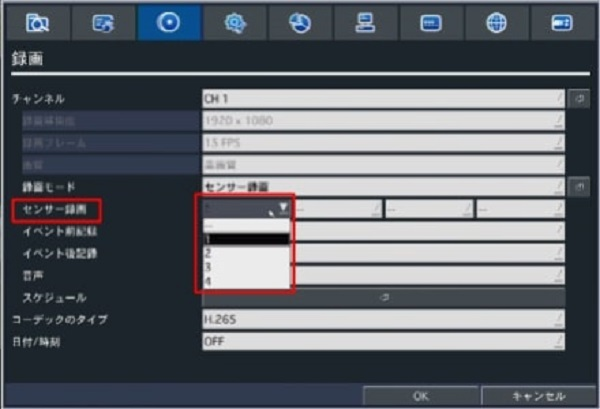
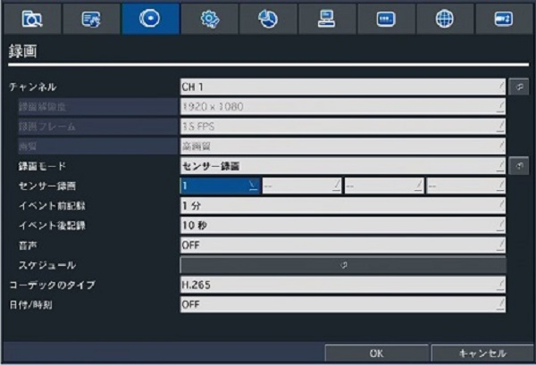
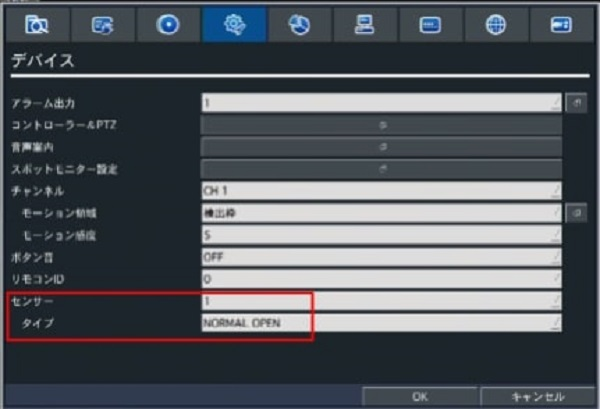
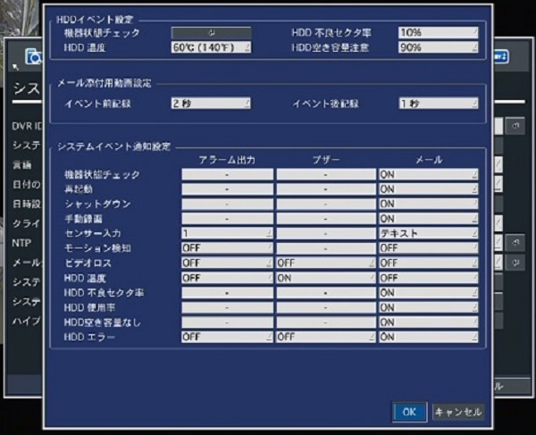
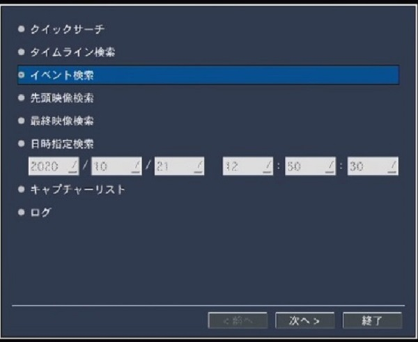
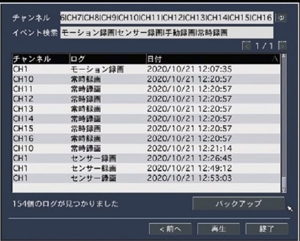

# センサー録画設定方法

[[toc]]

CH1にてセンサー入力を使用する手順をご紹介

## センサー録画設定方法

①録画設定で録画モードで「センサー録画」を選択する

②矢印ボタンを押すとセンサー録画設定のポップアップが表示されます。

センサー録画のモードと画質を設定し、OKをクリックします。

- センサーのみ：センサー検知時のみ録画を開始します。
- 常時＋センサー：センサー検知時にセンサー用画質で録画します。
- センサー：センサー検知後の画質を設定します。
- 常時：常時録画の画質を設定します。
  
※センサーを選択した場合、**イベント前記録、イベント後記録の画質は同じです**。

※常時＋センサーを選択した場合、**イベント前記録の画質は常時の画質**になります。

センサー録画の録画時間を設定します。センサー録画にはイベント前記録＋イベント後記録の合計の秒数が記録されます。

- イベント前記録：センサー検知前の録画時間を指定します。範囲は0秒～20分です。
- イベント後記録：センサー検知後の録画時間を指定します。範囲は3～60秒です。

③センサー録画で使用するセンサー信号を選択します。１番に入力されるセンサーを選択する場合、１を選択。

④設定完了後の画面がこちら

⑤デバイス→センサーとタイプの項目を設定。

今回はセンサー１をNORMAL　OPENで使用する場合の設定

設定完了です。

[センサー検知をメールで知らせたい場合はこちら](./recorder-system-event.html)

**アイゼック最新のレコーダーはこちら▼**
- [【16ch同時再生, 4K対応機種】ANEモデル 製品ページ](https://isecj.jp/recorder/recorder-ane)

**レコーダーの導入事例を確認する▼**
- [多機能なデジタルレコーダーを使った導入事例](https://isecj.jp/case/security-enhancement)
- [マルチクライアントソフトの導入事例](https://isecj.jp/case/netcafe-camera)
- [レコーダー・センサー・警報機を連携した独自システムの構築事例](https://isecj.jp/case/system-design)

<!-- ⑥システム→システムイベント通知で、「センサー入力」→１に
メールをテキスト、又は動画を設定

⑦メール送信機能を設定します。

（メール送信機能の設定は[こちら](./function04-mail.html)）

⑧設定完了です。
センサーが働くとCH１の右上に「S」と表記されます。

⑨メールが送信されると下記のようなメールが届きます。

## ログの確認方法

検索画面でイベント検索を選択するとセンサーが働いた時間のログが確認出来ます。

センサー録画のログを選択して再生を押すと、イベントが発生した時の録画を再生する事ができます。

 -->
