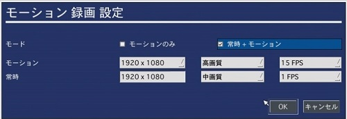

# モーション録画設定方法

[[toc]]

１）モーション領域を設定します。

モーション領域を設定したいカメラ＊が接続されているチャンネルを選択し（本例ではCH1）モーション領域を検出枠に設定し青枠部分をクリックしモーション領域を設定します。

（＊IPカメラではモーション検知は使用できません）

２)モーション領域の設定

映像画面に格子状の線が引かれブロックに分割された画面が表示されます。任意のブロックを選択すると右図のようにブロックが薄い緑色にかわり検出枠として設定されます。

設定された検出枠の映像に変化（人が通るなど）があると検知します。

３)録画モードを設定

設定メニューの「録画」から録画モードにモーション録画を選択します。

次に青枠部分を押します。

青枠部分を押すと「モーションのみ」か「常時＋モーション」のどちらかを選択できます。

「モーションのみ」を選択するとモーション検知時のみしか録画をしません。

モーション検知以外の時も録画をしたい場合は「常時＋モーション」を選択ください。

また「常時＋モーション」を選択した際、初期設定では常時録画は低画質でフレームレートも低い設定となっていますので、画質やフレームレートの調整も忘れないよう実施ください。

**アイゼック最新のレコーダーはこちら▼**
- [【16ch同時再生, 4K対応機種】ANEモデル 製品ページ](https://isecj.jp/recorder/recorder-ane)

**レコーダーの導入事例を確認する▼**
- [多機能なデジタルレコーダーを使った導入事例](https://isecj.jp/case/security-enhancement)
- [マルチクライアントソフトの導入事例](https://isecj.jp/case/netcafe-camera)
- [レコーダー・センサー・警報機を連携した独自システムの構築事例](https://isecj.jp/case/system-design)