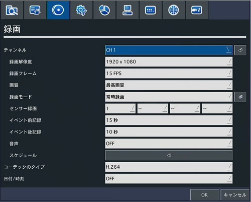
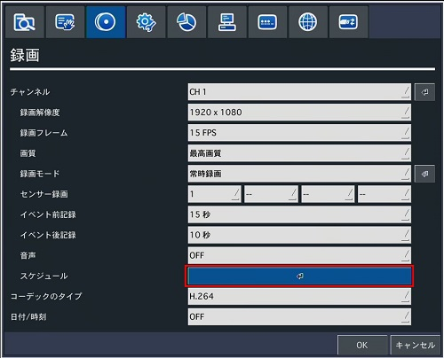
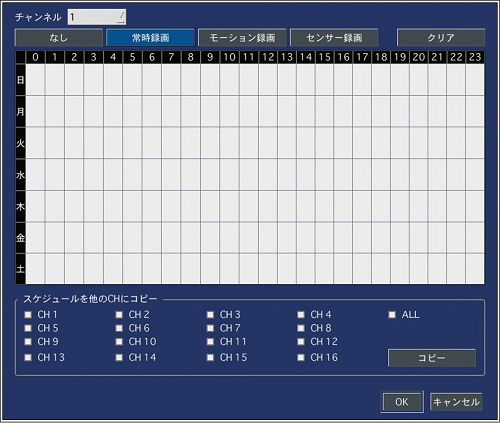
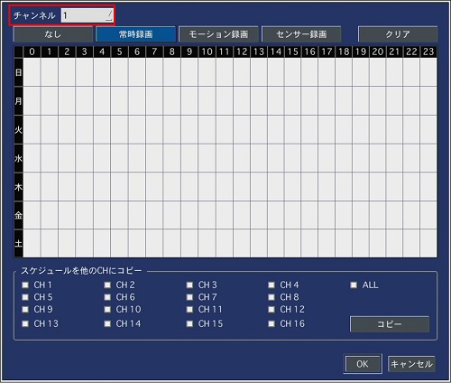
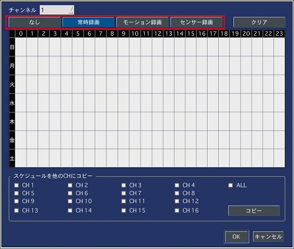
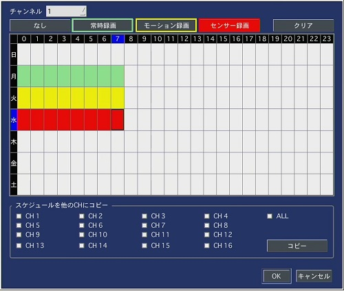
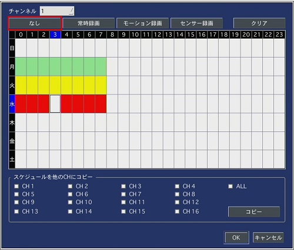
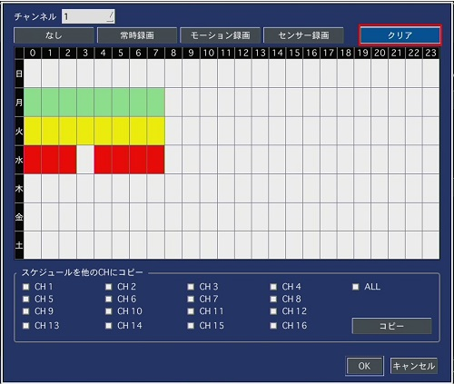
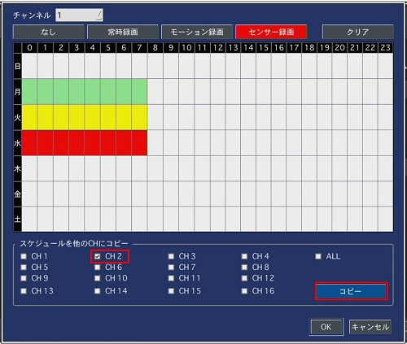
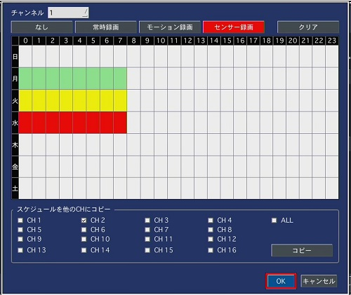

# スケジュール録画

[[toc]]

## スケジュール録画設定画面を開く

設定画面から録画タブを選択します。

スケジュールをクリックします。

スケジュール録画設定画面が表示されます。

## スケジュール録画の設定方法

スケジュール録画するチャンネルを選択します。

録画モードを選択します。

モードを選択したらスケジュール録画したいマスを選び、クリックします。
クリックされたマスが塗りつぶされます。

マスの色は三種類あります。色の意味は以下の通りです。

- 緑：常時録画
- 黄：モーション録画
- 赤：センサー録画

## スケジュールを削除する

スケジュールを削除したいマスがある場合は「なし」を選択して消したいマスをクリックするとスケジュールが削除されます。

スケジュールをまとめて消したい場合は「クリア」をクリックします。

## スケジュールをコピーする

別のチャンネルにスケジュールをコピーしたい場合は「スケジュールを他のCHにコピー」からチャンネルを選択し、コピーをクリックします。

## スケジュールを保存する

スケジュールの設定が完了したらOKをクリックします。これでスケジュール録画の設定は完了です。

**アイゼック最新のレコーダーはこちら▼**
- [【16ch同時再生, 4K対応機種】ANEモデル 製品ページ](https://isecj.jp/recorder/recorder-ane)