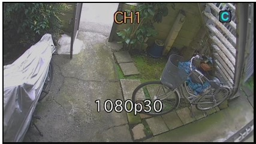

# 手動録画機能

[[toc]]

## 手動録画方法

手動録画するチャンネルを選択します。

- マウスの場合：マウスカーソルを録画したい画面まで移動し、クリックしてください。
- リモコンの場合：リモコンの方向キー（上、下、右、左）を押して選択してください。

選択されたチャンネルは黄色で表示されます。

レコーダー前面パネルのRECボタンを押してください。

画面に赤いRマークが表示されます。

もう一度RECボタンを押すと録画が終了し、画面から赤いRマークが消えます。

## レコーダーをUMSクライアントに接続する

録画の確認にはUMSクライアントが必要です。

UMSクライアントを立ち上げ、Connectをクリックします。

接続設定を入力し、OKをクリックします。

- モデル：DVR/NVRを選択します。
- 接続先名：使用しません。
- 接続先アドレス：レコーダーのIPアドレスを入力します。
- ポート番号：レコーダーのポート番号を入力します。
- ID：レコーダーのIDを入力します。初期値は「admin」です。
- パスワード：レコーダーに設定したパスワードを入力します。

レコーダーのIPアドレスとポート番号を知りたい場合は設定＞ネットワークから確認できます。

## UMSクライアントから録画を再生する

レコーダーとの接続が完了したら一覧画面が表示されます。

手動録画したチャンネルをクリックします。

選択したチャンネルのみが表示されます。

画面右下のRemote Logをクリックします。

ログの検索が画面が表示されます。

左側の検索条件を設定します。

- Type：録画を見る場合はEventを選択します。
- Channel：ログを表示するチャンネルを選択します。
- Event：録画の種類を選択します。手動録画は「Manual」です。
- カレンダー：ログを表示する日付を選択します。

各種設定を選択したらFindをクリックします。

ログが表示されるので再生したい手動録画（Manual）をダブルクリックまたは選択してから「Play」をクリックします。

録画が表示されます。

**アイゼック最新のレコーダーはこちら▼**
- [【16ch同時再生, 4K対応機種】ANEモデル 製品ページ](https://isecj.jp/recorder/recorder-ane)

**レコーダーの導入事例を確認する▼**
- [多機能なデジタルレコーダーを使った導入事例](https://isecj.jp/case/security-enhancement)
- [マルチクライアントソフトの導入事例](https://isecj.jp/case/netcafe-camera)
- [レコーダー・センサー・警報機を連携した独自システムの構築事例](https://isecj.jp/case/system-design)