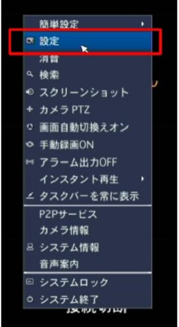
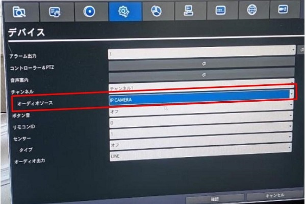
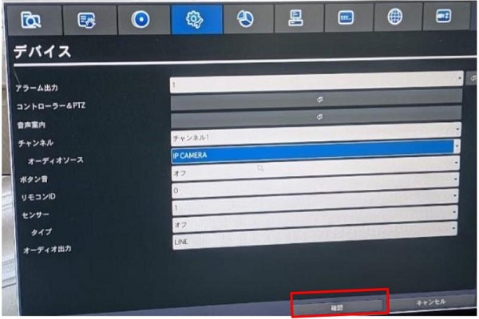
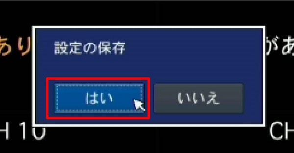

# IPカメラで取り込んだ音声がレコーダーに記録・出力されない

## 原因
　レコーダーの１～４ｃｈはアナログ音声入力端子がついているため、IPカメラの音声入力を有効にするには別途レコーダー側の設定が必要となります。初期設定の時点では、アナログ入力が有効となっていますので、IPカメラの音声を使用する場合は設定の確認を行うことをお願いしております。

## 設定変更手順

### １．レコーダーの設定画面に入ります。

### 2. デバイスタブに移動し、オーディオソースを「IP　CAMERA」に変更します。

### ３.確認をクリックします。

### ４．設定の保存で「はい」をクリックします。

**アイゼック最新のレコーダーはこちら▼**
- [【16ch同時再生, 4K対応機種】ANEモデル 製品ページ](https://isecj.jp/recorder/recorder-ane)

**レコーダーの導入事例を確認する▼**
- [多機能なデジタルレコーダーを使った導入事例](https://isecj.jp/case/security-enhancement)
- [マルチクライアントソフトの導入事例](https://isecj.jp/case/netcafe-camera)
- [レコーダー・センサー・警報機を連携した独自システムの構築事例](https://isecj.jp/case/system-design)

