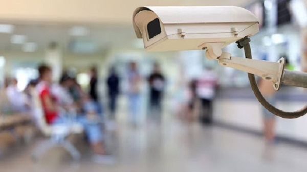

# はじめに

「DVR」をお買い上げいただきありがとうございます。オンラインマニュアルでは、お買い上げ時の状態での操作方法を説明しています。ご使用の際は[「安全のため必ずお守りください」](./recorder-safety-instruction.html)をお読みになり安全な場所、環境、方法でのご利用をお願いいたします。

本マニュアルでは「お客様が商品の到着から、セットアップを行い商品をスムーズにお使いいただくこと」を目的に、必要な手順を順を追って解説しております。

また、ご購入を検討の方はこちらの[商品スペック](./recorder-specification.html)をご覧くださいませ。

## オンラインマニュアルの構成

### １．商品の基本操作
- [初めの操作](./recorder-first-operation.html)

- [リアルタイムでの監視）](./recorder-monitor-realtime.html)

- [録画方法の選択](./record01-introduce.html)

- [録画の再生](./recorder-play-overview.html)

- [録画のバックアップ](./backup-overview.html)

- [メンテナンス](./recorder-ntp-adjust.html) 

### ２．シーン別便利機能
- [設定をパスワードなしで入る方法](./recorder-password-off.html) 
- [遠隔監視](./faq05-remote-viewer.html)
- [便利機能（通知など）](./function05-sound.html)
- [メンテナンス](./recorder-log-message.html)

### ３．よくある質問
- [チャンネル番号を日本表記にしたい](./faq03-language.html) 
- [NTPによる時刻補正が行われない](./recorder-ntp-adjust.html) 
- [UMSクライアントについて知りたい](./recorder-ums-event-message.html) 
- [お問い合わせ時に必要な情報を知りたい](./faq02-serial.html)  

### ４． [各部の名称と働き](./recorder-specification.html)

### ５． [保障・アフターサービスについて](./recorder-specification.html)

### アイゼック最新のレコーダーはこちら
- [【16ch同時再生, 4K対応機種】ANEモデル 製品ページ](https://isecj.jp/recorder/recorder-ane)

### レコーダーの導入事例を確認する
- [多機能なデジタルレコーダーを使った導入事例](https://isecj.jp/case/security-enhancement)
- [マルチクライアントソフトの導入事例](https://isecj.jp/case/netcafe-camera)
- [レコーダー・センサー・警報機を連携した独自システムの構築事例](https://isecj.jp/case/system-design)
