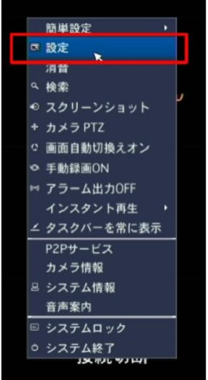
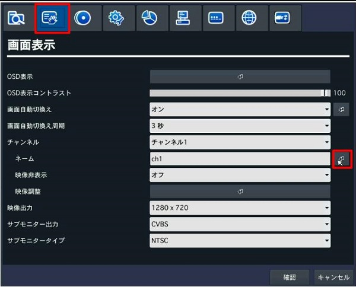
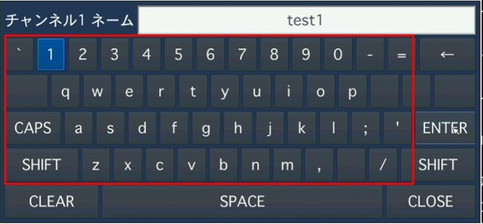
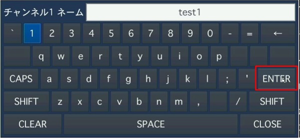
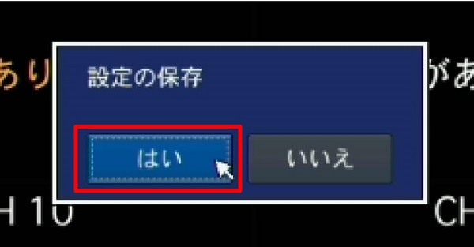
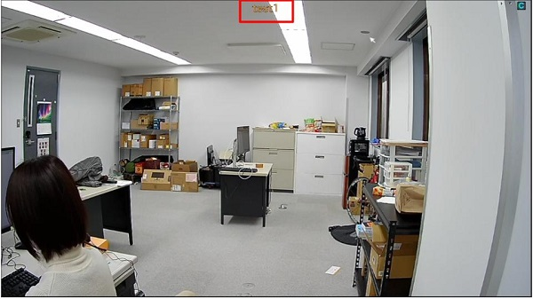

# チャンネルをレコーダーでローマ字表記で変えたい

日本語表示はパソコン上でのみ設定可能ですが、ローマ字表示での変更はレコーダー上で行うことができます。

## 手順

### １．レコーダーの設定メニューに入ります。

### ２．画面表示のタブに移動し、「ネーム」の「↲」をクリックします。

### ３．元々あるチャンネル名を「CLEAR」または「←」をクリックして初期化します。

### ４．画面上のキーボードを使って、任意のチャンネル名を入力していきます。
大文字にしたい場合「CAPS」をクリックします。

### ５．入力後、「ENTER」をクリックします。

### ６．ネームが新しいチャンネル名に変わっていることを確認して、「確認」をクリックします。

### ７．設定の保存で「はい」をクリックします。

### ８．チャンネル名が変わっていることを確認します。

**アイゼック最新のレコーダーはこちら▼**
- [【16ch同時再生, 4K対応機種】ANEモデル 製品ページ](https://isecj.jp/recorder/recorder-ane)
**レコーダーの導入事例を確認する▼**
- [多機能なデジタルレコーダーを使った導入事例](https://isecj.jp/case/security-enhancement)
- [マルチクライアントソフトの導入事例](https://isecj.jp/case/netcafe-camera)
- [レコーダー・センサー・警報機を連携した独自システムの構築事例](https://isecj.jp/case/system-design)