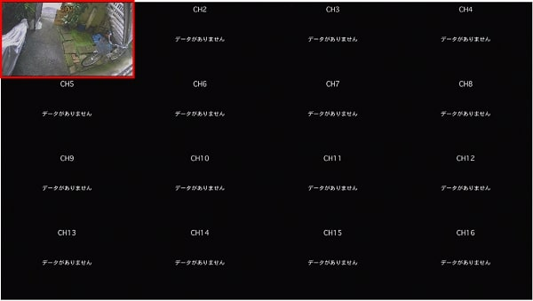
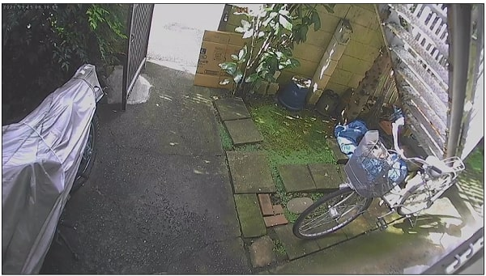
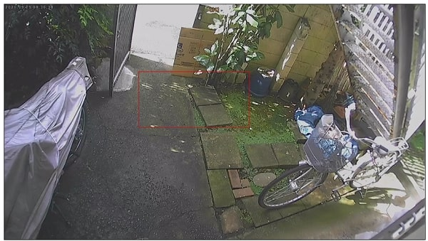
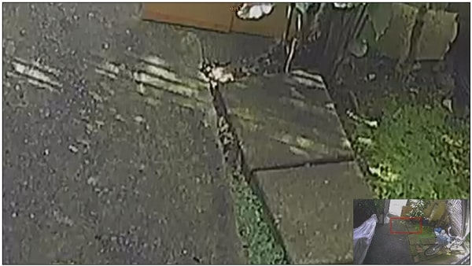

# デジタルズームする方法

レコーダーの映像をデジタルズームする場合は以下の手順にしたがってください。

デジタルズームしたいチャンネルをダブルクリックします。

ダブルクリックするとチャンネルがフルスクリーン表示されます。

マウスをドラッグ(クリックボタンを押したままマウスを動かすこと)すると赤枠が表示されます。

マウスの左クリックボタンを離すと赤枠の部分がデジタルズームされます。

マウスをクリックするとズーム前の画面に戻ります。

**アイゼック最新のレコーダーはこちら▼**
- [【16ch同時再生, 4K対応機種】ANEモデル 製品ページ](https://isecj.jp/recorder/recorder-ane)

**レコーダーの導入事例を確認する▼**
- [多機能なデジタルレコーダーを使った導入事例](https://isecj.jp/case/security-enhancement)
- [マルチクライアントソフトの導入事例](https://isecj.jp/case/netcafe-camera)
- [レコーダー・センサー・警報機を連携した独自システムの構築事例](https://isecj.jp/case/system-design)