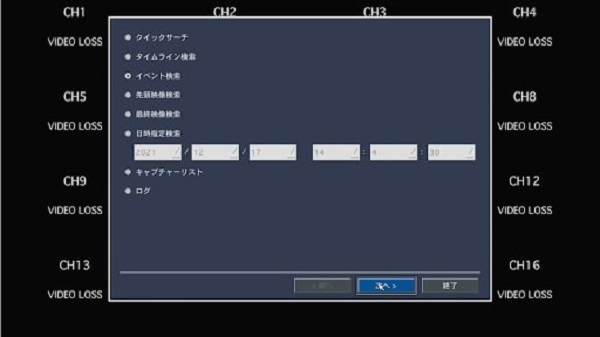
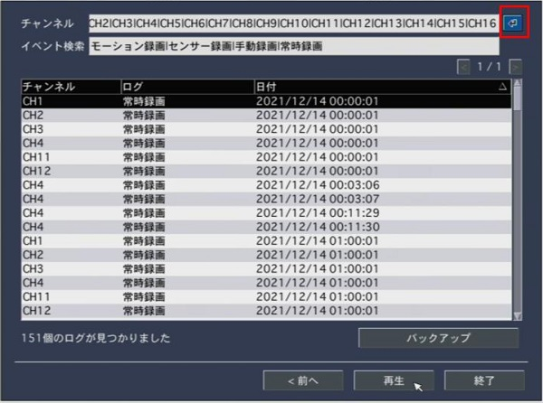
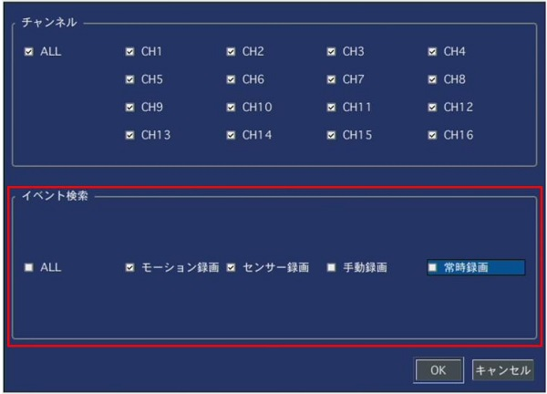
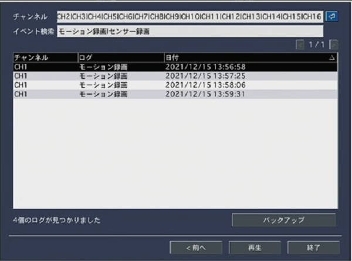

# ログの確認方法

検索画面でイベント検索を選択するとセンサー・モーションが働いた時間のログが確認出来ます。

イベント検索を選択します。

 

「↲」をクリックし、センサー録画・モーション録画のログのみを絞って検索していきます。

ログを選択し、「再生」を押すとイベントが発生した時の映像を再生することができます。
 

**アイゼック最新のレコーダーはこちら▼**
- [【16ch同時再生, 4K対応機種】ANEモデル 製品ページ](https://isecj.jp/recorder/recorder-ane)

**レコーダーの導入事例を確認する▼**
- [多機能なデジタルレコーダーを使った導入事例](https://isecj.jp/case/security-enhancement)
- [マルチクライアントソフトの導入事例](https://isecj.jp/case/netcafe-camera)
- [レコーダー・センサー・警報機を連携した独自システムの構築事例](https://isecj.jp/case/system-design)