# 初めの操作（商品のお届け～カメラの接続まで）

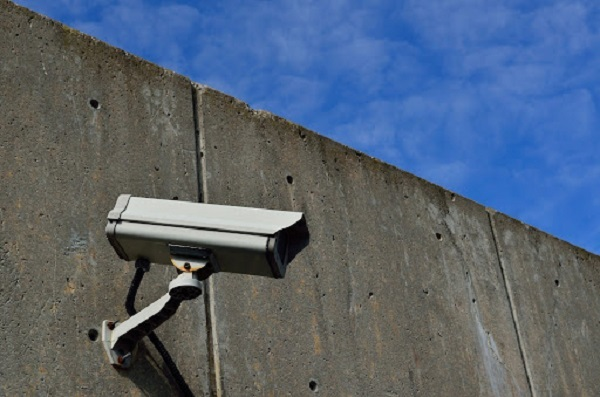

ここでは商品が届けられてから実際に初期設定を行い、カメラを接続するまでの手順を紹介します。必要なステップは全部で五つです。一つ一つ確認していきましょう。

[[toc]]

## １．製品・付属品を確認する
以下の５点の製品・付属品があるか確認をしましょう。

- レコーダー（DVR）
- 電源コード
- リモコン
- リモコン用の電池
- マウス（有線）
- 取扱説明書

その他：レコーダーを接続するモニター、HDMI・VGAコード、ネットワーク用のルーター、ルーターに接続済みのパソコン、IPカメラ用のスイッチングハブをご用意していただけますとスムーズにセットアップの作業を行うことができます。

## ２．レコーダーを接続する
レコーダー本体と映像を映すためのモニターを接続します。
接続を行うにあたって以下の３つをご準備ください。

### 用意するもの
- モニター
- 電源コード（付属）	
- VGAまたはHDMIコード

### レコーダー接続の手順

１．レコーダーに電源を接続する
付属のACアダプターと電源コードをつかって、レコーダーに電源を接続します。
電源コードは、レコーダー背面の「Power（電源）」に差します。

２．レコーダーとモニターをつなげる
お客様のモニターの種類によってVGAまたはHDMIコードを選択し、レコーダーとモニターをつなぎます。VGA・HDMIどちらもレコーダー背面に接続端子がございます。接続を行うと自動でモニターにレコーダーの画面が映し出されます。

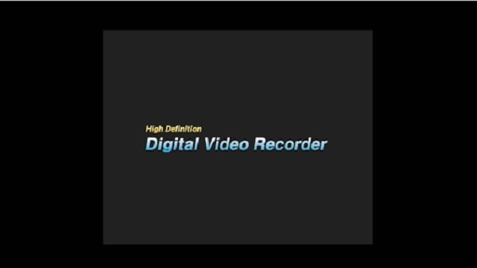

３．パスワード「1111」を入力
初期設定のパスワードである「1111」を入力し、ログインします。
ログイン後、１６画面で区切られたライブ画面が映し出されれば接続完了です。

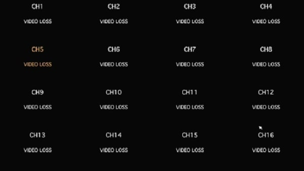

**レコーダーの導入事例を確認する▼**
- [多機能なデジタルレコーダーを使った導入事例](https://isecj.jp/case/security-enhancement)

## ３．パスワードの変更をする
初期の設定としてパスワード「１１１１」を設定しておりますが、セキュリティーの観点から変更をお願いしております。下記の手順でパスワードの変更を行ってください。

### 用意するもの
- マウス（付属）
マウスなしでも作業はできますが、マウスを使うと簡単に作業できます。

### パスワード変更の手順
1. 設定画面でセキュリティタブを選択する
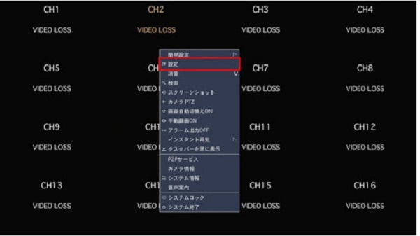
モニターの画面を右クリックして、設定をクリックします。

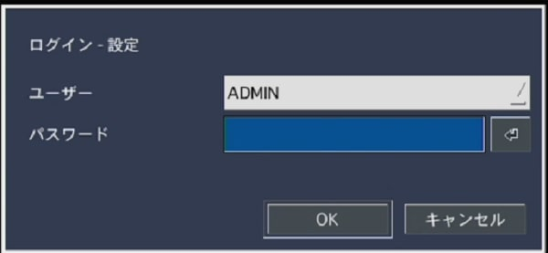
設定したパスワードを入力し設定画面に入ります。

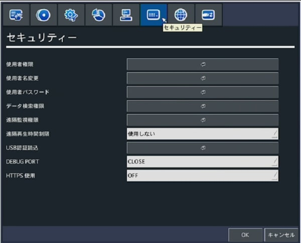
設定したパスワードを入力し設定画面に入ります。上のタブからアイコンにマウスを合わせ、セキュリティーと表示されるタブをクリックします。

2. 「使用者パスワード」の項目を変更する
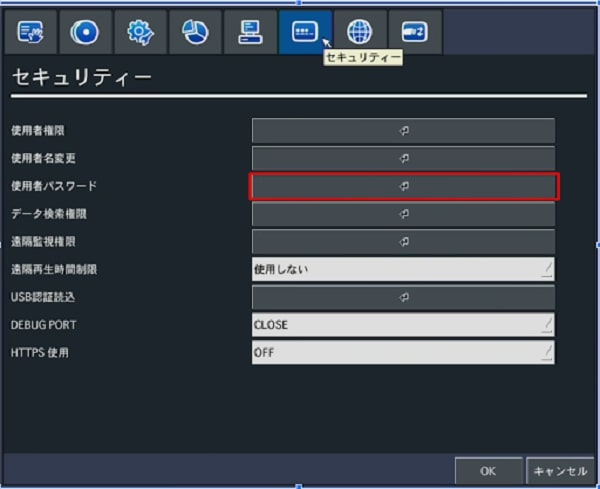
使うのは使用者パスワードの欄です。「↲」をクリックし、
- 現パスワード：「１１１１」
- 新パスワード
- 確認
の欄を記入します。記入後「OK」をクリックすると設定が完了します。

※設定したパスワードを忘れてしまうと、初期化が必要になってしまい使用を再開するまでに時間がかかってしまいます。必ずパスワードの管理を行って、お忘れなきようお願いいたします。

[より詳しいパスワード変更方法はこちらから](./faq01-password.html)

## ４．ネットワーク設定を行う

### ネットワーク設定の目的
ネットワーク設定はカメラの接続を行う上で必須の設定です。
ネットワークの設定を行うことでパソコンやスマホなどのデバイスでもカメラの映像を確認できるなど遠隔での操作が可能になります。

### 用意するもの
- ルーター
- ルーターにつながっているデバイス（パソコン）

### ネットワーク設定の手順

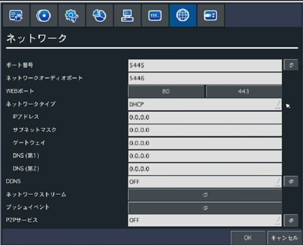

1. ネットワークタイプを選ぶ

設定画面を開き、「ネットワーク」のタブに移動します。
入力する必要がある項目は、ネットワークタイプです。

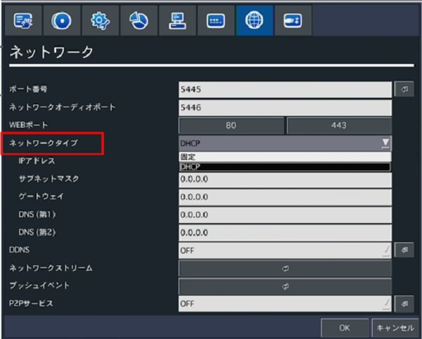

ネットワークタイプには以下の二つがあります
- DHCP
- 固定

DHCPとはデバイスがネットワークに接続する際に自動的にIP アドレスを割り振る設定です。ネットワーク設定（情報の入力）を手動でする必要がなく簡単な一方、
- 接続のたびにIPアドレスが変わるため、使用者の管理が難しい
- ルーターなどのサーバーがダウンした際にネットワークに接続できなくなる
などの弊害があります。

一方固定とは、管理者がIP アドレスを自動割り当てではなく指定することで、固定のIPアドレスを設定する方法です。IPアドレスのほかにもサブネットマスクやゲートウェイなどのネットワーク情報を調べて入力～設定する必要がありますが、使用者の管理がしやすいという最大のメリットがあります。

＜DHCP と固定の違いまとめ＞

|    |  DHCP  |  固定  |
| ---- | ---- | ---- |
|  利点  |  ネットワークの設定を自動でしてくれる  |  使用者の管理がしやすい  |
|  弱点  |  接続のたびにIPアドレスが変わる可能性があるため、使用者の管理が難しいルーターなどのサーバーがダウンした際にネットワークに接続できなくなる  |  ネットワーク設定（情報の入力）を手動で行う必要がある  |

2. ネットワーク情報を入力する

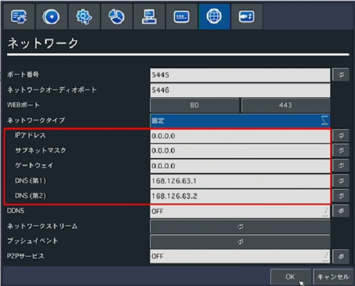

「固定」をネットワークタイプに選んだ場合はネットワーク情報の入力をする必要があります。入力が必要な項目は以下の５つです。
- IPアドレス
- サブネットマスク
- ゲートウェイ
- DNS（第1）（ゲートウェイと同じ数値を入力する）
- DNS（第2）（ゲートウェイと同じ数値を入力する）

入力後は「OK」を押して設定を保存します。

それぞれIPアドレスは独自のもの、その他の情報はネットワーク内共通の情報です。これらの情報を入力するには,ネットワーク情報・IPアドレスを調べる必要があります。→ネットワーク情報の調べ方

**レコーダーの導入事例を確認する▼**
- [レコーダー・センサー・警報機を連携した独自システムの構築事例](https://isecj.jp/case/system-design)

### ネットワーク情報の調べ方（Windows）
ネットワーク情報を調べるには、同じネットワークにつながっているデバイスを使用します。

1. コマンドプロンプトを起動する
ネットワーク情報を出すための画面、コマンドプロンプトを起動します。
windowsの画面、左下の検索ボックスで「CMD」と調べ、アプリを起動してください。

2. ネットワーク情報を出す
コマンドプロンプトでネットワーク情報を検索していきます。
プロンプト上に「ipconfig」と打ち込んでエンターを押すと、
下の画面のように情報が出てきます。

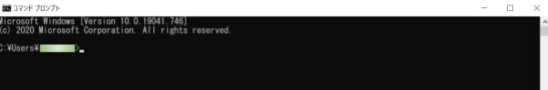

3. 必要な情報をメモする
ここでは、
- サブネットマスク
- ゲートウェイ
の二点の数値をメモしていきます。
なおゲートウェイは「DNS」の数値としても用います。

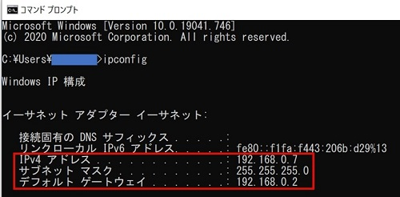

4. ネットワーク上で現在使われているIPアドレスを出す
同じコマンドプロンプト上で「arp -a」と打ち込んでエンターを押すと、
今度はこのような数値が映し出されます。
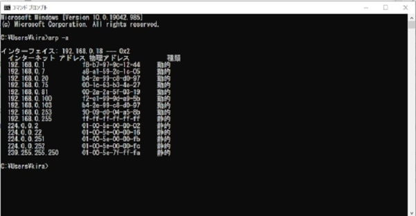

5. レコーダーで使用するIPv4アドレスを決める。（被らない下1組を割り出す）
レコーダーに使うIPアドレスは被ってしまうといけないので上記に表示されている以外の数字をIPアドレスとして使用していきます。ここでいうと「192.168.0.○○」の○○の部分をお客様自身で設定していただく必要があるので、画面上に出ていない3桁までの数字をここから決めていきます。

**レコーダーの導入事例を確認する▼**
- [マルチクライアントソフトの導入事例](https://isecj.jp/case/netcafe-camera)

## ５． カメラを接続する
使用可能な📷の一覧は補足情報で後述。

### 5.1ローカルカメラ（同軸カメラ）の接続
同軸カメラをレコーダーに接続していきます。用意するものは以下の通りです。

### 用意するもの
- 同軸カメラ

### ローカルカメラ（同軸カメラ）の接続
同軸カメラについている、電源コード、同軸ケーブルをそれぞれ電源、レコーダーの背面に繋げます。同軸ケーブルは全部で16個レコーダーにつなげることができます。

- 画面の拡大・縮小
初期表示では画面16分割で表示されています。一画面のみを拡大したい場合は画面をダブルクリックします。戻す場合も同じくダブルクリックしてください。

### 5.2 IPカメラの接続
ネットワークで動作するIPカメラをレコーダーに接続していきます。用意するものは以下の４つです。

### 用意するもの
- IPカメラ
- スイッチハブ
- ランケーブル
- 電源ケーブル・ACアダプター（付属）※POE接続をしない場合のみ

※スイッチハブがなくても接続自体はできますが、ネットワークが制限されてしまい遠隔での操作ができなくなってしまうため、ハブを用意していただくことをお勧めいたします。

### IPカメラ接続の手順

1. ハイブリット設定をする
IPカメラの映像をモニターに表示するための設定を行います。
設定画面を開き、💻のマークの「システム」タブをクリックします。

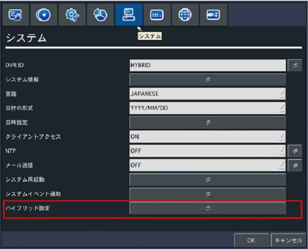

一番下のハイブリット設定を開き、「ローカルCHの数 」を変更することでIPCHの数が自動で変わります。

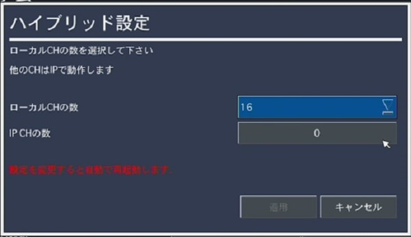

初期ではアナログカメラの表示が16と画面上のすべてを占めているので、この数を減らすことでIPカメラを表示させる枠を補完するという仕組みです。（設定を保存すると自動で再起動されます）

2. 電源、ランケーブルを繋げる
IPカメラを電源、スイッチハブに接続していきます。（ハブの接続方法）
スイッチハブにて「POE接続」をするか否かで作業が異なります。

- POE接続の場合
スイッチハブをWIFIのルーターと繋ぎます。スイッチハブのPOEではない挿し口、ルーターにLANケーブルを差してください。
つぎに、スイッチハブとIPカメラを接続していきます。スイッチハブのPOEの挿し口にIPカメラのLANケーブルをさしてください。これでネットワーク、電源の確保ができました。

- POE接続でない場合
POE接続と同様スイッチハブをWIFIのルーターと繋ぎます。スイッチハブのPOEではない挿し口、ルーターにLANケーブルを差してください。
つぎに、スイッチハブとIPカメラを接続していきます。スイッチハブのPOEではないの挿し口にIPカメラのLANケーブルをさしてください。また、電源の確保のため付属の電源ケーブルと、IPカメラをつなぎます。

まとめ：
POE：スイッチハブールーター、スイッチハブーIPカメラ
POE以外：スイッチハブールーター、スイッチハブーIPカメラ、電源ーIPカメラ

#### POE接続の注意点
POE接続を行う際は以下の２つに気を付けましょう。
- POEと電源接続を同時に行わない
- POE非対応の機械もある

#### POEと電源接続を同時に行わない
POE接続はLANケーブルのみで、IPカメラの電源・ネットワークの接続をかねる働きがあります。したがって、POEの接続のほかに、電源ケーブルを用いてIPカメラに直接電源を送ってしまうと過給電となりショートの原因になってしまいます。POEを行う際はIPカメラに付属している電源ケーブルは使わずに、LANケーブルのみをつなげるようにしてください。

#### POE非対応の機械もある
レコーダーのなかにはPOE非対応のものもあります。しかしたいていのスイッチングハブはPOE給電可能な機器とそうでないものを判断することができますので対応していない危機に接続した場合でも問題なく、電源給電なしの接続に自動で切り替えをしてくれます。しかし、安価なものの中にはこういった判断ができないハブもありますので基本的にはPOE非対応の機種には使わないほうが無難でしょう。

※PoEとは？
PoEは「Power of Ethernet」の略で、電源供給とネットワーク接続を同時に行える技術。ランケーブルから直接給電できるため、コンセントが使えない場所での使用に便利。POE非対応の機種もあるので使用の前に確認を。

3. IPカメラの設定をする
接続したIPカメラを登録していきます。設定画面を開き、「IPカメラ」のタブを開きます。設定を行う作業は次の4つです。

- チャンネル登録
- 製造元登録
- パスワード入力
- PROFILE入力※Onvifの場合のみ  

1. チャンネル登録
モニターの画面のどの部分に映像を映し出すかを決めます。通常の画面（１６分割）では全部で16個のチャンネルが映し出されています。「IPカメラ」のタブの数字をクリックすると、先ほどハイブリット設定で決めたローカルチャンネルの数に従って、IPカメラのチャンネル数の範囲が映し出されます。ここから任意の数字を選択してください。

2. 製造元登録
カメラの機種をレコーダーに保存していきます。
製造元の項目をクリックし、該当するカメラのメーカーを選択します。該当メーカーがない場合は「ONVIF」を選択します。選択後「スキャン」をクリックするとレコーダーが検索を開始し、カメラの選択肢が表示されます。該当のカメラを選択し登録ボタンを押したら完了です。

3. パスワード入力
IPカメラ用の任意のパスワードを設定します。
パスワードを設定することで外部から勝手に映像を見られないようリスク対策ができます。

4. PROFILE入力※Onvifの場合のみ
Onvifの場合、製造元登録した後profile登録をする必要があります。
profileを開き該当のprofileを選択します。	

## 初めの操作に便利な機能

- 設定をパスワードなしで入る方法
初期状態では特定の操作（設定、録画の再生、PTGカメラ、録画のオフ、ネットワークアクセスなど）をする際にパスワードを求められます。
これらは使用者権限設定より変更することができます。
[使用者権限設定の方法](./recorder-password-off.html)

## 補足情報）使用可能なカメラ
AHD及びHD-TVI方式のハイビジョン、フルハイビジョン画質とアナログカメラが接続可能です（自動認識します）

AHD Ver 1.0 1280×720ドット（720p） / Ver 2.0 1920×1080（1080p） / Ver 3.0 2592×1520
HD-TVI  Ver 1.0 1280×720ドット（720p） / Ver 2.0 1920×1080（1080p） / Ver 3.0 2592×1520 2K
CVBS 25万画素、38万画素(D1)、48万画素（960h）
IPカメラ 最大2592×1520ドット 

**アイゼック最新のレコーダーはこちら▼**
- [【16ch同時再生, 4K対応機種】ANEモデル 製品ページ](https://isecj.jp/recorder/recorder-ane)

