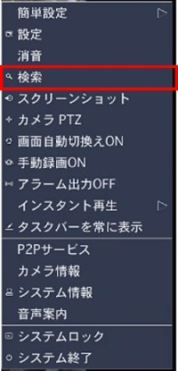
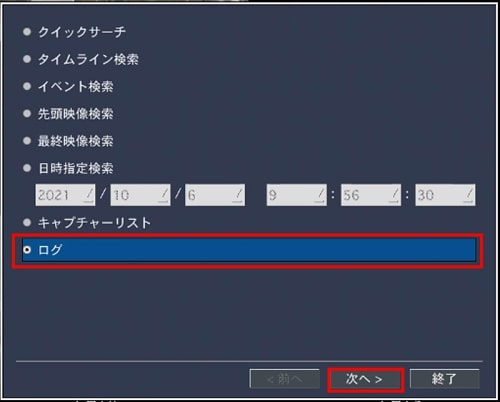
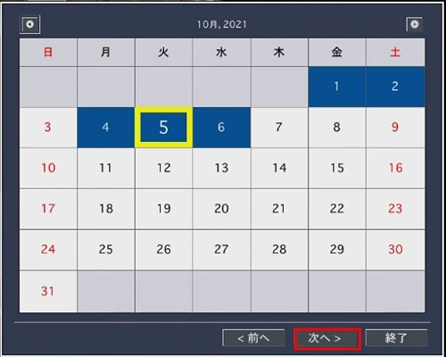
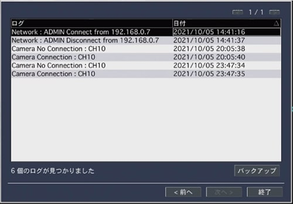
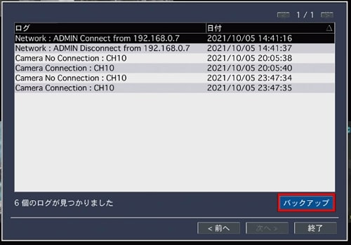
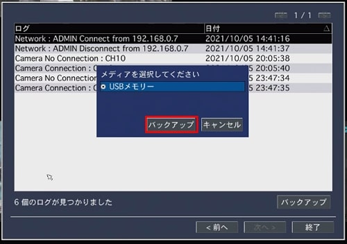
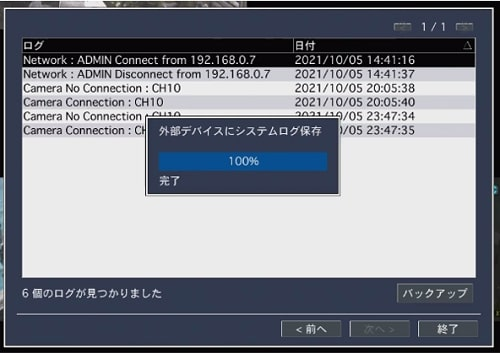
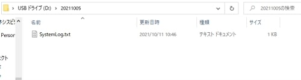

# ログの確認方法

[[toc]]

## ログの確認方法

レコーダーのログを確認する場合は

マウスを右クリック＞検索をクリック

ログを選択し、次へをクリック

日付を選択し、次へをクリック

ログが表示されます。

## ログの保存方法

レコーダーにUSBメモリを挿します。

バックアップをクリックします。

バックアップをクリックします。

保存が始まります。
外部デバイスにシステムログ保存の表示が消えたら
USBメモリをレコーダーから取り外します。

USBメモリに保存したログファイルはPCで確認できます。

## ログメッセージ一覧

| CODE | メッセージ                      | 説明                                                               | 
| ---- | ------------------------------- | ---------------------------------------------------------------- | 
| 0    | Power Off or Self Recovery      | ログの記録ができなかった時,表示されるメッセージで次のような場合に現れます。  (1) 使用者が電源をOFFした時や停電になった場合。  (2) Kernel Panic あるいは Main Program Downなど深刻なエラーが発生した場合。 | 
| 1    | User Shutdown                   | メニューから通常的にShutdown実施。                                  | 
| 2    | No response from Storage        | 正常動作している中に録画を担当するCPUの応答なし。(Multi-CPU 構造)     | 
| 12   | No response from Storage        | 起動時,録画を担当するCPUの応答なし。(Multi-CPU 構造)                 | 
| 3    | No response from Slave          | 正常動作している中に Slave CPUの応答なし。(Multi-CPU 構造)           | 
| 11   | No response from Slave          | 起動時, Slave CPUの応答なし。(Multi-CPU 構造)                      | 
| 4    | Playback Error                  | 倍速を変更したがCPUの反応なし。(Multi-CPU 構造)                     | 
| 5    | Playback Error                  | 再生を担当する CPUとの接続失敗。(Multi-CPU 構造)                     | 
| 6    | Playback Error                  | 再生をクリックしたが CPUの応答なし。(Multi-CPU 構造)                 | 
| 7    | Playback Error                  | 一時停止をクリックしたがCPUの応答なし。(Multi-CPU 構造)               | 
| 9    | Playback Error                  | 早送りをクリックしたが CPUの応答なし。(Multi-CPU 構造)                | 
| 8    | Playback Error                  | Stepをクリックしたが CPUの応答なし。(Multi-CPU 構造)                 | 
| 10   | Abnormal Time Jump              | 正常動作している中に,時間がずれる。(過去あるいは未来)                  | 
| 14   | Mode Change -> Application      | テストモードからユーザーモードに切り替える。                          | 
| 15   | Mode Change -> Test             | ユーザーモードからテストモードに切り替える。                          | 
| 17   | Software Error                  | Software Thread Down。(Softwareのバーグあるいはリソース不足)         | 
| 18   | Recording Error                 | カメラが接続されている状態での録画不具合。                            | 
| 19   | Write Error                     | HDDに書き込みができない。                                           | 
| 20   | Time went too forwards          | NTP補正結果,時刻が変更になった時。                                   | 
| 21   | Load Configuration              | USBを利用して Configuration Roading。                              | 
| 22   | Load Default Configuration      | 使用者設定を戻す。                                                  | 
| 23   | Load Factory Configuration      | 工場出荷時に戻す。                                                  | 
| 24   | User Restart                    | メニューを利用して正常に再起動。                                     | 
| 25   | Software Upgrade                | Softwareアップグレード。                                            | 
| 26   | Display Resolution Change       | 出力解像度の変更。                                                  | 
| 27   | HDD Format                      | HDD Formatをするための再起動。                                      | 
| 28   | Set Date and Time               | 日付/時刻の変更。                                                   | 
| 29   | Hybride Mode Change             | Hybrideに設定変更。                                                 | 
| 30   | RTC Error                       | RTC エラー。                                                       | 
| 31   | Filesystem Error                | ファイルシステムが全体的に壊れた場合。                                | 
| 32   | Filesystem Error                | Meta Dataが壊れた場合。                                             | 
| 33   | New HDD Insertion               | 新しい HDDを追加。                                                    | 
| 34   | Slave HDD Change                | Slave HDD 交換。                                                     | 
| 35   | Time Mismatch                   | 現在のシステム時刻が最後の録画日の時刻より先になっている場合。（時刻逆転)  | 
| 36   | Web Server Error                | Webサーバー異常。                                                     | 
| 37   | PCI Bus Error                   | PCI バースエラー。                                                    | 
| 38   | Channel Operational Mode Change | チャンネル “使用/未使用”のオプションに変更があった場合。                 | 
| 39   | Filesystem Restart              | ファイルシステムを復旧した後,意図的に再起動。                           | 
| 40   | Time went backwards             | NTP 補正結果、時刻が過去に回帰した場合。                                | 
| 41   | Queue Error                     | Softwareの内部から使用するQueueに問題が発生した場合。                   | 
| 42   | -                               | Reserved                                                            | 
| 43   | Network User Limit Change       | ネットワークの同時接続者の制限が変更になった場合。                       | 
| 44   | Schedule Reboot                 | 予約されていた再起動。                                                | 
| 45   | RAID Config Change              | RAIDの構成を変更するため再起動した場合。                                | 
| 46   | Sub Monitor Output Change       | サブ―モニターの出力標準を変更した場合。                                 | 
| 47   | -                               | Reserved                                                            | 
| 48   | CODEC Change                    | Codecの種類を変更した場合。 (H.264➡H.265あるいは H.265➡H.264)        | 

**アイゼック最新のレコーダーはこちら▼**
- [【16ch同時再生, 4K対応機種】ANEモデル 製品ページ](https://isecj.jp/recorder/recorder-ane)

**レコーダーの導入事例を確認する▼**
- [多機能なデジタルレコーダーを使った導入事例](https://isecj.jp/case/security-enhancement)
- [マルチクライアントソフトの導入事例](https://isecj.jp/case/netcafe-camera)
- [レコーダー・センサー・警報機を連携した独自システムの構築事例](https://isecj.jp/case/system-design)