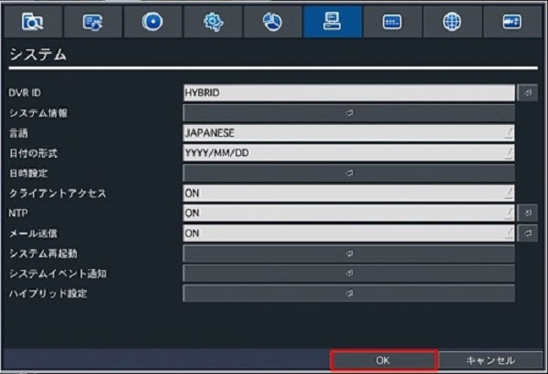

# レコーダーの状態を日次でメール送信する

本記事ではレコーダーの状態を日次でメール送信する方法について説明します。

設定からシステム＞メール送信をONにします。

矢印ボタンをクリックしてメール送信の設定画面を開きます。

メール設定を入力し、OKをクリックします。
※Yahooメールの設定方法は[こちら](./function04-mail.html)参照
※OKをクリックする前にメールが届くかメールテストを実施してください。

システムイベント通知をクリックします。

機器状態チェックをクリックします。

通知間隔を設定し、OKをクリックします。

システムイベント通知設定の機器状態チェックのメール通知をONにして、OKをクリックします。
※レコーダーの再起動やHDDエラー等も通知したい場合はこれらの項目もONにしてください。

OKをクリックします。

はいをクリックします。

これでレコーダーの設定は完了です。
指定した時間にメールが届いているか確認してください。

**アイゼック最新のレコーダーはこちら▼**
- [【16ch同時再生, 4K対応機種】ANEモデル 製品ページ](https://isecj.jp/recorder/recorder-ane)

**レコーダーの導入事例を確認する▼**
- [多機能なデジタルレコーダーを使った導入事例](https://isecj.jp/case/security-enhancement)
- [マルチクライアントソフトの導入事例](https://isecj.jp/case/netcafe-camera)
- [レコーダー・センサー・警報機を連携した独自システムの構築事例](https://isecj.jp/case/system-design)
