# リアルタイムでの監視

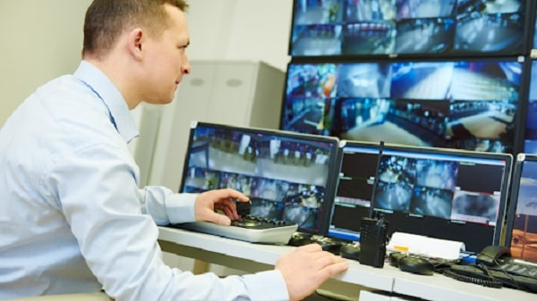

リアルタイムで防犯カメラの映像を確認する方法を解説します。
各アイコンの意味や使い方を理解して、リアル監視の効率をあげていきましょう。
また後半ではリアルタイム監視での便利機能を紹介します。

[[toc]]

## ライブ監視画面の構成
レコーダーを起動すると最初に表示されるのがこのライブ監視の画面になります。ここでは接続しているカメラのライブ映像を見ることができます。このままでも監視はできますが、画面の構成やアイコンの意味を理解してより効率的に監視をしていきましょう。

### ①映像画面
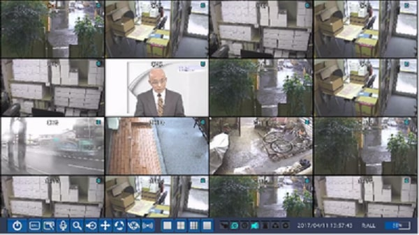
初期は16画面になっており、最大１６台の防犯カメラの映像が流れます。
それぞれの映像画面右上のアイコンには、録画イベントの種類が表示されています。

|  アイコン  |  意味  |
| ---- | ---- |
|  C  |  常時録画  |
|  R  |  手動（マニュアル）録画  |
|  M  |  モーション検知による録画  |
|  S  |  センサー録画(通常)  |
|  A  |  センサー検知による録画（イベント）  |

### ②タスクバー
画面下部にマウスを這わせるか、画面上を右クリックして、「タスクバー」を常に表示をクリックするとタスクバーが表示されます。

（タスクバーを常に表示）
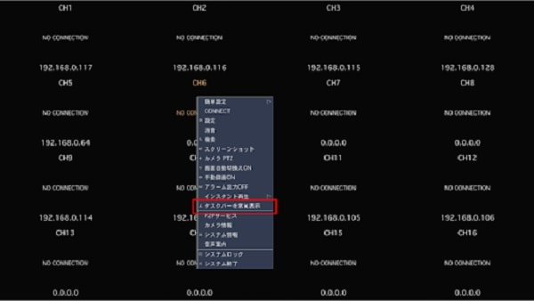

（タスクバーが表示される）
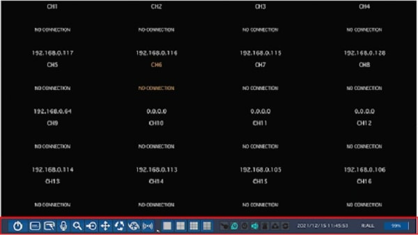

タスクバーでは、アイコンのライトの点灯ぐあいから現在の録画設定状態を確かめたり、アイコンをクリックして、ライブ画面の表示やレコーダーに関する各種設定ができます。

### タスクアイコン

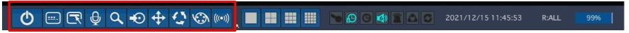

#### ＜ライブ監視に便利なアイコン＞
ライブ監視でよく用いられるアイコンです。それぞれのアイコンの役割は以下の通り。

|  アイコン  |  意味  |
| ---- | ---- |
|    |  使用者権限をロックします  |
|     |  選択されている画面の音声をON/OFFできます（選択されている画面は「映像画面のCH数字が黄色くなっている」）  |
|  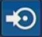   |  画面のスクリーンショットをUSBに保存します  |
|     |  PTZカメラコントロールメニューに入ります  |
|     |  映像画面を自動で切り替えしていきます  |
|    |  手動録画を開始／中止します手動録画を始めると、事前に設定した他の録画モード（動作検知・センサー検知）などは無視されます|
|     |  アラーム出力機能をON/OFFにします  |

#### ＜その他のタスクアイコン＞

|  アイコン  |  意味  |
| ---- | ---- |
|  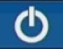  | システムを終了します |
|     | 設定メニューに入ります。（各種システム設定）  |
|     |  検索メニューに入ります。（録画再生時に使う） |

### 画面表示の変更アイコン

初期ではライブ映像が１６画面で再生されています。以下のアイコンでこの分割を変更することができます。

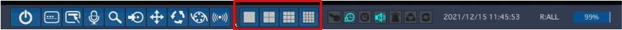

|  アイコン  |  意味  |
| ---- | ---- |
|    | ライブ映像を一画面で表示します。アイコンをクリックするごとに表示されるチャンネルが順に変わっていきます。 |
|     |  ライブ映像を４画面で表示します。アイコンをクリックするごとに表示されるチャンネルが４つずつ変わっていきます。）  |
|     |  ライブ画像を9画面で表示します。  |
|     |  ライブ画像を16画面で表示します。|

### アイコンランプ
アイコンランプでは各設定や動作の状態が確認できます。
オン→青色に光ります。

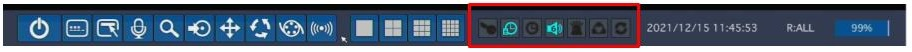
|  アイコン  |  意味  |
| ---- | ---- |
|  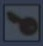  |  操作ロックがかかっている状態を表します。 |
|  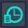   |  アラーム出力機能がかかっています。 |
|  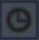   |  アラーム出力中に点灯します。 |
|  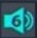   |  音声出力状態です。数字のチャンネルが該当しています。  |
|     |  モーションか外部センサーの入力による録画中です。  |
|  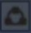  |  手動録画を開始／中止します手動録画を始めると、事前に設定した他の録画モード（動作検知・センサー検知）などは無視されます|
|  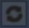   |  画面自動切替えが動作中です。  |

### その他表示
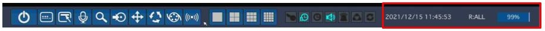

|  アイコン  |  意味  |
| ---- | ---- |
|  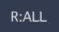  |  リモコンID※を表します  |
|     |  ハードディスクの使用容量を0～99％で表します。  |

**レコーダーの導入事例を確認する▼**
- [多機能なデジタルレコーダーを使った導入事例](https://isecj.jp/case/security-enhancement)
- [マルチクライアントソフトの導入事例](https://isecj.jp/case/netcafe-camera)
- [レコーダー・センサー・警報機を連携した独自システムの構築事例](https://isecj.jp/case/system-design)

## ワード解説

- リモコンIDとは？
レコーダー側でIDを設定することで、レコーダーが複数ある場合も一つのリモコンで特定のレコーダーを操作できるようにつけるリモコンの番号です。レコーダー側で任意の数字を設定したあと、リモコンで「ID＋数字」を押すと同じ数字を設定したレコーダーのみを操作できる
※リモコン側で数字を押す際、その数字が一桁の場合はの前に０を付けてください。
例：数字が１の場合→ID＋０１と押す。

- 使用者権限とは？
使用者権限とは、ライブ監視以外の機能をロックする機能です。ロックがかかった状態だと、ログが方法の変更や各種設定などができなくなります。
例えば、管理者が会社の場合、監視役に使用者権限を与えないことで、設定などの誤操作がなくなりトラブルを避けられます。

- アラーム出力機能とは？
パトライトやサイレンなどの外部機器を接続することで、特定の反応（モーション検知やセンサー検知）があった際に、アラーム（光る・鳴る）を出す機能です。
外部者が入ってきたときなどにすぐに対処できるようサインを出すために有効です。
システムイベント通知の欄より設定が可能です。

## リアルタイム監視での便利な機能

- 遠隔で見る機能
スマホやパソコン、モニターなど監視室にいなくても別場所でカメラの映像を確認することができます。
[遠隔で見る方法](./faq05-remote-viewer.html)

- スポット機能
スポット機能とは、HDMI出力から出すメイン映像以外にCVBS出力から特定のチャンネルの映像のみを表示させる機能です。例えば、メインのモニタにはカメラの分割映像を表示しておき、サブモニタに特定のチャンネルの映像を表示させる事ができます。また、スポット出力はモーション検知が働いた際に、該当するチャンネルの映像を表示させたり、各チャンネルの映像を数秒ごとに切替表示する事が可能です。
[スポット機能の使い方](./function-spot-monitoring.html)

- デジタルズーム
デジタルズームを使うことで、再生動画の一部を拡大することが出来ます。
[デジタルズームの使い方](./recorder-dijital-zoom.html)

**アイゼック最新のレコーダーはこちら▼**
- [【16ch同時再生, 4K対応機種】ANEモデル 製品ページ](https://isecj.jp/recorder/recorder-ane)

