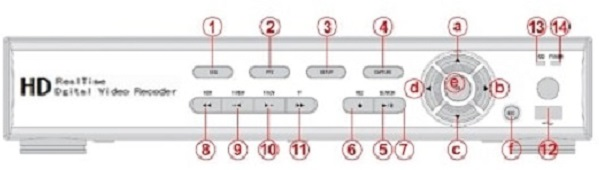
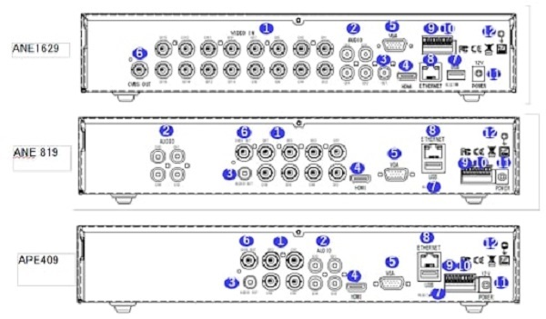
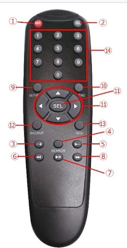
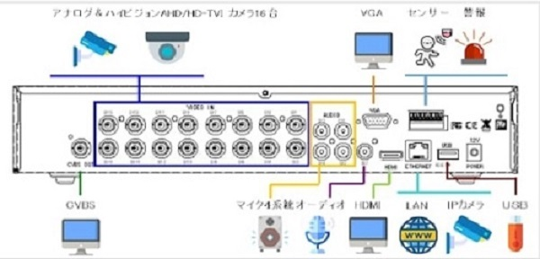

# 各部の名称と働き
レコーダー、リモコンの各部の名称と働きをご紹介いたします。
後半には後面パネルの接続例を紹介します。
## 前面パネル

後半には後面パネルの接続例を紹介します。
|  名称  |  意味  |
| :--- | :--- |
|  ① SEQ:   |  オートシーケンス  |
|  ② PTZ:  |  PTZコントロール  |
|  ③ SETUP:   |  設定メニューに入る  |
|  ④ CAPTURE:  |  ライブ・再生時のバックアップ  |
|  ⑤ SEARCH:   |  サーチメニューに入る  |
|  ⑥ REC:   |  マニュアル録画の開始／停止  |
|  ⑦ PLAY/PAUSE:  |  マニュアル録画の開始／停止  |
|  ⑧ REW:   |  再生／一時停止  |
|  ⑨ F/REW :   |  再生時に巻き戻し  |
|  ⑩ F/ADV:   |  再生中 – 再生箇所を60秒戻す 一時停止中 – 再生箇所を1フレーム戻す  |
|  ⑪ FF:   |  再生時に早送り  |
|  ⑫ USB port:  |  USBポート ：USBメモリー、マウスを接続します  |
|  ⑬ HDD:   |  録画中と再生時に点滅  |
|  ⑭ POWER:   |  電源ONで点灯  |

また、方向ボタンは場面によって機能が変わります  

＜設定中の方向ボタン機能＞

|    |    |
| ---- | ---- |
|  ⓐ カーソルを上へ   |  ⓑ カーソルを右へ／設定値を変更  |
|  ⓒ カーソルを下へ  |  ⓓ カーソルを左へ／設定値を変更  |

＜ライブ／再生時の方向ボタン機能＞

|  記号   |  意味   |
| ---- | ---- |
|  ⓐⓓ   |  選択カメラを逆方向に切替（CH3→CH2→CH1）  |
|  ⓑⓒ   |  選択カメラを順方向に切替（CH1→CH2→CH3）  |
|  ⓔ   |  ライブ・再生時フルスクリーン/4分割/9分割/16分割（モデルによる）切替 メニューの決定 セットアップ値の保存  |
|  ⓕ   |  前のメニューに戻る 再生画面から戻る ライブ画面時はステータスバー表示/非表示 長押しで操作ロック/ロック解除  |

## 後面パネル

|  名称  |  意味  |
| :--- | :--- |
| ①VIDEO IN   |  カメラからの映像信号入力端子  |
| ②AUDIO IN  |  音声入力用端子  |
|  ③AUDIO OUT   |  音声出力用端子  |
|  ④HDMI  |  HDMI対応モニターとの接続  |
|  ⑤VGA   |  VGA対応モニターとの接続  |
|  ⑥CVBS   |  サブモニターとの接続  |
|  ⑦USB  |  USBメモリー、USBマウスなど  |
|  ⑧ETHERNET   |  LAN接続用のRJ-45コネクタ。遠隔監視及びIPカメラ等で使用  |
|  ⑨SENSOR IN    |  本機からアラーム信号を発する場合に使用  |
|  ⑩ALARM OUT   |  RS-485 PTZカメラ制御用端子 (+, -)  |
|  ⑪POWER   |  本製品添付のAVアダプター(DC12V)をご使用ください。 |
|  ⑫GROUND  |  接地  |

## 赤外線リモコン

|  名称  |  意味  |
| :--- | :--- |
|  ①RECORD   |  手動録画を開始/中止します。一般的にはスケジュール録画をしていますので使いません。|
|  ②ID  |  リモコンIDが設定されている時、リモコンIDの認証を行います。DVRが複数台有る場合にDVRを指定して操作します。DVRが1台の場合は使用しません。|
|  ③--◀   |  再生中の映像の1分前にジャンプして再生します。一時停止中は、1フレーム前の画像を表示します。LIVE中は選択チャンネルのAUDIO ON/OFFをします。|
|  ④SEARCH  |  検索メニューに入ります。  |
|  ⑤▶--   |  再生中の映像の1分後にジャンプして再生します。一時停止中は、1フレーム後の画像を表示します。ライブモードでは、PTZ操作パネルを表示します。  |
|  ⑥◀◀   |  再生中のデータを巻戻しします。  |
|  ⑦▶/II  |  再生中の映像を静止画表示/再生再開します。  |
|  ⑧▶▶   |  再生中のデータを早送りします。  |
|  ⑨SETUP   |  設定メニューに入ります。  |
|  ⑩ESC   | 前画面に戻ります。  |
|  ⑪▲▼◀▶  |  メニューでカーソルを移動します。  |
|  ⑪SEL  |  下位メニューを表示します。  |
|  ⑫BACKUP |  ライブや再生画面をバックアップします。  |
|  ⑬SEQ   |  画面自動切換えを行います。  |
|  ⑭数字  |  1画面で表示するCHを選択します。  |

## 接続例

注意 IPカメラ接続は設定メニューにてシステム内のハイブリッド設定でIPカメラ機能を設定した場合です。

**アイゼック最新のレコーダーはこちら▼**
- [【16ch同時再生, 4K対応機種】ANEモデル 製品ページ](https://isecj.jp/recorder/recorder-ane)

**レコーダーの導入事例を確認する▼**
- [多機能なデジタルレコーダーを使った導入事例](https://isecj.jp/case/security-enhancement)
- [マルチクライアントソフトの導入事例](https://isecj.jp/case/netcafe-camera)
- [レコーダー・センサー・警報機を連携した独自システムの構築事例](https://isecj.jp/case/system-design)
