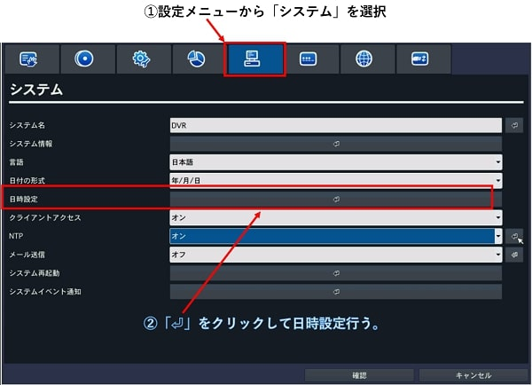

# NTP時刻補正について
レコーダーはバッテリー内蔵のRTCチップで時刻をカウントしております。

使用しているRTCチップの誤差は１日辺り±１秒以下となりますが、長期間時刻補正をせずに使用しているとレコーダーでの時刻と実際の時刻に大きなずれが生じます。

従ってレコーダー内のNTP補正機能を使用し毎日自動で時刻修正を行うか、一定期間ごとに手動で時刻を修正頂く必要がございます。

手動時刻補正の手順とNTP補正の方法は以下の通りです。

## 手動時刻補正手順
1)レコーダー画面上でマウスの右クリックを押して表示されるポップアップ画面から「設定」を選択します。

2)設定画面が表示されますので、「システム」を選択し、メニュー内の日時設定の「⏎」押します。

3)ポップアップが表示されるので下記チェックボックスにチェックを入れて時刻を修正します。

4)下記図のような通知が表示されるので「はい」を押してレコーダーが再起動したら完了です。

## NTP補正設定手順
1)レコーダー画面上でマウスの右クリックを押して表示されるポップアップ画面から「設定」を選択します。

2)設定画面が表示されますので、「システム」を選択し、メニュー内のNTPをONにし⏎を押してNTPサーバー設定を行います。

3)NTPの詳細設定を設定します。

設定内容は下記図を参照下さい

1. にてNTPサーバーアドレスを入力
2. にて時間帯を設定(日本の場合、下記図と同じ設定としてください)
3. NTP補正を周期事に実施するか時刻指定で行うか、１回のみか設定できます。
4. 3で周期事又は時刻指定とした場合に詳細なタイミングを設定します。

以上で設定は完了です。確認ボタンを押していき最後に表示される設定の保存のポップアップで「はい」を選択して下さい。

### 注意１：レコーダーをローカルネットワーク内で使用しておりNTPサーバーへ接続できない場合

レコーダーをローカルネットワーク内で使用しておりNTPサーバーへ接続できない場合、ローカルネットワーク内のPCをNTPサーバーとして使用する事もできます。

やり方については下記をご参照ください。

[WindowsPCをNTPサーバーにする方法](./faq04-ntp.html)

### 注意２：レコーダーの時刻が10秒以上進み方向にズレている場合、NTP補正は行われません。手動で時刻を修正する必要がございます。

レコーダーでNTP補正する場合、レコーダーの時間が実際の時間よりも進み方向にズレている場合、ずれが9秒以内であれば補正しますがそれ以上にズレていると補正しません。

理由は下記図の通りで、進み方向にずれてしまうと時刻を補正した際に被る部分（下記図の黄色部分）のデータを上書きし以前の録画データが消えてしまう為です。

この為、進み方向に９秒以上ずれていた場合NTPで自動補正は行われず手動で補正する必要があります。

また9秒以内の場合NTPにより自動で補正されますが、その間のデータは消えずにレコーダーのメモリ内に保存されます。

保存されたデータはウェブブラウザのアドレス欄に下記の通り打ち込むと閲覧ができます。

http://<レコーダーのIPアドレス:レコーダーのwebポート/cgi-bin/timedup.cgi

実際に閲覧するまでの動画をご参照ください。

[動画](https://www.youtube.com/watch?v=Gk4lwWHG-_Y)

なおレコーダーの時刻が遅れる方向にずれていてそれを修正する場合はデータの上書きの心配がない為、制限はございません。

**アイゼック最新のレコーダーはこちら▼**
- [【16ch同時再生, 4K対応機種】ANEモデル 製品ページ](https://isecj.jp/recorder/recorder-ane)

**レコーダーの導入事例を確認する▼**
- [多機能なデジタルレコーダーを使った導入事例](https://isecj.jp/case/security-enhancement)
- [マルチクライアントソフトの導入事例](https://isecj.jp/case/netcafe-camera)
- [レコーダー・センサー・警報機を連携した独自システムの構築事例](https://isecj.jp/case/system-design)