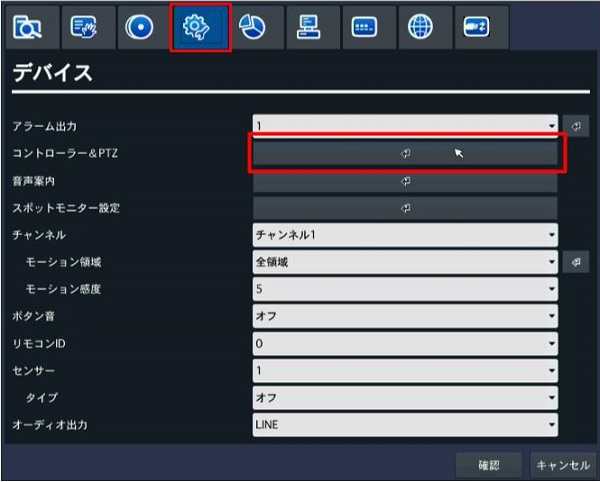
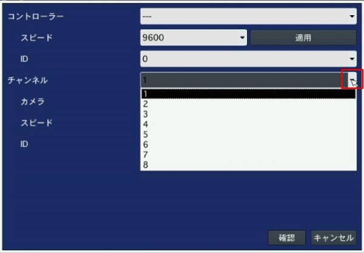
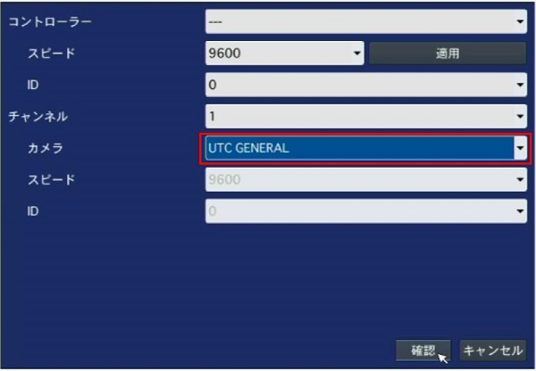
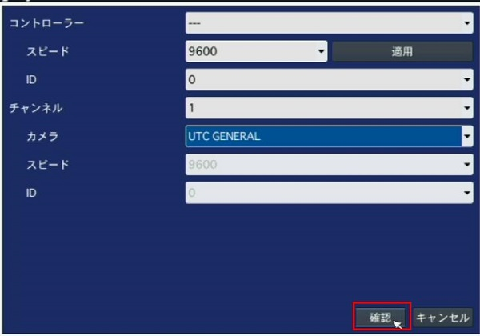
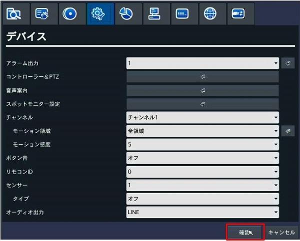
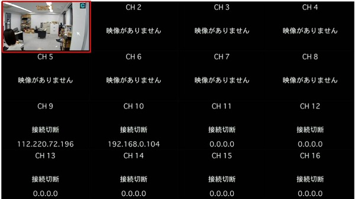
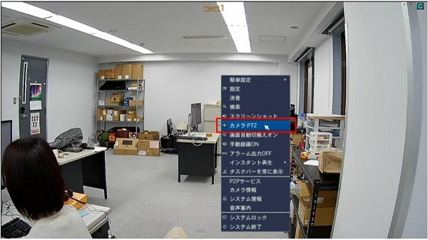
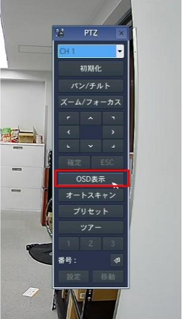
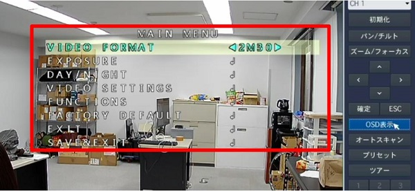
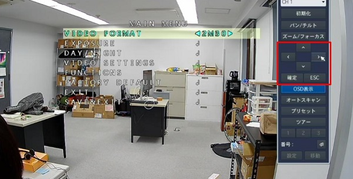

# OSDメニューを表示させたい

レコーダーの設定より、特定のチャンネルのOSDメニューを表示させることができます。

## 手順

### １．レコーダーの設定画面に入ります。

### 2. デバイスタブに移動し、「コントローラー＆PTZ」の「↲」をクリックします。

### ３. OSDメニューを表示させるチャンネルを選択します。

### ４. カメラの通信プロトコルを選択します。
アイゼックのカメラの場合は基本「UTC GENERAL」か「PELCO-C」です。

### ５．「確認」を２回クリックします。

### ６．設定の保存で「はい」をクリックします。

### ７．設定したチャンネルをクリックし、一画面表示にします。

### ８．右クリックをし、「カメラPTZ」をクリックします。

### ９．「OSD表示」をクリックします。

OSDメニューが画面上に表示されます。

### １０．矢印で操作をし、「確定」で設定を保存します。

**アイゼック最新のレコーダーはこちら▼**
- [【16ch同時再生, 4K対応機種】ANEモデル 製品ページ](https://isecj.jp/recorder/recorder-ane)

**レコーダーの導入事例を確認する▼**
- [多機能なデジタルレコーダーを使った導入事例](https://isecj.jp/case/security-enhancement)
- [マルチクライアントソフトの導入事例](https://isecj.jp/case/netcafe-camera)
- [レコーダー・センサー・警報機を連携した独自システムの構築事例](https://isecj.jp/case/system-design)