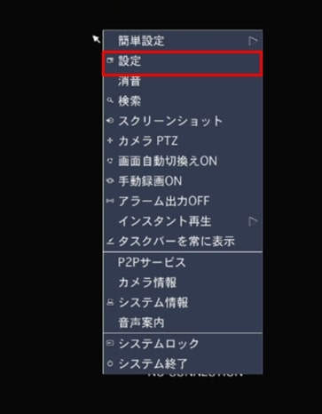
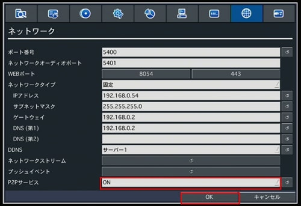
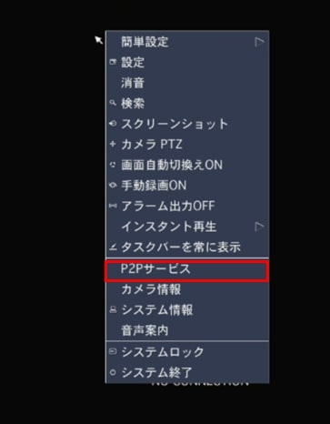
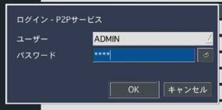
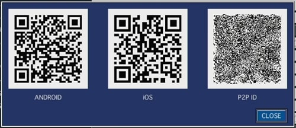
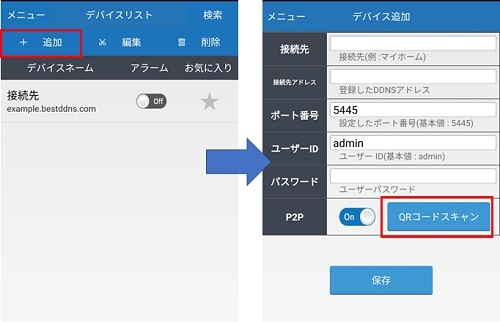
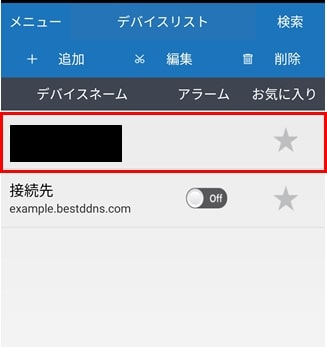
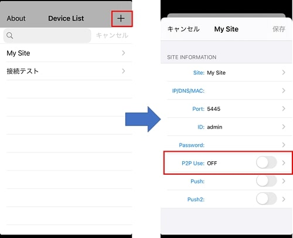
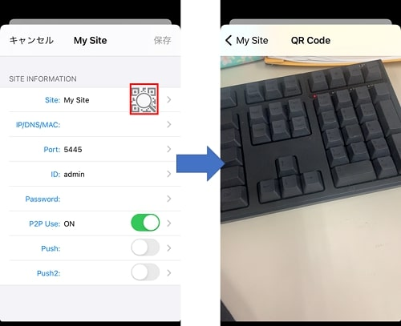
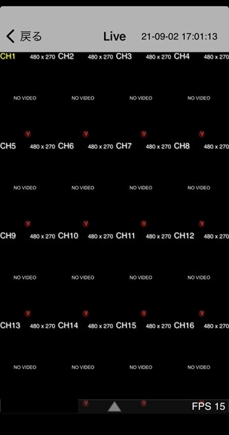

# 【スマホで見る】P2P接続機能

[[toc]]

P2P接続機能を使うとルーターのポート開放等不要でスマートフォンから遠隔接続が可能です。
使用方法は下記を参照下さい。
（注意：PCから遠隔接続する場合、P2P接続は使用できません。またP2P接続の場合映像のみで音声は出ませんのでご注意ください）
## レコーダーの設定
レコーダーにマウスを接続し、右クリックでメニューを開きます。
メニューから設定をクリックします。

ネット―ワーク＞P2PサービスをONに変更し、OKをクリックします。

右クリックでメニューを開きます。
P2Pサービスをクリックします。

パスワードを入力し、OKをクリックします。

QRコードが表示されます。
ANDROIDとiOSのQRコードを読み込むとスマホアプリ「iUMS」のインストール画面が標示されます。

## スマホ側の設定
スマホアプリiUMSを立ち上げ、QRコードを読み込みます。
### Androidの場合
追加をタップし、接続先設定画面のP2PをOnにするとQRコードスキャンボタンが表示されます。
QRコードスキャンをタップすると

カメラが立ち上がります。QRコードをスキャンすると接続先設定画面に戻り、各種項目が自動入力されます。保存をタップすると接続先が保存されます。

接続先が追加されます。

### iOSの場合
＋をタップし、接続先設定画面のP2P UseをONにします。

QRコードスキャンボタンが表示されます。QRコードスキャンをタップするとカメラが立ち上がり、QRコードをスキャンします。

スキャン完了後はレコーダーに接続されます。

**アイゼック最新のレコーダーはこちら▼**
- [【16ch同時再生, 4K対応機種】ANEモデル 製品ページ](https://isecj.jp/recorder/recorder-ane)

**レコーダーの導入事例を確認する▼**
- [多機能なデジタルレコーダーを使った導入事例](https://isecj.jp/case/security-enhancement)
- [マルチクライアントソフトの導入事例](https://isecj.jp/case/netcafe-camera)
- [レコーダー・センサー・警報機を連携した独自システムの構築事例](https://isecj.jp/case/system-design)