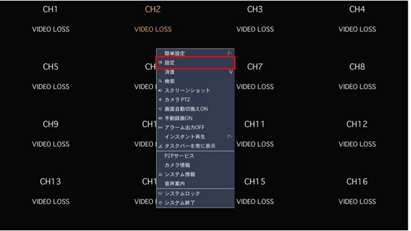
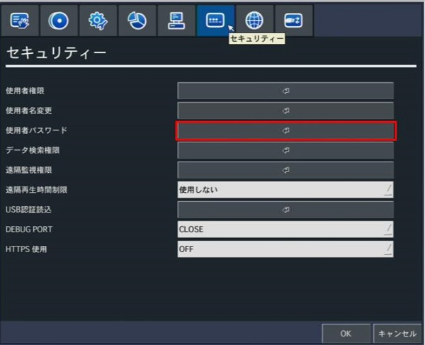
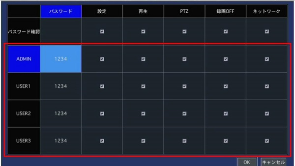

# 設定をパスワードなしで入る方法

設定を開く際にパスワードの入力を省略する方法を紹介します。

## 手順

### １．設定を開く

  

### ２．セキュリティータブに移動し、使用者パスワードをクリックする

  

### ３．設定のチェックを外す（その他　再生時、PTZカメラ調節時、録画のオフ、ネットワーク設定時のパスワード入力を省略することができます。） 

  

**アイゼック最新のレコーダーはこちら▼**
- [【16ch同時再生, 4K対応機種】ANEモデル 製品ページ](https://isecj.jp/recorder/recorder-ane)

**レコーダーの導入事例を確認する▼**
- [多機能なデジタルレコーダーを使った導入事例](https://isecj.jp/case/security-enhancement)
- [マルチクライアントソフトの導入事例](https://isecj.jp/case/netcafe-camera)
- [レコーダー・センサー・警報機を連携した独自システムの構築事例](https://isecj.jp/case/system-design)