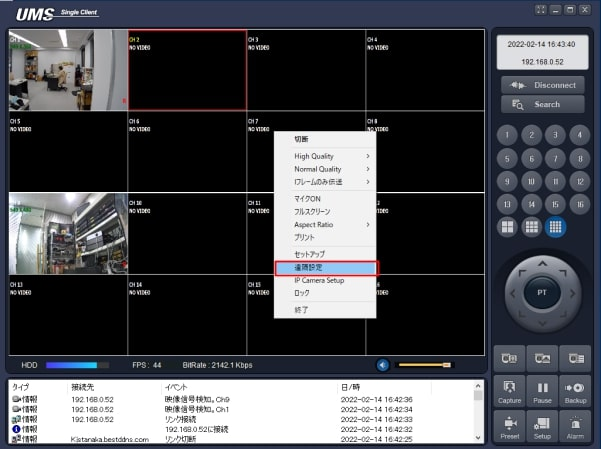
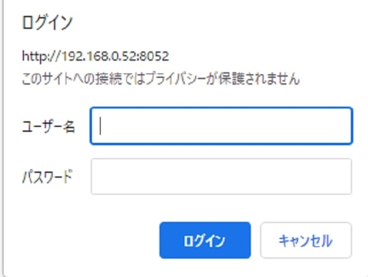
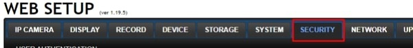
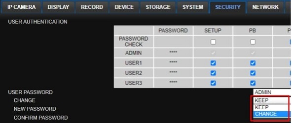
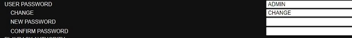
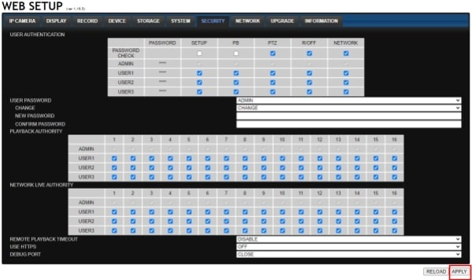

# 遠隔からパスワード変更したい

①UMSクライアントでレコーダーに接続した状態で右クリックして出てくるポップアップから「遠隔設定」を選択

②ネットブラウザが立ち上がるので、ユーザー名（ID）とパスワードを入力

③WEB　SETUP画面が表示されるので上段メニューから「SECURITY」を選択

④Changeの欄から選択窓からCHANGEを選択します。

⑤下の黒塗りになっていた「NEW　PASSWORD」と「CONFIRM　PASSWORD」が入力可能となりますので
「NEW　PASSWORD」に新しいパスワードを入力します。
「CONFIRM　PASSWORD」に確認の為、再度新しいパスワードを入力します。

⑥右下の「APPLY」ボタンを押します。

⑦画面が切り替わりタイムバーが表示され、タイムバーの色が全て染まったら完了です。

**アイゼック最新のレコーダーはこちら▼**
- [【16ch同時再生, 4K対応機種】ANEモデル 製品ページ](https://isecj.jp/recorder/recorder-ane)

**レコーダーの導入事例を確認する▼**
- [多機能なデジタルレコーダーを使った導入事例](https://isecj.jp/case/security-enhancement)
- [マルチクライアントソフトの導入事例](https://isecj.jp/case/netcafe-camera)
- [レコーダー・センサー・警報機を連携した独自システムの構築事例](https://isecj.jp/case/system-design)